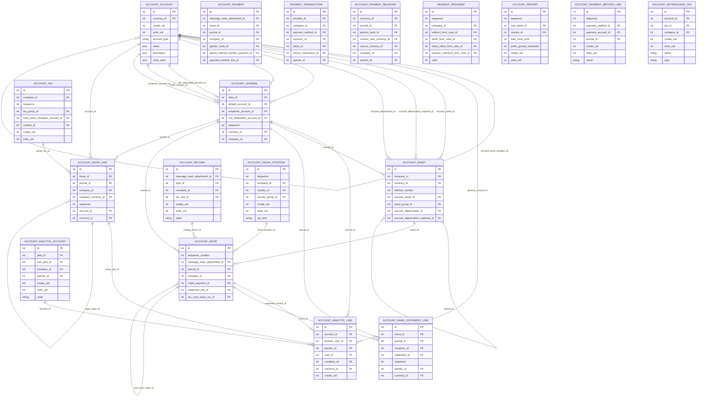

# iTEST02 ERD - Accounting Finance

Source dump: `iTEST02_2026-06-14_14-41-19.dump`

This ERD is a readable module-level extraction from the PostgreSQL custom dump. It intentionally limits the number of tables and edges so reviewers can understand the functional relationships without opening the full 1,395-table schema.

## Scope

- Module: `Accounting_Finance`
- Tables in module: 178
- Tables shown in ERD: 18
- Full foreign key inventory: see `iTEST02_foreign_keys.csv`

## Mermaid ERD

## Selected tables

- `account_account`
- `account_move`
- `account_journal`
- `account_move_line`
- `account_payment`
- `account_tax`
- `account_analytic_line`
- `account_asset`
- `payment_transaction`
- `account_bank_statement_line`
- `account_payment_register`
- `payment_provider`
- `account_return`
- `account_report`
- `account_fiscal_position`
- `account_analytic_account`
- `account_payment_method_line`
- `account_withholding_tax`
