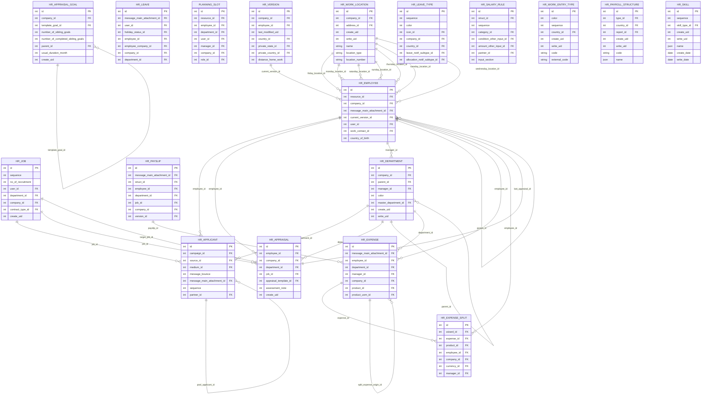

# iTEST02 ERD - HR Payroll

Source dump: `iTEST02_2026-06-14_14-41-19.dump`

This ERD is a readable module-level extraction from the PostgreSQL custom dump. It intentionally limits the number of tables and edges so reviewers can understand the functional relationships without opening the full 1,395-table schema.

## Scope

- Module: `HR_Payroll`
- Tables in module: 179
- Tables shown in ERD: 18
- Full foreign key inventory: see `iTEST02_foreign_keys.csv`

## Mermaid ERD

## Selected tables

- `hr_employee`
- `hr_applicant`
- `hr_job`
- `hr_version`
- `hr_department`
- `hr_expense`
- `hr_payslip`
- `hr_leave`
- `hr_appraisal`
- `planning_slot`
- `hr_work_location`
- `hr_appraisal_goal`
- `hr_leave_type`
- `hr_salary_rule`
- `hr_work_entry_type`
- `hr_payroll_structure`
- `hr_expense_split`
- `hr_skill`
