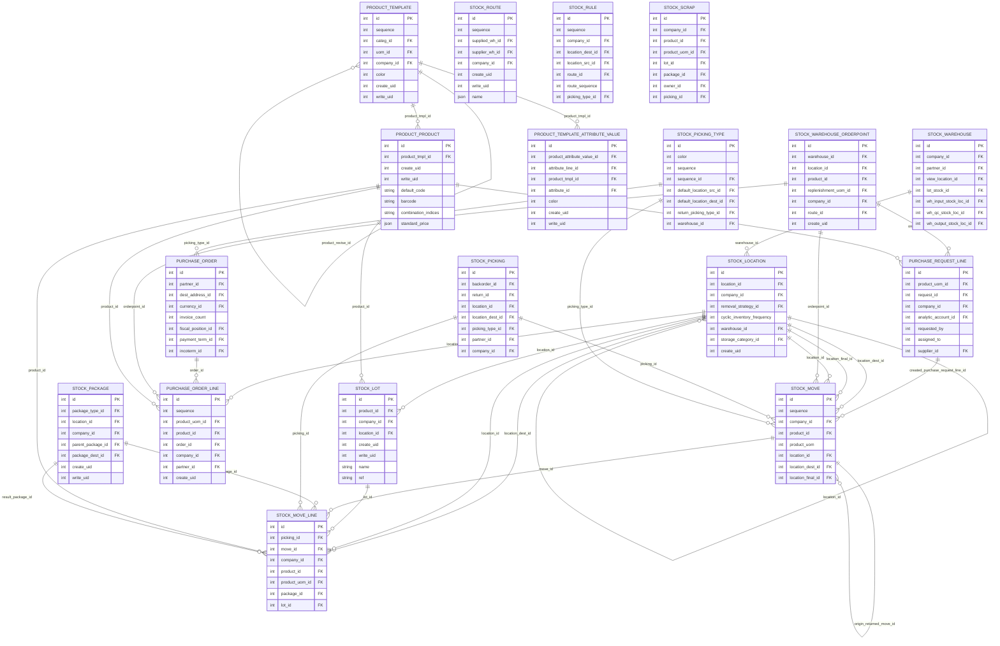

# iTEST02 ERD - Inventory Purchase

Source dump: `iTEST02_2026-06-14_14-41-19.dump`

This ERD is a readable module-level extraction from the PostgreSQL custom dump. It intentionally limits the number of tables and edges so reviewers can understand the functional relationships without opening the full 1,395-table schema.

## Scope

- Module: `Inventory_Purchase`
- Tables in module: 169
- Tables shown in ERD: 18
- Full foreign key inventory: see `iTEST02_foreign_keys.csv`

## Mermaid ERD

## Selected tables

- `product_product`
- `stock_location`
- `stock_warehouse`
- `product_template`
- `stock_move`
- `stock_picking_type`
- `stock_picking`
- `purchase_order`
- `stock_move_line`
- `stock_route`
- `stock_package`
- `purchase_order_line`
- `stock_lot`
- `stock_rule`
- `product_template_attribute_value`
- `stock_scrap`
- `stock_warehouse_orderpoint`
- `purchase_request_line`
