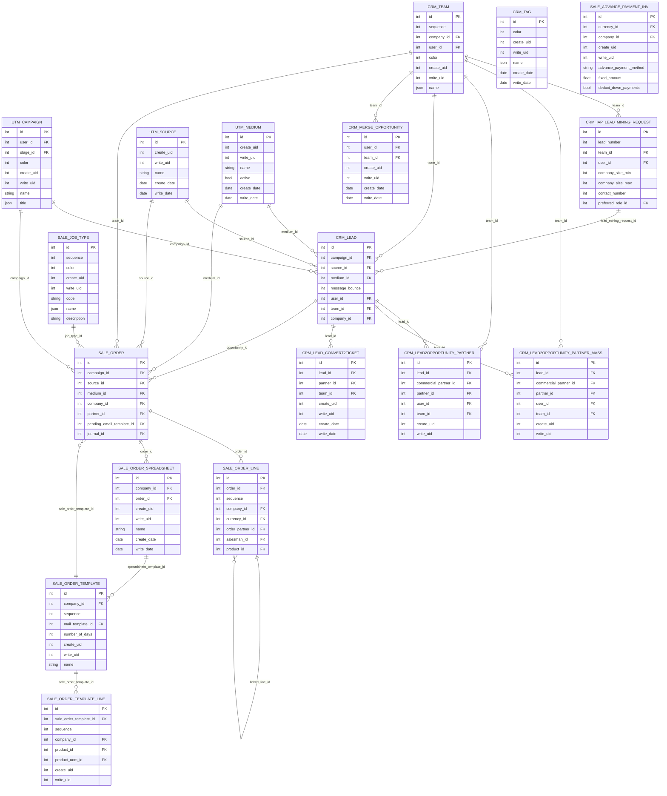

# iTEST02 ERD - Sales CRM

Source dump: `iTEST02_2026-06-14_14-41-19.dump`

This ERD is a readable module-level extraction from the PostgreSQL custom dump. It intentionally limits the number of tables and edges so reviewers can understand the functional relationships without opening the full 1,395-table schema.

## Scope

- Module: `Sales_CRM`
- Tables in module: 60
- Tables shown in ERD: 18
- Full foreign key inventory: see `iTEST02_foreign_keys.csv`

## Mermaid ERD

## Selected tables

- `sale_order`
- `sale_order_line`
- `crm_lead`
- `crm_team`
- `utm_campaign`
- `crm_iap_lead_mining_request`
- `utm_source`
- `crm_lead2opportunity_partner_mass`
- `utm_medium`
- `sale_order_template`
- `crm_lead2opportunity_partner`
- `sale_job_type`
- `sale_order_spreadsheet`
- `sale_order_template_line`
- `crm_tag`
- `crm_lead_convert2ticket`
- `crm_merge_opportunity`
- `sale_advance_payment_inv`
