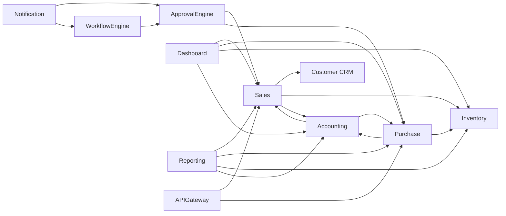

# Application and Module Boundary (ARC-WP-005)

Document ID: ARC-WP-005
Version: 0.1
Session: [SMEPLUS-26-07-10-001]
Control Level: /L99.99
Status: DRAFT
Approval Status: PREPARED FOR INDEPENDENT REVIEW / HOLD
Gate Status: HOLD

## 1. Document Control

| Field | Value |
|---|---|
| Document ID | ARC-WP-005 |
| Deliverable | APPLICATION_MODULE_BOUNDARY.md |
| Version | 0.1 |
| Architecture Owner | Solution Architecture AI Owner |
| Supporting Owner | ERP Module Architecture AI Owner |
| Independent Reviewer | ChatGPT L99 |
| Approval Authority | Boss |
| Created | 2026-07-14 |
| Evidence Path | 99_SMEsPlus_Enterprise_Suite/03_Architecture/STATE03_ARCHITECTURE_ACCELERATION/APPLICATION_MODULE_BOUNDARY.md |
| Verification Status | NOT VERIFIED |

## 2. Purpose

Define the application landscape and module boundaries of the SMEsPlus Enterprise Suite: domain grouping, source-module ownership, shared platform services, permitted and prohibited dependencies, and the clean-room implementation boundary.

## 3. Scope

- Module inventory and grouping into domains.
- Cross-module dependencies and prohibited patterns.
- Shared platform services and extension strategy.
- Functional-to-module traceability.

## 4. Out of Scope

- Physical deployment topology (ARC-WP-007/infrastructure domain).
- Detailed API contracts (build state / ARC-WP-010 concept only).

## 5. Architecture Owner

Solution Architecture AI Owner.

## 6. Supporting Owner

ERP Module Architecture AI Owner.

## 7. Independent Reviewer

ChatGPT L99.

## 8. Dependencies

- CROSS_MODULE_DEPENDENCY_MATRIX.md, MODULE_SPEC_* files, ARC-WP-004 (control), ARC-WP-007 (components), ARC-WP-010 (integration).

## 9. Assumptions

- A-001: Modules communicate via APIs and events, never via shared database tables (PR-12).
- A-002: Enterprise Control, not modules, owns approval and posting.
- A-003: Clean-room constraint governs all module implementations.

## 10. Current State

Fifteen module specs exist (Sales, Purchase, Inventory, Accounting, Customer CRM, Tenant Management, Organization Management, User Role Management, Authorization, Approval Engine, Workflow Engine, Notification, Dashboard, Reporting, API Gateway) with a PARTIAL cross-module dependency matrix.

## 11. Target State

A clear module map with domain grouping, single source-module ownership per business object, explicit dependency contracts, and prohibited-pattern rules, ready to drive component (ARC-WP-007) and integration (ARC-WP-010) design.

## 12. Architecture Model

### 12.1 Domain Grouping
- **Platform/Control**: Tenant Management, Organization Management, User Role Management, Authorization, Approval Engine, Workflow Engine, Notification, API Gateway.
- **Operations (Source Modules)**: Sales, Purchase, Inventory, Customer CRM.
- **Finance**: Accounting (posting consumer).
- **Insight**: Dashboard, Reporting.

### 12.2 Source-Module Ownership (selected)
| Business Object | Owning Source Module |
|---|---|
| Sales order / invoice | Sales |
| Purchase order / vendor bill | Purchase |
| Stock movement | Inventory |
| Journal entry / ledger | Accounting (via Posting Engine) |
| Customer master | Customer CRM |
| Approval request | Approval Engine |

### 12.3 Dependency Map

### 12.4 Prohibited Dependency Patterns
- No direct cross-module database access.
- No circular synchronous call chains (cycles resolved via events).
- No module performing posting or final approval outside the control engines.
- No module bypassing the API Gateway for external access.

### 12.5 Shared Platform Services
Identity, entitlement, audit, notification and observability are shared services consumed by all modules through defined interfaces.

### 12.6 Extension and Custom Module Strategy
Extension via configuration and feature flags first (AP-007); custom modules must declare dependencies and comply with control and clean-room rules. No source-code forking of the core.

### 12.7 Clean-Room Implementation Boundary
No module may embed code, schema or content derived directly from a proprietary source system. Learning is conceptual only (PR-16, `09_Security_Clean_Room`).

## 13. Architecture Decisions

- ADR-ARC-010 (Modules integrate only via API/events, no shared tables): PROPOSED.
- ADR-ARC-011 (No circular synchronous dependencies): PROPOSED.

## 14. Security Considerations

Prohibited direct DB coupling reduces lateral-movement risk; API Gateway is the single external ingress with authentication/authorization.

## 15. Privacy and Compliance Considerations

Customer master ownership in CRM centralizes personal-data governance; downstream modules reference, not copy, personal data where feasible.

## 16. Tenant-Isolation Considerations

All inter-module calls carry and enforce tenant context; no module may widen scope on behalf of another.

## 17. Recovery and Continuity Considerations

Module independence enables per-module recovery; event-based coupling supports replay after outage.

## 18. Observability Considerations

Inter-module calls and events are traced with correlation IDs for end-to-end business-process visibility.

## 19. Capacity and Cost Considerations

Module independence allows independent scaling; high-fan-in modules (Accounting, API Gateway) are capacity hotspots (ARC-WP-011).

## 20. Risks and Gaps

- R-005-01: Accounting is a high-fan-in dependency; a bottleneck/availability risk. Severity: High.
- R-005-02: Clean-room contamination if module design imports source patterns verbatim. Severity: Critical.
- G-005-01: Dependency matrix status is PARTIAL; contracts not yet defined.

## 21. Measurable Acceptance Criteria

| AC ID | Criterion | Verification Method | Required Evidence |
|---|---|---|---|
| AC-001 | Every module assigned to exactly one domain group | Review | Section 12.1 |
| AC-002 | Every listed business object has one owning source module | Review | Section 12.2 |
| AC-003 | Prohibited patterns enumerated | Review | Section 12.4 |
| AC-004 | Clean-room boundary references clean-room policy | Link check | Section 12.7 |

## 22. Evidence Requirements

| Evidence ID | Type | GitHub Location | Owner | Reviewer | Verification Status |
|---|---|---|---|---|---|
| EV-ARC-005 | Module boundary map | This file path | Solution Architecture AI Owner | ChatGPT L99 | NOT VERIFIED |

## 23. Open Decisions

- OD-005-01: Confirm Posting Engine as distinct from Accounting module. DECISION REQUIRED.
- OD-005-02: Confirm custom-module governance process. DECISION REQUIRED.

## 24. Gate Impact

- Gate B input (application and module boundary). Contributes; does not pass.
- Recommendation: READY FOR INDEPENDENT REVIEW.

## 25. Change History

| Version | Date | Change | Author | Reviewer |
|---|---|---|---|---|
| 0.1 | 2026-07-14 | Initial draft | Solution Architecture AI Owner (Claude Code drafting agent) | Pending (ChatGPT L99) |

## 26. Approval Status

PREPARED FOR INDEPENDENT REVIEW / HOLD. Independent review and Boss decision remain mandatory.
