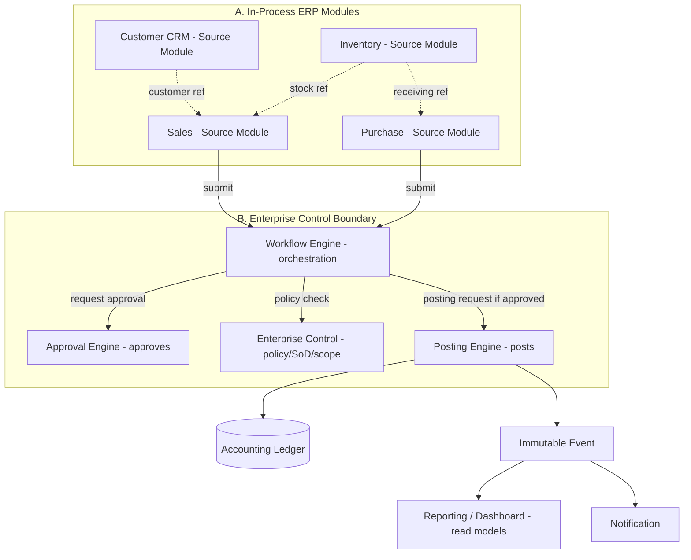

# Application and Module Boundary (ARC-WP-005) — Controlled Hybrid Modular Architecture

Document ID: ARC-WP-005
Version: 0.2
Session: [SMEPLUS-26-07-10-001]
Control Level: /L99.99
Status: DRAFT
Approval Status: PREPARED FOR REVIEW / HOLD
Architecture Style: Controlled Hybrid Modular Architecture (PROPOSED / HOLD)
Gate Status: HOLD
Correction Reference: L99 Review Finding P0-02 (Batch 001 remediation)

## 1. Document Control

| Field | Value |
|---|---|
| Document ID | ARC-WP-005 |
| Deliverable | APPLICATION_MODULE_BOUNDARY.md |
| Version | 0.2 |
| Architecture Owner | Solution Architecture AI Owner |
| Supporting Owner | ERP Module Architecture AI Owner |
| Independent Reviewer | ChatGPT L99 |
| Approval Authority | Boss |
| Created | 2026-07-14 |
| Evidence Path | 99_SMEsPlus_Enterprise_Suite/03_Architecture/STATE03_ARCHITECTURE_ACCELERATION/APPLICATION_MODULE_BOUNDARY.md |
| Verification Status | NOT VERIFIED |

## 2. Purpose

Define the application landscape and module boundaries of the SMEsPlus Enterprise Suite: domain grouping, source-module ownership, shared platform services, permitted and prohibited dependencies, and the clean-room implementation boundary.

## 3. Scope

- Module inventory and grouping into domains.
- Cross-module dependencies and prohibited patterns.
- Shared platform services and extension strategy.
- Functional-to-module traceability.

## 4. Out of Scope

- Physical deployment topology (ARC-WP-007/infrastructure domain).
- Detailed API contracts (build state / ARC-WP-010 concept only).

## 5. Architecture Owner

Solution Architecture AI Owner.

## 6. Supporting Owner

ERP Module Architecture AI Owner.

## 7. Independent Reviewer

ChatGPT L99.

## 8. Dependencies

- CROSS_MODULE_DEPENDENCY_MATRIX.md, MODULE_SPEC_* files, ARC-WP-004 (control), ARC-WP-007 (components), ARC-WP-010 (integration).

## 9. Assumptions

- A-001: The system is a **Controlled Hybrid Modular Architecture**, not pure microservices and not an uncontrolled monolith. In-process ERP modules may share ORM and transactional database access under controlled interfaces; external/cross-runtime integration uses APIs and events only (ADR-ARC-010). This corrects the v0.1 assumption that "modules communicate via APIs and events, never via shared database tables", which incorrectly forced microservices and conflicted with the Odoo-first modular ERP direction (L99 finding P0-02).
- A-002: Source modules execute their own business transactions. The Enterprise Control Layer governs (enforces policy/SoD/scope around) approval and posting; it does not itself execute approval or posting. The Approval Engine approves, the Posting Engine posts (see ARC-WP-004; L99 finding P0-03).
- A-003: Clean-room constraint governs all module implementations.

## 10. Current State

Fifteen module specs exist (Sales, Purchase, Inventory, Accounting, Customer CRM, Tenant Management, Organization Management, User Role Management, Authorization, Approval Engine, Workflow Engine, Notification, Dashboard, Reporting, API Gateway) with a PARTIAL cross-module dependency matrix.

## 11. Target State

A clear module map with domain grouping, single source-module ownership per business object, explicit dependency contracts, and prohibited-pattern rules, ready to drive component (ARC-WP-007) and integration (ARC-WP-010) design.

## 12. Architecture Model

### 12.1 Domain Grouping
- **Platform/Control**: Tenant Management, Organization Management, User Role Management, Authorization, Approval Engine, Workflow Engine, Notification, API Gateway.
- **Operations (Source Modules)**: Sales, Purchase, Inventory, Customer CRM.
- **Finance**: Accounting (posting consumer).
- **Insight**: Dashboard, Reporting.

### 12.2 Source-Module Ownership (selected)
| Business Object | Owning Source Module |
|---|---|
| Sales order / invoice | Sales |
| Purchase order / vendor bill | Purchase |
| Stock movement | Inventory |
| Journal entry / ledger | Accounting (via Posting Engine) |
| Customer master | Customer CRM |
| Approval request | Approval Engine |

### 12.3 Controlled Hybrid Modular Architecture — Three Boundary Categories

The architecture is a **Controlled Hybrid Modular Architecture**. It is neither pure microservices nor an uncontrolled monolith. Integration rules depend on which of three boundary categories applies.

#### A. In-Process ERP Module Boundary
For modules deployed within the same ERP application runtime (e.g., Sales, Purchase, Inventory, Customer CRM, Accounting operating in one Odoo-style runtime):
- Shared ORM and transactional database access **may** be allowed.
- Direct raw SQL access to another module's tables is **prohibited** unless formally controlled and documented.
- Business ownership remains with the source module.
- Cross-module operations must use defined service, model or domain interfaces.
- Shared transaction boundaries must be documented.
- Internal module dependency does **not** automatically require an HTTP API call.
- Circular dependency remains **prohibited** (see ADR-ARC-011).

#### B. Enterprise Control Boundary
Approval Engine, Posting Engine, Workflow Engine and policy-control components must be reached only through explicit controlled interfaces. No source module may:
- approve its own restricted transaction;
- post directly outside the Posting Engine;
- bypass segregation-of-duties controls;
- mutate immutable audit or event records;
- bypass tenant/company/branch scope.

#### C. External Service and Integration Boundary
APIs, events and webhooks are **mandatory** for: external systems, Make automation, mobile applications, public APIs, independent services, cross-runtime services, asynchronous integration and partner systems. Direct database integration across service boundaries is **prohibited**.

### 12.4 Controlled Directional Flow (No Circular Synchronous Dependencies)

The v0.1 diagram showed uncontrolled circular synchronous dependencies (Sales↔Accounting, Purchase↔Accounting). These are removed. Business flow is a controlled, directional posting chain; cross-module read/reporting needs use controlled read models, services or events — not synchronous cycles.

Directional concept (no cycles):
`Source Module → Approval / Workflow Control → Posting Request → Posting Engine → Accounting Ledger → Immutable Event → Reporting / Notification`

### 12.5 Prohibited Dependency Patterns
- No **raw cross-module SQL** or direct access to another module's tables (even in-process) unless formally controlled and documented.
- No **direct cross-service (cross-runtime) database coupling** — external/independent services integrate via API/events only.
- No **circular synchronous** call chains (resolve via events / controlled read models).
- No module performing posting or final approval outside the control engines.
- No module bypassing the API Gateway for external access.

### 12.6 Shared Platform Services
Identity, entitlement, audit, notification and observability are shared services consumed by all modules through defined interfaces.

### 12.7 Extension and Custom Module Strategy
Extension via configuration and feature flags first (AP-007); custom modules must declare dependencies and comply with control and clean-room rules. No source-code forking of the core.

### 12.8 Clean-Room Implementation Boundary
No module may embed code, schema or content derived directly from a proprietary source system. Learning is conceptual only (PR-16, `09_Security_Clean_Room`).

## 13. Architecture Decisions

- ADR-ARC-010 (**Controlled Hybrid Module Integration** — distinguishes in-process module integration, shared-ORM transaction boundaries, controlled domain/service interfaces, external API/event boundaries, and prohibits direct cross-service database coupling): PROPOSED / HOLD. Supersedes the v0.1 "API/events only, no shared tables" formulation.
- ADR-ARC-011 (No circular synchronous dependencies; use events / controlled read models): PROPOSED.

## 14. Security Considerations

Prohibited raw cross-module SQL and prohibited direct cross-service database coupling reduce lateral-movement risk; the API Gateway is the single external ingress with authentication/authorization. In-process shared-ORM access is permitted only through controlled interfaces, keeping the attack surface bounded while matching the ERP runtime reality.

## 15. Privacy and Compliance Considerations

Customer master ownership in CRM centralizes personal-data governance; downstream modules reference, not copy, personal data where feasible.

## 16. Tenant-Isolation Considerations

All inter-module calls carry and enforce tenant context; no module may widen scope on behalf of another.

## 17. Recovery and Continuity Considerations

Module independence enables per-module recovery; event-based coupling supports replay after outage.

## 18. Observability Considerations

Inter-module calls and events are traced with correlation IDs for end-to-end business-process visibility.

## 19. Capacity and Cost Considerations

Module independence allows independent scaling; high-fan-in modules (Accounting, API Gateway) are capacity hotspots (ARC-WP-011).

## 20. Risks and Gaps

- R-005-01: Accounting is a high-fan-in dependency; a bottleneck/availability risk. Severity: High.
- R-005-02: Clean-room contamination if module design imports source patterns verbatim. Severity: Critical.
- G-005-01: Dependency matrix status is PARTIAL; contracts not yet defined.

## 21. Measurable Acceptance Criteria

| AC ID | Criterion | Verification Method | Required Evidence |
|---|---|---|---|
| AC-001 | Every module assigned to exactly one domain group | Review | Section 12.1 |
| AC-002 | Every listed business object has one owning source module | Review | Section 12.2 |
| AC-003 | Three boundary categories (in-process / control / external) defined | Review | Section 12.3 |
| AC-004 | Prohibited patterns enumerated (raw cross-module SQL, cross-service DB coupling, sync cycles) | Review | Section 12.5 |
| AC-005 | Dependency diagram shows no circular synchronous dependencies | Diagram review | Section 12.4 |
| AC-006 | Clean-room boundary references clean-room policy | Link check | Section 12.8 |

## 22. Evidence Requirements

| Evidence ID | Type | GitHub Location | Owner | Reviewer | Verification Status |
|---|---|---|---|---|---|
| EV-ARC-005 | Module boundary map | This file path | Solution Architecture AI Owner | ChatGPT L99 | NOT VERIFIED |

## 23. Open Decisions

- OD-005-01: Confirm Posting Engine as distinct from Accounting module. DECISION REQUIRED.
- OD-005-02: Confirm custom-module governance process. DECISION REQUIRED.

## 24. Gate Impact

- Gate B input (application and module boundary). Contributes; does not pass.
- Recommendation: READY FOR INDEPENDENT REVIEW.

## 25. Change History

| Version | Date | Change | Author | Reviewer |
|---|---|---|---|---|
| 0.1 | 2026-07-14 | Initial draft | Solution Architecture AI Owner (Claude Code drafting agent) | Pending (ChatGPT L99) |
| 0.2 | 2026-07-14 | P0-02 remediation: recast as Controlled Hybrid Modular Architecture (3 boundary categories); removed circular synchronous dependency diagram; replaced ADR-ARC-010 with controlled hybrid integration | Solution Architecture AI Owner (Claude Code Expert correction agent) | Pending (ChatGPT L99) |

## 26. Approval Status

PREPARED FOR REVIEW / HOLD. Architecture style is Controlled Hybrid Modular Architecture, status PROPOSED / HOLD. Independent review and Boss decision remain mandatory.
