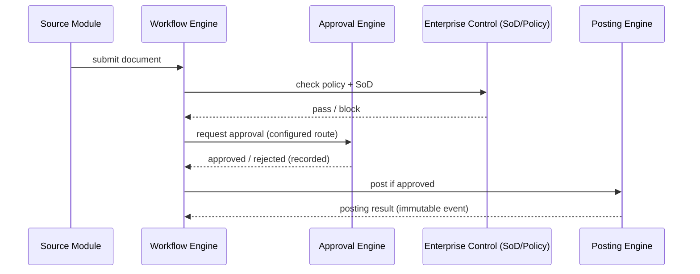

# Enterprise Control Layer (ARC-WP-004)

Document ID: ARC-WP-004
Version: 0.2
Session: [SMEPLUS-26-07-10-001]
Control Level: /L99.99
Status: DRAFT
Approval Status: PREPARED FOR REVIEW / HOLD
Gate Status: HOLD
Correction Reference: L99 Review Finding P0-03 (Batch 001 remediation)

## 1. Document Control

| Field | Value |
|---|---|
| Document ID | ARC-WP-004 |
| Deliverable | ENTERPRISE_CONTROL_LAYER.md |
| Version | 0.2 |
| Architecture Owner | Enterprise Control Architecture AI Owner |
| Supporting Owner | Access Architecture AI Owner |
| Independent Reviewer | ChatGPT L99 |
| Approval Authority | Boss |
| Created | 2026-07-14 |
| Evidence Path | 99_SMEsPlus_Enterprise_Suite/03_Architecture/STATE03_ARCHITECTURE_ACCELERATION/ENTERPRISE_CONTROL_LAYER.md |
| Verification Status | NOT VERIFIED |

## 2. Purpose

Define the SMEsPlus Enterprise Control Layer: the cross-cutting control plane that governs approval, posting, workflow, segregation of duties and policy enforcement between source modules, so that no module can independently approve or post outside enterprise policy.

## 3. Scope

- Enterprise control responsibilities and boundaries.
- Approval Engine, Posting Engine, Workflow Engine and source-module responsibilities.
- Segregation of duties, policy enforcement, exception and escalation control.

## 4. Out of Scope

- Module-internal business logic (owned by module specs).
- IAM internals (ARC-WP-009), integration transport (ARC-WP-010).

## 5. Architecture Owner

Enterprise Control Architecture AI Owner.

## 6. Supporting Owner

Access Architecture AI Owner.

## 7. Independent Reviewer

ChatGPT L99.

## 8. Dependencies

- ARC-WP-005 (module boundaries), ARC-WP-007 (logical components), ARC-WP-009 (access), ARC-WP-010 (events), MODULE_SPEC_APPROVAL_ENGINE.md, MODULE_SPEC_WORKFLOW_ENGINE.md.

## 9. Assumptions

- A-001: Approval and posting are platform capabilities, not per-module features (PR-03, PR-06, PR-07).
- A-002: A source module owns and executes its business transaction; the Enterprise Control Layer **governs** (enforces policy/SoD/scope around) approval and posting but does **not itself execute** approval or posting. The Approval Engine approves; the Posting Engine posts (L99 finding P0-03).
- A-003: Approval rules are configurable per tenant/company.

## 10. Current State

Approval Engine and Workflow Engine exist as module specs (BR-APP-001..004); posting is referenced by Accounting as a "posting source reference" but no unified Enterprise Control Layer architecture exists.

## 11. Target State

A defined control layer where source modules submit documents, the Approval Engine applies configurable approval, and the Posting Engine performs ledger/stock posting only from approved documents, with segregation of duties and full audit.

## 12. Architecture Model

### 12.0 Canonical Responsibility Model (controlling)

```text
Approval Engine approves only.
Source Module executes the business transaction.
Posting Engine posts.
Workflow Engine controls status transition and orchestration.
Enterprise Control Layer enforces policy, segregation of duties, restrictions and gate conditions.
Events record immutable business facts.
```

The Enterprise Control Layer **governs and enforces the control policy around** the Approval Engine and Posting Engine. It does **not** directly execute approval or posting actions, and it **cannot bypass** the Approval Engine or Posting Engine.

### 12.1 Responsibilities

- **Source Module** (Sales, Purchase, Inventory, CRM, etc.): owns the business document; validates business rules; initiates submission; **executes the authorized business transaction**. Does not perform final restricted approval. Does not post directly.
- **Approval Engine**: evaluates approval rules; records approve/reject decisions. Does not execute source-module business operations. Does not perform posting.
- **Posting Engine**: performs controlled ledger/stock posting; accepts only valid authorized posting requests; enforces idempotency; emits immutable posting results.
- **Workflow Engine**: controls state transitions; coordinates the approval and posting sequence; does not replace source-module execution logic.
- **Enterprise Control Layer**: enforces policy; enforces segregation of duties; enforces tenant/company/branch scope; blocks restricted actions; controls exceptions and escalation. Cannot bypass the Approval Engine or Posting Engine, and does not itself approve or post.
- **Immutable Event Layer**: records business facts; append-only; does not replace operational source records unless explicitly approved by ADR (see ADR-ARC-002).

### 12.2 Control Flow



### 12.3 Segregation of Duties
The creator of a document cannot be its sole approver; the approver cannot alter posted results. SoD rules are configurable but have non-overridable defaults for financial documents (candidate ADR).

### 12.4 Policy Enforcement and Restricted Actions
Restricted actions (post, reverse, override approval, change approval route) require elevated permission and are always audited. Overrides require an exception record.

### 12.5 Exception and Escalation
Timeouts, rejections and policy blocks raise exceptions routed to a configurable escalation path (e.g., higher approver, admin) with notification (via Notification module).

### 12.6 Tenant/Company/Branch Control
All control decisions resolve organizational scope (ARC-WP-002) before applying rules; approval routes and SoD are scoped per company.

## 13. Architecture Decisions

- ADR-ARC-007 (Posting only from approved source document): PROPOSED.
- ADR-ARC-009 (SoD defaults non-overridable for financial documents): PROPOSED.

## 14. Security Considerations

Restricted actions are high-value targets; they require elevated authorization, immutable audit and cannot be self-approved. Override paths must be tightly controlled.

## 15. Privacy and Compliance Considerations

Approval and posting audit trails may contain identity of approvers; retained per audit policy. SoD supports financial compliance.

## 16. Tenant-Isolation Considerations

Control configuration and audit are tenant/company scoped; no cross-tenant approval routing.

## 17. Recovery and Continuity Considerations

In-flight approvals and unposted documents must survive recovery in a consistent state; posting must be idempotent to avoid double-post after retry (see ARC-WP-010 idempotency).

## 18. Observability Considerations

Every submit/approve/reject/post/override is an audited, traceable event; pending-approval age and rejection rates are metrics.

## 19. Capacity and Cost Considerations

Approval and posting throughput are capacity dimensions (ARC-WP-011); asynchronous posting queues absorb peaks.

## 20. Risks and Gaps

- R-004-01: Posting double-execution on retry without idempotency. Severity: Critical. Mitigation: idempotent posting keys.
- R-004-02: Over-configurable SoD could allow self-approval if defaults are weak. Severity: High.
- G-004-01: Posting Engine has no dedicated module spec yet.

## 21. Measurable Acceptance Criteria

| AC ID | Criterion | Verification Method | Required Evidence |
|---|---|---|---|
| AC-001 | Canonical responsibility model present; Enterprise Control governs but does not execute approval/posting | Review | Sections 12.0, 12.1 |
| AC-002 | Source module executes the business transaction; Approval Engine approves; Posting Engine posts | Review | Section 12.1 |
| AC-003 | Posting occurs only from an approved document | Design review | Section 12.2, ADR-ARC-007 |
| AC-004 | SoD default prevents self-approval of financial documents | Review | Section 12.3 |
| AC-005 | Restricted actions enumerated and audited | Review | Section 12.4 |

## 22. Evidence Requirements

| Evidence ID | Type | GitHub Location | Owner | Reviewer | Verification Status |
|---|---|---|---|---|---|
| EV-ARC-004 | Control-layer design | This file path | Enterprise Control Architecture AI Owner | ChatGPT L99 | NOT VERIFIED |

## 23. Open Decisions

- OD-004-01: Confirm non-overridable SoD default set. DECISION REQUIRED.
- OD-004-02: Commission a Posting Engine module spec. DECISION REQUIRED.

## 24. Gate Impact

- Gate B input (enterprise control baseline). Contributes; does not pass.
- Recommendation: READY FOR INDEPENDENT REVIEW.

## 25. Change History

| Version | Date | Change | Author | Reviewer |
|---|---|---|---|---|
| 0.1 | 2026-07-14 | Initial draft | Enterprise Control Architecture AI Owner (Claude Code drafting agent) | Pending (ChatGPT L99) |
| 0.2 | 2026-07-14 | P0-03 remediation: added canonical responsibility model; clarified Enterprise Control governs (does not execute) approval/posting; source module executes the business transaction | Enterprise Control Architecture AI Owner (Claude Code Expert correction agent) | Pending (ChatGPT L99) |

## 26. Approval Status

PREPARED FOR REVIEW / HOLD. Independent review and Boss decision remain mandatory.
