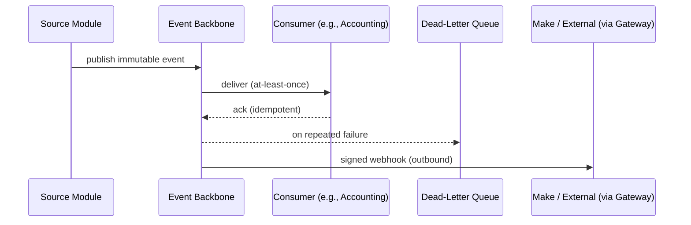

# Integration and Event Architecture (ARC-WP-010)

Document ID: ARC-WP-010
Version: 0.1
Session: [SMEPLUS-26-07-10-001]
Control Level: /L99.99
Status: DRAFT
Approval Status: PREPARED FOR INDEPENDENT REVIEW / HOLD
Gate Status: HOLD

## 1. Document Control

| Field | Value |
|---|---|
| Document ID | ARC-WP-010 |
| Deliverable | INTEGRATION_EVENT_ARCHITECTURE.md |
| Version | 0.1 |
| Architecture Owner | Integration and Event Architecture AI Owner |
| Supporting Owner | API Architecture AI Owner |
| Independent Reviewer | ChatGPT L99 |
| Approval Authority | Boss |
| Created | 2026-07-14 |
| Evidence Path | 99_SMEsPlus_Enterprise_Suite/03_Architecture/STATE03_ARCHITECTURE_ACCELERATION/INTEGRATION_EVENT_ARCHITECTURE.md |
| Verification Status | NOT VERIFIED |

## 2. Purpose

Define the integration and event architecture: API responsibilities, synchronous/asynchronous integration, webhooks, the immutable event model, delivery guarantees, retry/dead-letter, idempotency, integration security, the Make automation boundary and traceability.

## 3. Scope

- Internal and external integration patterns and the event backbone.
- Immutable event rule, delivery semantics, error handling, security.

## 4. Out of Scope

- Detailed API contract definitions (build state).
- Event store technology selection (ARC-WP-008/007, HOLD).

## 5. Architecture Owner

Integration and Event Architecture AI Owner.

## 6. Supporting Owner

API Architecture AI Owner.

## 7. Independent Reviewer

ChatGPT L99.

## 8. Dependencies

- ARC-WP-004 (control events), ARC-WP-005 (module boundaries), ARC-WP-006 (external systems), ARC-WP-007 (event layer), MODULE_SPEC_API_GATEWAY.md, MODULE_SPEC_NOTIFICATION.md.

## 9. Assumptions

- A-001: Modules integrate only via versioned APIs and events (PR-12).
- A-002: Business events are immutable (PR-08).
- A-003: External automation uses Make via controlled webhooks.

## 10. Current State

API Gateway and Notification module specs exist; dependency matrix references are PARTIAL; immutable-event guarantee is a principle without an architecture.

## 11. Target State

An authoritative integration/event architecture defining event ownership, delivery guarantees, idempotency and the external (Make) boundary, ready for contract definition in later states.

## 12. Architecture Model

### 12.1 Integration Principles
Contract-first, versioned APIs; events for cross-module decoupling; no shared-database integration; external ingress only via API Gateway.

### 12.2 API Responsibilities
Synchronous request/response for user-driven operations and queries; validation, entitlement and tenant resolution at the gateway.

### 12.3 Synchronous vs Asynchronous
- Synchronous: user actions requiring immediate result.
- Asynchronous (events/queue): posting, notifications, cross-module propagation, external automation.

### 12.4 Event Model and Immutable Rule
Domain events (e.g., `SalesOrderSubmitted`, `DocumentApproved`, `LedgerPosted`) are append-only, versioned, tenant-scoped and never mutated/deleted (PR-08). Each event has an owning source (ARC-WP-005 ownership).

### 12.5 Delivery Guarantees
At-least-once delivery with idempotent consumers; ordering preserved per aggregate where required.

### 12.6 Retry and Dead-Letter
Failed deliveries retry with backoff; exhausted retries route to a dead-letter queue with alerting and manual replay.

### 12.7 Idempotency
Every consumer uses an idempotency key (event ID / business key) to prevent duplicate side effects (critical for Posting Engine, ARC-WP-004).

### 12.8 Integration Security
Webhooks are signed and verified; external tokens are least-privilege and scoped per tenant; payloads carry no unnecessary personal data.

### 12.9 Make Automation Boundary
Make interacts only through the API Gateway and signed webhooks; it never accesses the data store or internal event bus directly. Make credentials are tenant-scoped and revocable.

### 12.10 Integration Flow Diagram

## 13. Architecture Decisions

- ADR-ARC-002 (Immutable event store): PROPOSED.
- ADR-ARC-017 (At-least-once + idempotent consumers): PROPOSED.
- ADR-ARC-018 (Make integrates only via gateway/signed webhooks): PROPOSED.

## 14. Security Considerations

Unsigned/unverified webhooks and over-privileged external tokens are key risks; signing, scoping and verification are mandatory. Event payloads minimize personal data.

## 15. Privacy and Compliance Considerations

Outbound events to external automation carry minimal data; personal-data-bearing events require justification and are logged.

## 16. Tenant-Isolation Considerations

Every event carries tenant context; consumers reject events outside their tenant scope; external webhooks are tenant-scoped.

## 17. Recovery and Continuity Considerations

Event backbone is durable; replay from the immutable store supports recovery; idempotency prevents double-apply on replay.

## 18. Observability Considerations

Publish/deliver/ack/DLQ metrics and end-to-end correlation IDs; DLQ depth is alertable; delivery latency monitored.

## 19. Capacity and Cost Considerations

Event volume and consumer throughput are capacity dimensions; backpressure and partitioning control cost (ARC-WP-011).

## 20. Risks and Gaps

- R-010-01: Non-idempotent consumer causes duplicate posting on retry. Severity: Critical.
- R-010-02: Unsigned webhook spoofing. Severity: High.
- G-010-01: Event backbone technology not selected (HOLD — stack not locked).

## 21. Measurable Acceptance Criteria

| AC ID | Criterion | Verification Method | Required Evidence |
|---|---|---|---|
| AC-001 | Immutable event rule stated with ownership | Review | Section 12.4 |
| AC-002 | Delivery guarantee + idempotency defined | Review | Sections 12.5/12.7 |
| AC-003 | Retry/dead-letter path defined | Review | Section 12.6 |
| AC-004 | Make boundary restricts to gateway/signed webhooks | Review | Section 12.9 |

## 22. Evidence Requirements

| Evidence ID | Type | GitHub Location | Owner | Reviewer | Verification Status |
|---|---|---|---|---|---|
| EV-ARC-010 | Integration/event architecture | This file path | Integration and Event Architecture AI Owner | ChatGPT L99 | NOT VERIFIED |

## 23. Open Decisions

- OD-010-01: Event backbone technology. DECISION REQUIRED (HOLD).
- OD-010-02: Per-aggregate ordering requirements. DECISION REQUIRED.

## 24. Gate Impact

- Gate B input (API, integration and event strategy). Contributes; does not pass.
- Recommendation: READY FOR INDEPENDENT REVIEW.

## 25. Change History

| Version | Date | Change | Author | Reviewer |
|---|---|---|---|---|
| 0.1 | 2026-07-14 | Initial draft | Integration and Event Architecture AI Owner (Claude Code drafting agent) | Pending (ChatGPT L99) |

## 26. Approval Status

PREPARED FOR INDEPENDENT REVIEW / HOLD. Independent review and Boss decision remain mandatory.
