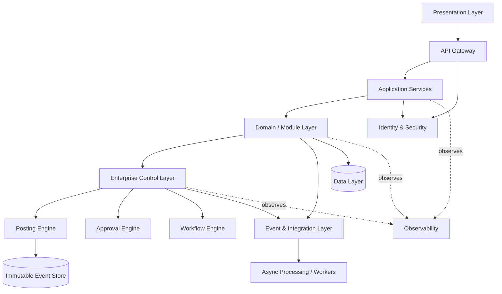

# Logical Component Architecture (ARC-WP-007)

Document ID: ARC-WP-007
Version: 0.1
Session: [SMEPLUS-26-07-10-001]
Control Level: /L99.99
Status: DRAFT
Approval Status: PREPARED FOR INDEPENDENT REVIEW / HOLD
Gate Status: HOLD

## 1. Document Control

| Field | Value |
|---|---|
| Document ID | ARC-WP-007 |
| Deliverable | LOGICAL_COMPONENT_ARCHITECTURE.md |
| Version | 0.1 |
| Architecture Owner | Technical Architecture AI Owner |
| Supporting Owner | Infrastructure Architecture AI Owner |
| Independent Reviewer | ChatGPT L99 |
| Approval Authority | Boss |
| Created | 2026-07-14 |
| Evidence Path | 99_SMEsPlus_Enterprise_Suite/03_Architecture/STATE03_ARCHITECTURE_ACCELERATION/LOGICAL_COMPONENT_ARCHITECTURE.md |
| Verification Status | NOT VERIFIED |

## 2. Purpose

Define the logical component layers of the SMEsPlus Enterprise Suite and their dependency rules, from presentation to data, including enterprise-control, event/integration, identity, observability and asynchronous processing layers.

## 3. Scope

- Logical layers and their responsibilities.
- Dependency direction rules and a logical component diagram.

## 4. Out of Scope

- Physical deployment/infrastructure topology (infrastructure domain).
- Data isolation option selection (ARC-WP-008).

## 5. Architecture Owner

Technical Architecture AI Owner.

## 6. Supporting Owner

Infrastructure Architecture AI Owner.

## 7. Independent Reviewer

ChatGPT L99.

## 8. Dependencies

- ARC-WP-004, ARC-WP-005, ARC-WP-006, ARC-WP-009, ARC-WP-010.

## 9. Assumptions

- A-001: Stateless application services, horizontally scalable (AP-009).
- A-002: Asynchronous processing via a queue/event backbone.
- A-003: Identity and observability are cross-cutting shared services.

## 10. Current State

Layering is implied by principles and module specs but not formalized as a logical component architecture with dependency rules.

## 11. Target State

A defined layered logical architecture with explicit allowed dependency directions, ready to drive component contracts and infrastructure mapping.

## 12. Architecture Model

### 12.1 Layers
1. **Presentation Layer**: web UI (Odoo-first UX reference), API clients.
2. **Application-Services Layer**: request handling, orchestration, entitlement checks.
3. **Domain and Module Layer**: source modules (Sales, Purchase, Inventory, CRM, Accounting).
4. **Enterprise-Control Layer**: Approval Engine, Posting Engine, Workflow Engine, SoD/policy.
5. **Event and Integration Layer**: event backbone, webhooks, external integration (Make).
6. **Data Layer**: tenant-scoped stores, immutable event store, document/object storage.
7. **Identity and Security Services**: authentication, authorization, entitlement, secrets.
8. **Observability Services**: logging, metrics, tracing, health, alerting.
9. **Asynchronous Processing**: queues, workers, scheduled jobs.

### 12.2 Component Diagram

### 12.3 Logical Dependency Rules
- Dependencies flow downward: Presentation → Application → Module → Control → Data.
- Modules never call presentation; lower layers never call upward synchronously (use events).
- Identity, observability and async are cross-cutting and may be used by any layer via defined interfaces.
- Approval and posting are performed by the Approval Engine and Posting Engine respectively, under the governance of the Enterprise-Control layer; the Enterprise-Control layer enforces policy/SoD/scope around these engines but does not itself execute approval or posting (see ARC-WP-004 canonical responsibility model). No module reaches the Posting Engine except via the controlled approval/workflow path.

## 13. Architecture Decisions

- ADR-ARC-002 (Immutable event store as system of record for events): PROPOSED.
- ADR-ARC-014 (Stateless services + async backbone): PROPOSED.

## 14. Security Considerations

Identity/security is a mandatory dependency for application and gateway layers; secrets are isolated from application code.

## 15. Privacy and Compliance Considerations

Document/object storage holding personal data is access-controlled and tenant-scoped; event store avoids storing unnecessary personal data.

## 16. Tenant-Isolation Considerations

Data layer enforces tenant scope; async workers carry tenant context on every job.

## 17. Recovery and Continuity Considerations

Stateless services recover by restart; durable state (data, event store, queues) has defined backup/replay (ARC-WP-011).

## 18. Observability Considerations

Every layer emits structured logs, metrics and traces to the observability services with correlation IDs.

## 19. Capacity and Cost Considerations

Horizontal scaling per layer; async layer absorbs bursts. Event store growth is a capacity/cost dimension.

## 20. Risks and Gaps

- R-007-01: Event store unbounded growth without retention/compaction. Severity: Medium.
- R-007-02: Upward synchronous coupling would break layering. Severity: Medium.
- G-007-01: Concrete technology per layer not selected (HOLD — stack not locked).

## 21. Measurable Acceptance Criteria

| AC ID | Criterion | Verification Method | Required Evidence |
|---|---|---|---|
| AC-001 | Nine logical layers defined with responsibilities | Review | Section 12.1 |
| AC-002 | Component Mermaid diagram present and valid | Diagram render | Section 12.2 |
| AC-003 | Dependency direction rules stated | Review | Section 12.3 |
| AC-004 | Approval/posting performed by their engines under Enterprise-Control governance (control layer governs, does not execute) | Review | Sections 12.2/12.3 |

## 22. Evidence Requirements

| Evidence ID | Type | GitHub Location | Owner | Reviewer | Verification Status |
|---|---|---|---|---|---|
| EV-ARC-007 | Logical component view | This file path | Technical Architecture AI Owner | ChatGPT L99 | NOT VERIFIED |

## 23. Open Decisions

- OD-007-01: Event store technology (linked to ARC-WP-008). DECISION REQUIRED.
- OD-007-02: Event retention/compaction policy. DECISION REQUIRED.

## 24. Gate Impact

- Gate B input (logical architecture). Contributes; does not pass.
- Recommendation: READY FOR INDEPENDENT REVIEW.

## 25. Change History

| Version | Date | Change | Author | Reviewer |
|---|---|---|---|---|
| 0.1 | 2026-07-14 | Initial draft | Technical Architecture AI Owner (Claude Code drafting agent) | Pending (ChatGPT L99) |

## 26. Approval Status

PREPARED FOR INDEPENDENT REVIEW / HOLD. Independent review and Boss decision remain mandatory.
