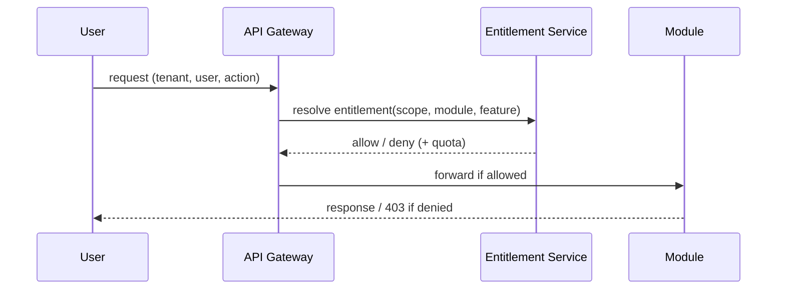

# Subscription and Module Entitlement Model (ARC-WP-003)

Document ID: ARC-WP-003
Version: 0.1
Session: [SMEPLUS-26-07-10-001]
Control Level: /L99.99
Status: DRAFT
Approval Status: PREPARED FOR INDEPENDENT REVIEW / HOLD
Gate Status: HOLD

## 1. Document Control

| Field | Value |
|---|---|
| Document ID | ARC-WP-003 |
| Deliverable | SUBSCRIPTION_ENTITLEMENT_MODEL.md |
| Version | 0.1 |
| Architecture Owner | SaaS Product Architecture AI Owner |
| Supporting Owner | Functional Architecture AI Owner |
| Independent Reviewer | ChatGPT L99 |
| Approval Authority | Boss |
| Created | 2026-07-14 |
| Evidence Path | 99_SMEsPlus_Enterprise_Suite/03_Architecture/STATE03_ARCHITECTURE_ACCELERATION/SUBSCRIPTION_ENTITLEMENT_MODEL.md |
| Verification Status | NOT VERIFIED |

## 2. Purpose

Define how subscriptions, plans, packages and module/feature entitlements are modelled and enforced across Tenant, Company, Branch and User scopes, and how entitlement drives provisioning and access.

## 3. Scope

- Subscription lifecycle and plan/package model.
- Module, user, company and branch entitlement.
- Feature flags, metering, provisioning/deprovisioning, entitlement validation.

## 4. Out of Scope

- Billing system implementation and payment processing (billing boundary only, not billing internals).
- Pricing values and commercial terms.
- Identity internals (ARC-WP-009).

## 5. Architecture Owner

SaaS Product Architecture AI Owner.

## 6. Supporting Owner

Functional Architecture AI Owner.

## 7. Independent Reviewer

ChatGPT L99.

## 8. Dependencies

- ARC-WP-002 (tenant/company/branch scopes), ARC-WP-004 (control enforcement), ARC-WP-009 (access), ARC-WP-005 (module boundaries).

## 9. Assumptions

- A-001: Modules are independently activatable per SaaS Foundation AP-006.
- A-002: Entitlement is evaluated at request time before business logic.
- A-003: A Tenant holds one active subscription; a subscription references one plan plus optional add-on packages.

## 10. Current State

SaaS Foundation principles require subscription-driven module activation and feature flags, but no consolidated entitlement model exists across scopes.

## 11. Target State

An authoritative entitlement model where subscription → plan/package → module/feature entitlements resolve deterministically per scope and are enforced by the Enterprise Control layer and API Gateway.

## 12. Architecture Model

### 12.1 Subscription Lifecycle
`TRIAL → ACTIVE → (SUSPENDED) → (RENEWED) → EXPIRED → TERMINATED`. Each transition emits an immutable event and triggers provisioning/deprovisioning.

### 12.2 Plan and Package Model
- **Plan**: base tier granting a defined module set and quotas.
- **Package**: add-on granting additional modules/features.
- **Entitlement**: the resolved effective set = plan ∪ packages, bounded by quotas.

### 12.3 Entitlement Scopes
- Module entitlement: which modules a Tenant may run.
- Company/Branch entitlement: which organizational scopes a module is active in.
- User entitlement: named-user or seat allocation within entitled modules.

### 12.4 Feature Flags
Fine-grained enable/disable within an entitled module, evaluated per tenant/company.

### 12.5 Usage and Metering
Metered dimensions (e.g., active users, documents, storage) are counted per tenant for quota enforcement and billing hand-off. Concrete metered dimensions: TBD with Owner.

### 12.6 Provisioning and Deprovisioning
On ACTIVE, provisioning enables entitled modules and default configuration. On SUSPENDED/EXPIRED, deprovisioning blocks new transactions while preserving data (no deletion).

### 12.7 Entitlement Validation Flow

## 13. Architecture Decisions

- ADR-ARC-005 (Entitlement evaluated at gateway before business logic): PROPOSED.
- ADR-ARC-006 (Suspension preserves data, blocks transactions): PROPOSED.

## 14. Security Considerations

Entitlement bypass equals unauthorized feature access; entitlement decisions must be server-side and audited. Feature flags must fail closed.

## 15. Privacy and Compliance Considerations

Metering must count events without storing unnecessary personal data. Billing hand-off transfers only aggregate usage.

## 16. Tenant-Isolation Considerations

Entitlement records are tenant-scoped; one tenant cannot read or influence another tenant's entitlement.

## 17. Recovery and Continuity Considerations

Entitlement state must be restorable and consistent with subscription state after recovery; mismatches must be detectable.

## 18. Observability Considerations

Entitlement decisions (allow/deny, quota hits) are logged and metered; quota-exhaustion is alertable.

## 19. Capacity and Cost Considerations

Metering data feeds capacity and cost models (ARC-WP-011). High-frequency entitlement checks require caching with correct invalidation on subscription change.

## 20. Risks and Gaps

- R-003-01: Stale entitlement cache could grant revoked access. Severity: High. Mitigation: event-driven cache invalidation.
- G-003-01: Metered dimensions undefined (TBD with Owner).
- G-003-02: Billing system boundary/interface not yet specified.

## 21. Measurable Acceptance Criteria

| AC ID | Criterion | Verification Method | Required Evidence |
|---|---|---|---|
| AC-001 | Subscription lifecycle states enumerated with transitions | Review | Section 12.1 |
| AC-002 | Entitlement resolvable per tenant/company/branch/user | Review | Section 12.3 |
| AC-003 | Validation flow shows deny path (fail closed) | Diagram review | Section 12.7 |
| AC-004 | Metered dimensions either listed or marked TBD with Owner | Review | Section 12.5 |

## 22. Evidence Requirements

| Evidence ID | Type | GitHub Location | Owner | Reviewer | Verification Status |
|---|---|---|---|---|---|
| EV-ARC-003 | Entitlement model | This file path | SaaS Product Architecture AI Owner | ChatGPT L99 | NOT VERIFIED |

## 23. Open Decisions

- OD-003-01: Define metered dimensions. DECISION REQUIRED.
- OD-003-02: Define billing-system boundary/interface. DECISION REQUIRED.

## 24. Gate Impact

- Gate B input (subscription/entitlement architecture). Contributes; does not pass.
- Recommendation: READY FOR INDEPENDENT REVIEW.

## 25. Change History

| Version | Date | Change | Author | Reviewer |
|---|---|---|---|---|
| 0.1 | 2026-07-14 | Initial draft | SaaS Product Architecture AI Owner (Claude Code drafting agent) | Pending (ChatGPT L99) |

## 26. Approval Status

PREPARED FOR INDEPENDENT REVIEW / HOLD. Independent review and Boss decision remain mandatory.
