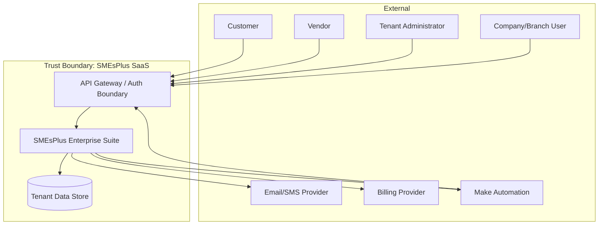

# High-Level System Context (ARC-WP-006)

Document ID: ARC-WP-006
Version: 0.1
Session: [SMEPLUS-26-07-10-001]
Control Level: /L99.99
Status: DRAFT
Approval Status: PREPARED FOR INDEPENDENT REVIEW / HOLD
Gate Status: HOLD

## 1. Document Control

| Field | Value |
|---|---|
| Document ID | ARC-WP-006 |
| Deliverable | SYSTEM_CONTEXT_ARCHITECTURE.md |
| Version | 0.1 |
| Architecture Owner | Technical Architecture AI Owner |
| Supporting Owner | Integration Architecture AI Owner |
| Independent Reviewer | ChatGPT L99 |
| Approval Authority | Boss |
| Created | 2026-07-14 |
| Evidence Path | 99_SMEsPlus_Enterprise_Suite/03_Architecture/STATE03_ARCHITECTURE_ACCELERATION/SYSTEM_CONTEXT_ARCHITECTURE.md |
| Verification Status | NOT VERIFIED |

## 2. Purpose

Define the high-level system context of the SMEsPlus Enterprise Suite: its boundary, internal and external actors, external systems, trust boundaries and high-level data movement.

## 3. Scope

- System boundary and actors (internal/external).
- External systems and integration/authentication/infrastructure boundaries.
- High-level data movement and trust boundaries.

## 4. Out of Scope

- Internal component decomposition (ARC-WP-007).
- Detailed integration mechanics (ARC-WP-010).

## 5. Architecture Owner

Technical Architecture AI Owner.

## 6. Supporting Owner

Integration Architecture AI Owner.

## 7. Independent Reviewer

ChatGPT L99.

## 8. Dependencies

- ARC-WP-004, ARC-WP-005, ARC-WP-007, ARC-WP-009, ARC-WP-010.

## 9. Assumptions

- A-001: SMEsPlus is a cloud-hosted multi-tenant SaaS accessed via web and API.
- A-002: External automation uses Make (per PR/integration scope) and controlled webhooks.
- A-003: A single API Gateway is the external ingress boundary.

## 10. Current State

Module specs and SaaS Foundation imply web, API and external automation channels, but no consolidated system-context view or trust-boundary map exists at the Enterprise Suite level.

## 11. Target State

An authoritative system-context diagram and description identifying every actor, external system and trust boundary, providing the frame for Gate B architecture artifacts.

## 12. Architecture Model

### 12.1 Actors
- **Internal actors**: Tenant Administrator, Company/Branch users, Approvers, Platform Operations/Support.
- **External actors**: Customers (via CRM/sales channels), Vendors, Auditors.

### 12.2 External Systems
- Billing/payment provider (boundary only).
- Email/SMS/notification providers.
- Make automation platform and external webhook consumers.
- Identity provider(s) for federation (option; DECISION REQUIRED).

### 12.3 System-Context Diagram

### 12.4 Trust Boundaries
- Boundary 1: public internet ↔ API Gateway (authentication/TLS).
- Boundary 2: API Gateway ↔ application services (authorization, tenant resolution).
- Boundary 3: application ↔ data store (tenant isolation enforcement).
- Boundary 4: application ↔ external providers (outbound, controlled, least-data).

### 12.5 High-Level Data Movement
Inbound requests authenticate at the gateway, resolve tenant, pass to modules, persist to tenant-scoped storage, and emit events/notifications outbound. No external system reads the data store directly.

## 13. Architecture Decisions

- ADR-ARC-012 (Single API Gateway as sole external ingress): PROPOSED.
- ADR-ARC-013 (External identity federation option): PROPOSED / DECISION REQUIRED.

## 14. Security Considerations

The gateway is the primary attack surface; all external traffic is authenticated and TLS-terminated there. Outbound integrations follow least-data.

## 15. Privacy and Compliance Considerations

Personal data leaving to external providers (email/SMS/billing) is minimized and logged; cross-border transfer implications are an open compliance item.

## 16. Tenant-Isolation Considerations

Tenant context is established at the gateway and carried through every downstream call; external systems never receive cross-tenant data.

## 17. Recovery and Continuity Considerations

External dependencies (notification, billing) must degrade gracefully; the core remains available if a non-critical external provider is down.

## 18. Observability Considerations

All boundary crossings are logged with correlation IDs; external call success/latency are monitored.

## 19. Capacity and Cost Considerations

Gateway throughput and external-provider call volume are capacity/cost dimensions (ARC-WP-011).

## 20. Risks and Gaps

- R-006-01: External provider outage cascading to core flows. Severity: Medium. Mitigation: async + graceful degradation.
- G-006-01: Identity federation decision open.
- G-006-02: Cross-border data transfer compliance undefined.

## 21. Measurable Acceptance Criteria

| AC ID | Criterion | Verification Method | Required Evidence |
|---|---|---|---|
| AC-001 | All internal and external actors listed | Review | Section 12.1 |
| AC-002 | System-context Mermaid diagram present and valid | Diagram render | Section 12.3 |
| AC-003 | Four trust boundaries defined | Review | Section 12.4 |
| AC-004 | No external system reads the data store directly | Review | Section 12.5 |

## 22. Evidence Requirements

| Evidence ID | Type | GitHub Location | Owner | Reviewer | Verification Status |
|---|---|---|---|---|---|
| EV-ARC-006 | System-context view | This file path | Technical Architecture AI Owner | ChatGPT L99 | NOT VERIFIED |

## 23. Open Decisions

- OD-006-01: Identity federation approach. DECISION REQUIRED.
- OD-006-02: Cross-border data transfer / hosting region. DECISION REQUIRED.

## 24. Gate Impact

- Gate B input (system context and solution boundary). Contributes; does not pass.
- Recommendation: READY FOR INDEPENDENT REVIEW.

## 25. Change History

| Version | Date | Change | Author | Reviewer |
|---|---|---|---|---|
| 0.1 | 2026-07-14 | Initial draft | Technical Architecture AI Owner (Claude Code drafting agent) | Pending (ChatGPT L99) |

## 26. Approval Status

PREPARED FOR INDEPENDENT REVIEW / HOLD. Independent review and Boss decision remain mandatory.
