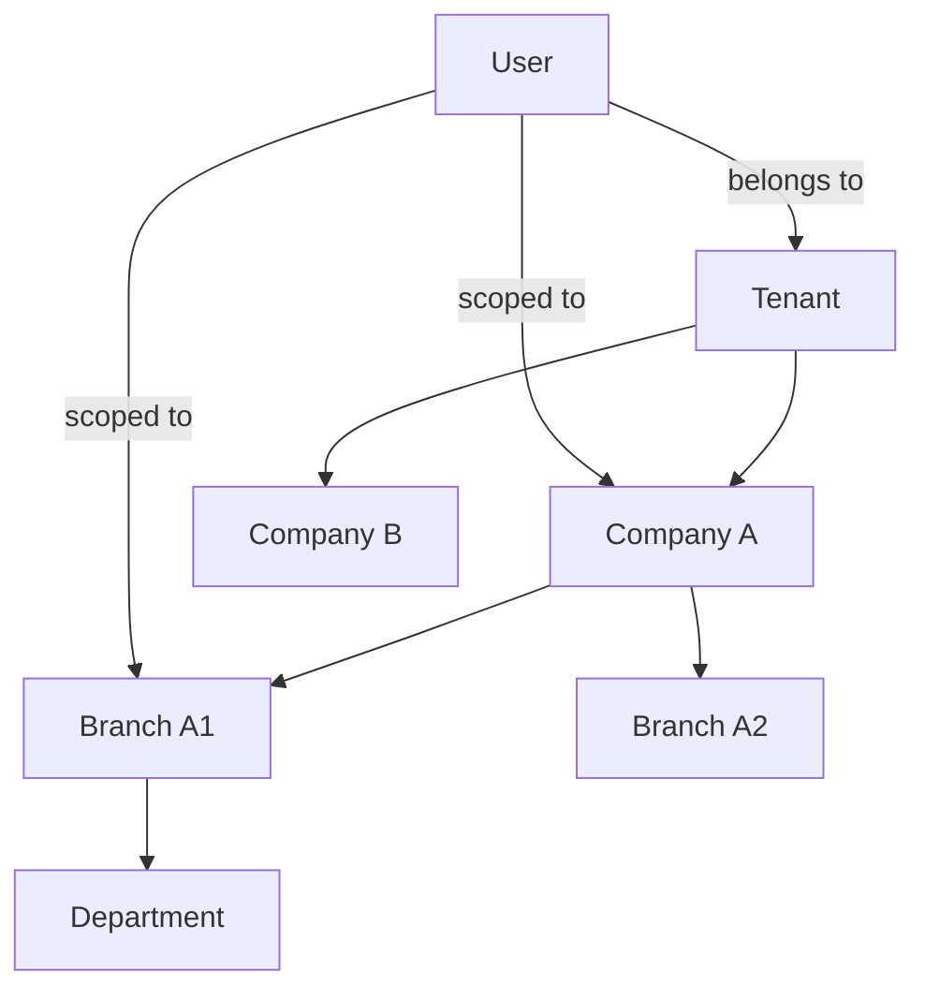

# Tenant, Company and Branch Model (ARC-WP-002)

Document ID: ARC-WP-002
Version: 0.1
Session: [SMEPLUS-26-07-10-001]
Control Level: /L99.99
Status: DRAFT
Approval Status: PREPARED FOR INDEPENDENT REVIEW / HOLD
Gate Status: HOLD

## 1. Document Control

| Field | Value |
|---|---|
| Document ID | ARC-WP-002 |
| Deliverable | TENANT_COMPANY_BRANCH_MODEL.md |
| Version | 0.1 |
| Architecture Owner | Multi-Tenant Architecture AI Owner |
| Supporting Owner | Data Architecture AI Owner |
| Independent Reviewer | ChatGPT L99 |
| Approval Authority | Boss |
| Created | 2026-07-14 |
| Evidence Path | 99_SMEsPlus_Enterprise_Suite/03_Architecture/STATE03_ARCHITECTURE_ACCELERATION/TENANT_COMPANY_BRANCH_MODEL.md |
| Verification Status | NOT VERIFIED |

## 2. Purpose

Define the organizational data model for tenancy in SMEsPlus: the Tenant, Company and Branch entities, their relationships to users and data scope, their lifecycles, and the isolation and ownership rules that govern them.

## 3. Scope

- Tenant, Company, Branch, Department organizational entities and their hierarchy.
- User-to-tenant, user-to-company, user-to-branch relationships and data scope.
- Lifecycle states and cross-company transaction controls.
- Grounded in `FR_DETAIL_TENANT_MANAGEMENT.md` and `FR_DETAIL_ORGANIZATION_MANAGEMENT.md`.

## 4. Out of Scope

- Physical database isolation option selection (owned by ARC-WP-008).
- Subscription/entitlement mechanics (owned by ARC-WP-003).
- Authentication and RBAC internals (owned by ARC-WP-009).

## 5. Architecture Owner

Multi-Tenant Architecture AI Owner.

## 6. Supporting Owner

Data Architecture AI Owner.

## 7. Independent Reviewer

ChatGPT L99.

## 8. Dependencies

- ARC-WP-008 (isolation option), ARC-WP-009 (IAM data scope), ARC-WP-003 (entitlement), ARC-WP-004 (enterprise control), FR-TEN and FR-ORG functional requirements.

## 9. Assumptions

- A-001: Tenant is the top-level commercial and isolation boundary.
- A-002: A Tenant may contain multiple Companies (legal entities); a Company may contain multiple Branches; a Branch may contain Departments.
- A-003: A legal-entity accounting boundary aligns to Company, not Tenant.
- A-004: Users belong to exactly one Tenant but may be scoped to one or many Companies/Branches.

## 10. Current State

Functional specs define Tenant and Organization (Company/Branch/Department) entities with isolation and lifecycle requirements (FR-TEN-001..010, FR-ORG-001..010) but no consolidated architectural model of the hierarchy, ownership and cross-company controls.

## 11. Target State

A single authoritative organizational model defining entities, hierarchy, user scoping, lifecycle, and cross-company transaction controls, ready to drive isolation (ARC-WP-008) and access (ARC-WP-009) design.

## 12. Architecture Model

### 12.1 Definitions
- **Tenant**: The subscribing customer organization; the top-level isolation, entitlement and billing boundary.
- **Company**: A legal entity within a Tenant; the accounting/posting boundary (owns its own ledger, tax identity).
- **Branch**: An operational location within a Company; a transaction and reporting scope.
- **Department**: An internal unit within a Branch; an optional approval and cost scope.

### 12.2 Hierarchy

### 12.3 Relationships
- User-to-Tenant: mandatory, exactly one.
- User-to-Company: one-to-many scope assignment.
- User-to-Branch: one-to-many scope assignment, must be within an assigned Company.
- User-to-Department: optional scope.

### 12.4 Shared Service Rules
Platform services (identity, notification, audit, entitlement) are shared infrastructure but always resolve and enforce tenant context before returning data.

### 12.5 Data-Scope Rules
Every business record carries `tenant_id` (mandatory), and where applicable `company_id`, `branch_id`. Reads are filtered by the caller's assigned scope; writes are rejected outside assigned scope.

### 12.6 Cross-Company Transaction Controls
Inter-company transactions (e.g., inter-company transfer) are permitted only through an explicit, approval-gated inter-company document; no implicit cross-company posting is allowed. This is a candidate ADR (DECISION REQUIRED).

## 13. Architecture Decisions

- ADR-ARC-003 (Company = legal/accounting boundary): PROPOSED.
- ADR-ARC-004 (Cross-company transactions require explicit inter-company document): PROPOSED.

## 14. Security Considerations

Scope enforcement is a security control; a mis-scoped assignment is a data-exposure risk. Scope changes must be audited (immutable event).

## 15. Privacy and Compliance Considerations

Company-level legal identity may carry regulated data (tax IDs); such fields are classified and access-controlled. PDPA applicability: DECISION REQUIRED.

## 16. Tenant-Isolation Considerations

Tenant is the hard isolation boundary; Company/Branch are logical scopes within a tenant. The physical enforcement mechanism is selected in ARC-WP-008.

## 17. Recovery and Continuity Considerations

Backup and restore must preserve referential integrity of the Tenant→Company→Branch→Department tree and must be restorable per-tenant (linked to ARC-WP-011 RPO/RTO).

## 18. Observability Considerations

Lifecycle transitions (create/activate/suspend) for each entity emit audit events; suspended-entity transaction attempts are logged and alertable.

## 19. Capacity and Cost Considerations

Tenant and company counts drive capacity planning; per-tenant record volumes feed cost allocation (ARC-WP-011).

## 20. Risks and Gaps

- R-002-01: Ambiguity between Company-as-legal-entity vs Branch-as-legal-entity in some SME structures. Severity: High. Owner: Multi-Tenant Architecture AI Owner.
- G-002-01: Inter-company transaction rules not yet defined in functional specs.

## 21. Measurable Acceptance Criteria

| AC ID | Criterion | Verification Method | Required Evidence |
|---|---|---|---|
| AC-001 | Tenant, Company, Branch, Department each defined with a single boundary role | Review | This file |
| AC-002 | User-to-scope relationships fully specified | Review | Section 12.3 |
| AC-003 | Cross-company control rule stated with an ADR reference | Traceability | ARC-WP-012 |
| AC-004 | Every business record scope key (tenant/company/branch) enumerated | Review | Section 12.5 |

## 22. Evidence Requirements

| Evidence ID | Type | GitHub Location | Owner | Reviewer | Verification Status |
|---|---|---|---|---|---|
| EV-ARC-002 | Organizational model | This file path | Multi-Tenant Architecture AI Owner | ChatGPT L99 | NOT VERIFIED |

## 23. Open Decisions

- OD-002-01: Confirm legal-entity mapping (Company vs Branch). DECISION REQUIRED.
- OD-002-02: Confirm inter-company transaction model. DECISION REQUIRED.

## 24. Gate Impact

- Gate B automatic-HOLD condition "tenant model unclear" is directly addressed here. Contributes to Gate B; does not pass it.
- Recommendation: READY FOR INDEPENDENT REVIEW.

## 25. Change History

| Version | Date | Change | Author | Reviewer |
|---|---|---|---|---|
| 0.1 | 2026-07-14 | Initial draft | Multi-Tenant Architecture AI Owner (Claude Code drafting agent) | Pending (ChatGPT L99) |

## 26. Approval Status

PREPARED FOR INDEPENDENT REVIEW / HOLD. Independent review and Boss decision remain mandatory.
