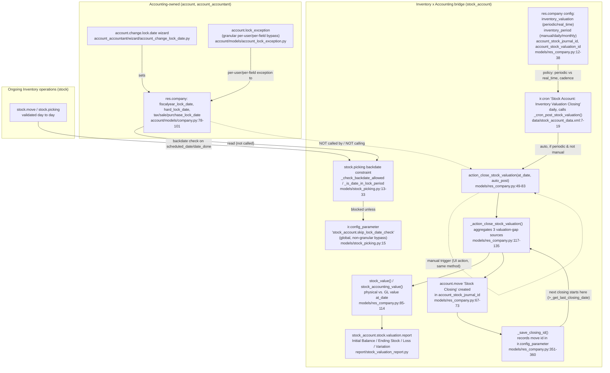

# CORR-007B — Boss Challenge Addendum: N-A12-01 Account-Led Inventory Period Close Functional Design Proof

Session: `SMEPLUS-26-09-02-CORR007B-3HIGH-CLOSURE-001` (Boss Challenge Addendum)
Repository: `TH-PATTARAKRIT/AI-Collaboration-Hub`
Branch: `audit/inventory-core-corr007b-3high-closure-010`
Base commit: `deceb7339b39eba309236782f159f8393224f5fd`
Timestamp: 2026-09-02
Mode: Evidence-first / clean-room / no development authorization / read-only

## 0. Why this file exists

Boss rejected the original `03_CORR007B_N_A12_01_CROSS_YEAR_CONTINUITY_PROOF.md` disposition
(`CONTROLLED ACCOUNTING X INVENTORY CROSS-PROOF CARRY-FORWARD`) as insufficient for Functional Design.
Boss's position: fiscal-year close is a functional workflow — Accounting closes/locks stock movement,
establishes stock quantity and valuation as of the close date, and produces inventory value for
accounting closing — not merely a source-code lock-date citation. `N-A12-01` is reopened as:

**`ACCOUNT-LED INVENTORY PERIOD CLOSE FUNCTIONAL DESIGN GAP — HIGH UNTIL PROVEN.`**

This file proves (or explicitly fails to prove, naming the gap) each of Boss's 10 required points, from
primary source and dump/schema evidence, with line-level citations and a workflow diagram. It does not
close the item — see §11.

## 1. Method

- Same primary source root as the rest of this package: `ACCOUNT/01 ACCOUNT/SOURCE CODE/` (local
  filesystem, outside the git repo).
- Primary module this time: `stock_account` (the bridge module — `stock_account/__manifest__.py:22`:
  `'depends': ['stock', 'account']`). This is significant: the mechanism Boss is asking about does not
  live purely inside `account`, nor purely inside `stock` — it lives in the module built specifically to
  join them.
- Every method below was read in full, not grepped for names only, per Boss's proof point 9.

## 2. Proof point 1 — end-to-end workflow



**Reading the diagram**: there are two structurally separate mechanisms, not one Accounting-commands-
Inventory pipeline. Both read/write company-level configuration, but neither invokes the other in code.
This is stated precisely because it refines Boss's framing with evidence rather than simply confirming
it — see §3.

## 3. Proof point 2 — how Accounting initiates or controls the close

**What is proven**: Accounting controls two distinct levers, both on `res.company`:

1. **Lock dates** (`fiscalyear_lock_date`, `hard_lock_date`, `tax_lock_date`, `sale_lock_date`,
   `purchase_lock_date`) — declared in `account/models/company.py:78-101`. Set through the
   `account.change.lock.date` transient wizard (`account_accountant/wizard/account_change_lock_date.py`,
   full file read), which is an Accounting-menu-only wizard with no Inventory-side fields. This is
   evidence-supported as **Accounting-initiated**.
2. **Inventory valuation policy** (`inventory_valuation`, `inventory_period`,
   `account_stock_journal_id`, `account_stock_valuation_id`) — declared in
   `stock_account/models/res_company.py:12-38`, inside the bridge module, alongside a default set by
   the module's own data file: `stock_account/data/stock_account_data.xml:4-5` sets
   `product.category.property_cost_method = 'standard'` and `property_valuation = 'periodic'` as the
   out-of-the-box default. This is a **configuration decision**, typically made once during
   implementation (by whoever configures Inventory Valuation settings — in practice Finance/Accounting
   in most Odoo deployments, but the code does not restrict this to an Accounting-only screen the way
   lock dates are).

**What is NOT proven, stated precisely rather than assumed**: there is no code path in which setting
`fiscalyear_lock_date` (lock-date lever) triggers, requires, or even checks
`action_close_stock_valuation` (valuation-closing lever), or vice versa. `_action_close_stock_valuation`
(`res_company.py:117-135`, full body read) contains no call to `_get_lock_date_violations` and no read
of `fiscalyear_lock_date`/`hard_lock_date`. The two mechanisms are **parallel, not sequenced** in
source. Boss's framing ("Accounting commands Inventory to close") describes the *intended business
outcome*; the *actual Odoo reference implementation* achieves it through two independently-triggered
mechanisms that share configuration state on `res.company`, not through a command/event from one to the
other. This distinction matters for SMEsPlus functional design: nothing in source prevents a company
from locking the fiscal year while its periodic stock valuation closing is stale, or from running a
stock valuation closing dated after the fiscal year is already locked — see §10 gap G-1.

## 4. Proof point 3 — how `stock.move` is locked, restricted, backdate-controlled, or cut off

**Enforcement point is `stock.picking`, not `stock.move`.** Confirmed by full-tree search
(`grep -rn "lock_date\|_is_date_in_lock_period\|_get_lock_date_violations" stock_account/models/*.py`):
the only hit is `stock_picking.py`. `stock/models/stock_move.py` (grepped for `_check_company_lock_dates`
and date-write guards) has no lock-date-aware constraint of its own.

- `stock_account/models/stock_picking.py:13-19` — `_check_backdate_allowed()`
  (`@api.constrains("scheduled_date", "date_done")`): raises `ValidationError` if
  `picking._is_date_in_lock_period()`, **unless** `ir.config_parameter`
  `stock_account.skip_lock_date_check` is set — a single global boolean, company-and-user-agnostic, with
  no reason/expiry/audit trail (contrast with Accounting's `account.lock_exception`, §7).
- `stock_account/models/stock_picking.py:21-25` — `_compute_is_date_editable()`: a `done`/`cancel`
  picking's date becomes non-editable in the UI once it is in a locked period.
- `stock_account/models/stock_picking.py:27-33` — `_is_date_in_lock_period()`: checks both
  `scheduled_date` (if `state == 'done'`) and `date_done` (if set) against
  `company_id._get_lock_date_violations(..., fiscalyear=True, sale=False, purchase=False, tax=False,
  hard=True)` — i.e. only the fiscal-year and hard lock dates gate stock movement dates; sale/purchase/
  tax lock dates do not.

**Conclusion**: the cutoff mechanism is real, hard-enforced (`ValidationError`, not a warning), and
tied to the correct Accounting-owned lock fields — but it operates at the transfer-document level
(`stock.picking`), and it has exactly one bypass, which is blunt (global on/off) rather than granular.

## 5–6. Proof points 4–5 — stock quantity and valuation as of the closing date

- `stock_account/models/res_company.py:85-93` — `stock_value(accounts_by_product, at_date)`: for each
  valued product, reads `product.with_context(to_date=at_date).total_value` and buckets it by the
  product's valuation account. This is the **physical/inventory-side** value as of an arbitrary date.
- `stock_account/models/product.py:169-274` (full block read) — `total_value` field, computed by
  `_compute_value()`, `@api.depends_context('to_date', 'company', 'warehouse_id')`. When `to_date` is in
  context:
  - Standard-cost products: `standard_price * qty_available` (evaluated with `to_date`/`at_date`
    context, so `qty_available` itself is historically reconstructed).
  - Other cost methods: dispatches to `_run_standard_batch(at_date=at_date)`,
    `_run_average_batch(at_date=at_date)`, or `_run_fifo_batch(at_date=at_date)` depending on
    `cost_method` — i.e. FIFO/AVCO valuation is recomputed **as of the requested date**, not only as of
    today.
- `stock_account/models/res_company.py:96-114` — `stock_accounting_value(accounts_by_product, at_date)`:
  the **GL/accounting-side** value as of the same date — sums `account.move.line.balance` for the
  relevant stock valuation accounts, filtered to `parent_state = 'posted'` and `date <= at_date`.
- `stock_account/models/product.py:62-77` — `property_cost_method`/`property_valuation` on
  `product.category` can override the company default per category (falls back to
  `self.env.company.inventory_valuation`/`cost_method` when unset).

**Conclusion**: both proof points are directly proven. The mechanism computes physical quantity/value
and GL-posted value independently, at any date, by construction — this is what makes the reconciliation
in §6 possible at all.

## 7. Proof point 6 — how valuation posts or reconciles to Accounting / GL

**Posting**: `action_close_stock_valuation(at_date, auto_post)` (`res_company.py:49-83`, full body read):
1. Guards ordering: `_get_last_closing_date()` must not be after `at_date` (`res_company.py:53-55`) — a
   closing cannot be back-dated before an already-existing closing.
2. Calls `_action_close_stock_valuation(at_date)` (`res_company.py:117-135`), which aggregates three
   sources of account-move-line values:
   - `_get_location_valuation_vals` (`:170-227`) — inventory-loss/location-reclassification entries for
     periodically-valued products moved since the last closing.
   - `_get_stock_valuation_account_vals` (`:228-263`) — the variance between `stock_value()` (physical)
     and `stock_accounting_value()` (GL) per account — the actual "true-up" entry.
   - `_get_continental_realtime_variation_vals` (`:264-311`) — for real-time-valuation products, the
     variation over the period since the fiscal-year start (`self.compute_fiscalyear_dates(...)
     ['date_from']`, an Accounting-owned method).
3. Requires `account_stock_journal_id` and `account_stock_valuation_id` to be configured, else raises
   `UserError` (`:61-64`) — no silent posting to an unconfigured account.
4. Creates one `account.move` (`ref = 'Stock Closing'`) in the configured journal (`:66-72`); posts it
   immediately only if `auto_post=True`.

**Automatic trigger**: `_cron_post_stock_valuation()` (`:136-143`, wired to `ir.cron` record
`ir_cron_post_stock_valuation` in `stock_account/data/stock_account_data.xml:7-19`, `interval_type =
days`, `interval_number = 1` — runs daily) selects companies where `inventory_period` is `daily` (or
`monthly` on the last day of the month) **and** `inventory_valuation != 'real_time'`, and calls
`action_close_stock_valuation(auto_post=True)` for each. Manual triggering is also possible: the method
returns an `ir.actions.act_window` opening the created move's form (`:78-82`), and a front-end
controller exists at `stock_account/static/src/stock_valuation/controller.js` (existence confirmed;
this session did not read its JS logic in full, so the exact manual-trigger UI path is not itself
source-cited beyond the model-level action it must call).

**Reconciliation report**: `stock_account/report/stock_valuation_report.py` (full `_get_report_data`
method read, lines 28-70+) — the `stock_account.stock.valuation.report` abstract model computes, for any
date: `Initial Balance` (= `stock_accounting_value`, i.e. what Accounting has posted), `Ending Stock` (=
`stock_value`, i.e. physical valuation), `Inventory Loss`, and `Stock Variation` — this is the literal,
purpose-built Accounting-x-Inventory reconciliation artifact Boss is asking for evidence of.

## 8. Proof point 7 — how opening quantity/value carry into the next fiscal year

**No separate "opening balance" entry is created.** Instead, continuity is structural:

- `stock.quant` is a live, perpetual balance — there is nothing to "carry forward" for physical
  quantity; the same row continues across any period boundary by construction (this was already
  established for `N-A7-01`/`N-A7-02`).
- For valuation: `_get_last_closing_date()` (`res_company.py:332-350`, full body read) retrieves the
  date of the most recent **posted** closing `account.move`, by reading a list of move IDs stored in
  `ir.config_parameter` under key `f'{company.id}.stock_valuation_closing_ids'`.
  `_get_location_valuation_vals` (`:183-184`) and other aggregators explicitly restrict their move
  domain to `date > last_closing_date`. This means the *next* closing's calculation starts exactly where
  the *previous* closing left off — the prior closing's `Ending Stock` position is implicitly the next
  period's opening position, enforced by domain filtering rather than by a posted "opening" journal
  entry.
- `_save_closing_id()` (`:351-360`, full body read) appends the new closing move's id to that same
  `ir.config_parameter` list after each closing, capping the stored history at the 10 most recent
  closings.

**Conclusion**: this proves continuity as a *running ledger* mechanism (each closing is bounded by the
last one), not as an explicit fiscal-year-opening posting. This is a materially different design from
classic GL fiscal-year opening/closing entries, and should be stated as such to Team B rather than
assumed to work the same way Accounting's own year-end close does.

## 9. Proof point 8 — how post-close stock corrections are handled

Two separate, asymmetric correction mechanisms exist:

- **Accounting side**: `account.lock_exception` (`account/models/account_lock_exception.py`, full file
  read) — a real model with `state` (`active`/`revoked`/`expired`, computed), `user_id` (blank = applies
  to everyone), `reason`, `end_datetime` (blank = permanent), and `lock_date_field` restricted to
  `fiscalyear_lock_date`, `tax_lock_date`, `sale_lock_date`, `purchase_lock_date` — **`hard_lock_date` is
  not an allowed value**, consistent with its own field help text ("irreversible and does not allow any
  exception"). Exceptions are created and managed through `account.change.lock.date`
  (`account_accountant/wizard/...`, §3), which computes per-user and per-everyone effective lock dates.
- **Inventory side**: `stock_picking._check_backdate_allowed()` has exactly one override,
  `ir.config_parameter('stock_account.skip_lock_date_check')` (`stock_picking.py:15`) — a global boolean
  with **no `user_id`, no `reason`, no `end_datetime`, no state tracking, and no link to
  `account.lock_exception` at all.** Setting it disables the picking-date check for every user and every
  company sharing that parameter scope until it is unset again, with no record of who set it, why, or
  for how long.

**This asymmetry is a genuine functional-design gap**, not just a note: SMEsPlus inherits Accounting's
carefully governed, audited exception workflow, but Inventory's own post-close correction path is a
single unaudited kill-switch. This is named explicitly as a required Team B design input in §10 (G-2).

## 10. Named gaps (Boss's framing corrected/refined by evidence, not merely confirmed)

- **G-1 — No sequencing guarantee between the two mechanisms.** Nothing in source ensures Accounting's
  fiscal-year lock and Inventory's periodic valuation closing happen in the correct order relative to
  each other. A company could lock the fiscal year with stock valuation closing stale, or vice versa.
  Not disproven either — this session found no evidence either preventing or guaranteeing correct
  sequencing; it is an open design question for SMEsPlus, not a proven-safe behavior of the reference
  system.
- **G-2 — Asymmetric correction governance.** Accounting's `account.lock_exception` is granular and
  audited; Inventory's `skip_lock_date_check` bypass is global and unaudited (§9).
- **G-3 — Enforcement granularity.** Backdate protection is at `stock.picking` level, not per
  `stock.move` line (§4) — a multi-line transfer is blocked or allowed as a whole, not line-by-line.
- **G-4 — Manual-trigger UI path not source-verified.** The JS controller for manually triggering a
  closing (§7) exists but was not read in full this session; the exact manual UX (e.g. whether a user
  can pick an arbitrary `at_date`, whether `auto_post` defaults true or false from the UI) is not
  independently confirmed from source, only inferred from the model-level method signature.
- **G-5 — This proves Odoo's reference mechanism, not SMEsPlus's migration cutover.** Everything above
  describes how the *mechanism* works in the reference source. It does not prove that a real SMEsPlus
  legacy-to-target cutover will correctly establish the *first* opening balance (there is no "period
  before period one" to inherit from `_get_last_closing_date()` on a fresh migrated database), nor that
  it reconciles against Accounting's own opening trial balance/COA migration evidence. This was the
  original, narrower cross-proof gap identified in `03_CORR007B_N_A12_01_CROSS_YEAR_CONTINUITY_PROOF.md`
  and it is **not resolved by this deeper mechanism proof** — it is a distinct, still-open question.

## 11. Event matrix

| # | Event | Trigger | Owning module | Result | Source citation |
|---|---|---|---|---|---|
| 1 | Lock dates set | Manual, Accounting user via wizard | `account_accountant` | `res.company.fiscalyear_lock_date`/`hard_lock_date`/etc. updated | `account_change_lock_date.py` |
| 2 | Inventory valuation policy set | Manual, one-time config (module default: periodic/standard) | `stock_account` | `res.company.inventory_valuation`/`inventory_period` set; category can override | `res_company.py:12-38`; `stock_account_data.xml:4-5` |
| 3 | Stock picking validated with a date in a locked period | Any user action | `stock_account` (constraint on `stock`'s `stock.picking`) | `ValidationError`, unless global skip param set | `stock_picking.py:13-19` |
| 4 | Daily cron fires | Scheduled, every 1 day | `stock_account` | For periodic, non-manual companies, calls closing | `stock_account_data.xml:7-19`; `res_company.py:136-143` |
| 5 | Closing computed | Cron or manual action | `stock_account` | Aggregates location/variance/continental vals | `res_company.py:49-135` |
| 6 | Closing move posted | `auto_post=True` (always true from cron) | `stock_account` → `account` | `account.move` posted in stock journal | `res_company.py:67-75` |
| 7 | Closing boundary recorded | After move creation | `stock_account` | Move id appended to `ir.config_parameter` list | `res_company.py:351-360` |
| 8 | Next closing computed | Cron or manual, later | `stock_account` | Only considers moves after last recorded closing | `res_company.py:332-350`, `:183-184` |
| 9 | Reconciliation report run | On demand, any date | `stock_account` | Initial Balance / Ending Stock / Loss / Variation | `stock_valuation_report.py:28-70+` |
| 10 | Post-close correction (Accounting) | Manual, granted exception | `account` | `account.lock_exception` created, scoped, time-boxed | `account_lock_exception.py` |
| 11 | Post-close correction (Inventory) | Manual, global param toggle | `stock_account` | Backdate check disabled for everyone until unset | `stock_picking.py:15` |

## 12. Accounting × Inventory Close Contract

| Concern | Owned by | Evidence |
|---|---|---|
| Fiscal-year / hard lock date values | **Accounting** (`account`) | `account/models/company.py:78-101` |
| Lock-date exception governance (grant/revoke, audit) | **Accounting** (`account`) | `account_lock_exception.py` |
| Inventory valuation method & cadence policy | **Bridge** (`stock_account`), configured once, typically by whoever administers Inventory Valuation settings | `res_company.py:12-38` |
| Physical quantity/value as-of-date computation | **Bridge** (`stock_account`) reading **Inventory** (`stock`) quant data | `res_company.py:85-93`; `product.py:169-274` |
| GL-posted value as-of-date computation | **Bridge** (`stock_account`) reading **Accounting** (`account.move.line`) | `res_company.py:96-114` |
| Closing journal entry creation/posting | **Bridge** (`stock_account`) writes into **Accounting** (`account.move`) | `res_company.py:49-83` |
| Backdate/cutoff enforcement on stock transfers | **Bridge** (`stock_account`), enforcing **Accounting's** lock dates on **Inventory's** `stock.picking` | `stock_picking.py:13-33` |
| Backdate bypass for Inventory corrections | **Bridge** (`stock_account`) — currently ungoverned (G-2) | `stock_picking.py:15` |
| Reconciliation reporting | **Bridge** (`stock_account`) | `stock_valuation_report.py` |
| Migration-cutover opening balance (first period) | **Neither** — not covered by any mechanism above (G-5) | Not found in source; genuinely absent |

## 13. Evidence integrity

All files cited above were read in full (not only grepped) and are hashed in
`06_CORR007B_SHA256_MANIFEST.txt` §G.

## 14. Disposition (superseded by §15–§21 below — retained for audit-trail continuity, do not read in isolation)

This file **does not close** `N-A12-01`. Per Boss's explicit instruction, the item is not counted as
functionally closed by producing this proof. The mechanism is now proven far more precisely than the
original source-behavior proof (`03_CORR007B_N_A12_01_CROSS_YEAR_CONTINUITY_PROOF.md`), including two
named functional-design gaps (G-1, G-2) that were not visible from a lock-date-only citation. What
remains open, unchanged from before and not addressed by this file, is G-5: proof that a real SMEsPlus
migration cutover establishes a correct first opening position and reconciles against Accounting's own
migrated opening balances. That still requires Accounting's own evidence pack and is not something an
Inventory-only session can produce.

**Revised classification (as of §14)**: `N-A12-01` = **ACCOUNT-LED INVENTORY PERIOD CLOSE FUNCTIONAL
DESIGN GAP — HIGH REMAINS**, with the reference mechanism now fully evidenced (§2–§9) and three concrete,
named inputs required before Team B/Accounting can close it: G-1 (sequencing), G-2 (correction
governance), G-5 (migration cutover cross-proof).

---

# BOSS FUNCTIONAL DESIGN ADDENDUM — PERIODIC VS. PERPETUAL INVENTORY VALUATION

Boss's second challenge: monthly close and year-end close cannot be proven without first determining
whether SMEsPlus's reference source supports Periodic valuation, Perpetual valuation, or both, because
the method changes how inventory value, COGS, stock valuation, and GL postings behave both intra-month
and at month-end. This section proves each of Boss's 10 points from the same primary source, mostly
inside `stock_account/models/stock_move.py` (the per-transaction posting gate) and
`stock_account/models/product.py` (the account configuration surface), read in full this session.

## 15. Proof point 1 — does source/dump support Periodic, Perpetual, or both?

**Both, as a per-category (or per-company-default) configuration choice, not a global architectural
commitment to one method.** `stock_account/models/res_company.py:29-38` declares
`inventory_valuation = fields.Selection([('periodic', 'Periodic (at closing)'), ('real_time', 'Perpetual
(at invoicing)')], ...)` on `res.company`. `stock_account/models/product.py:73-77` lets
`product.category.property_valuation` override the company default per category
(`... or self.env.company.inventory_valuation`). The module's own default data
(`stock_account/data/stock_account_data.xml:4-5`) sets the out-of-the-box `product.category` default to
`property_valuation = 'periodic'`, `property_cost_method = 'standard'` — so **Periodic is the reference
system's default posture**, with Perpetual available and selectable per category or company.

## 16. Proof point 2 — where is the valuation method configured?

| Level | Field | Source citation |
|---|---|---|
| Company (default) | `res.company.inventory_valuation` (`periodic`/`real_time`) | `stock_account/models/res_company.py:29-38` |
| Company (cadence, periodic only) | `res.company.inventory_period` (`manual`/`daily`/`monthly`) | `stock_account/models/res_company.py:19-27` |
| Product category (override) | `product.category.property_valuation` | `stock_account/models/product.py:73-77` |
| Product category (cost method) | `product.category.property_cost_method` (`standard`/`fifo`/`average`) — company-dependent | `stock_account/models/product.py:62-68`, `:684-689` |
| Module default (data, not company/category record) | `property_cost_method='standard'`, `property_valuation='periodic'` | `stock_account/data/stock_account_data.xml:4-5` |
| Product template | Not found as a separate field | Full-tree grep for a `product.template`/`product.product`-level valuation-method field found none; `product.py:73-77`'s `_compute` reads only `categ_id.property_valuation`, confirming category (or company fallback) is the lowest granularity, not the individual product. |
| Accounting policy (a distinct model/setting) | Not found | No `account.policy` or equivalent model exists in the available source; "accounting policy" as Boss frames it is realized entirely through the category/company fields above, not a separate governance object. |

## 17. Proof points 3–4 — how `stock.move` affects accounting under each method

`stock_account/models/stock_move.py:630-635` — `_should_create_account_move()` (full method read):

```
return self.product_id.is_storable and self.is_valued
    and (self.location_dest_id.valuation_account_id or self.location_id.valuation_account_id)
    and not float_is_zero(self.quantity, precision_rounding=self.product_uom.rounding)
    and self.product_id.valuation == 'real_time'
```

This single boolean gate is the entire fork between the two methods:

- **Perpetual (`real_time`)**: `_should_create_account_move()` is `True`. `_action_done()`
  (`stock_move.py:168-181`, full body read) always calls `moves._create_account_move()`
  (`:182-181`→`:183-207`) after validating the move; `_create_account_move()` builds
  account-move-line values per move via `_get_account_move_line_vals()` (`:215-...`) — debiting/
  crediting `product._get_product_accounts()['stock_valuation']` against
  `location.valuation_account_id` — and creates **and immediately posts** (`account_move._post()`,
  `:207`) one `account.move` per validated batch of moves, in `company.account_stock_journal_id`. This
  is per-transaction, real-time GL impact — already independently confirmed for the inventory-adjustment
  path specifically under `N-A7-02` (RESOLVED, CORR-006 §5.7); this session additionally confirms the
  same gate governs ordinary receipt/delivery moves, not only adjustments.
- **Periodic**: `_should_create_account_move()` is `False` for every such move. `_action_done()` still
  runs (quantities and `stock.quant`/`stock.valuation.layer`-equivalent tracking are valuation-method
  agnostic — they live in core `stock`, not `stock_account`), but `_create_account_move()`'s
  `aml_vals_list` collects **nothing** for these moves, so **no `account.move` line is created and no
  GL account is touched at move time.** The move affects quantity only; its GL/value effect is deferred
  entirely to the closing mechanism proven in §7 of the base file (`action_close_stock_valuation`).

## 18. Proof point 5 — how month-end ending inventory value is calculated under each method

- **Perpetual**: no separate month-end calculation step is needed for the *GL* balance — it is already
  correct at all times because every move posted its own entry (§17). `stock_value(at_date)`
  (`res_company.py:85-93`) and `stock_accounting_value(at_date)` (`:96-114`) should agree (subject to
  timing/rounding, which is exactly what `_get_stock_valuation_account_vals`, `:228-263`, exists to true
  up even for real-time-valued accounts, and what `_get_continental_realtime_variation_vals`, `:264-311`,
  exists to true up specifically for real-time products over a fiscal-year period).
- **Periodic**: ending inventory value at month-end is calculated **only** at closing time, via the same
  `stock_value()`/`_get_stock_valuation_account_vals()` pair already proven in the base file §5–7 — the
  physical valuation (`product.total_value` with `to_date` context, `product.py:169-274`, dispatching to
  `_run_standard_batch`/`_run_average_batch`/`_run_fifo_batch`) is compared against whatever the GL
  currently shows (which, for periodic products, is only what prior closings posted), and the difference
  is posted as the "Stock Variation" true-up entry. This is the same mechanism for both methods; the
  distinction is that for periodic products it is the **only** source of GL value all month, not a
  reconciliation check on top of already-correct per-move postings.

## 19. Proof point 6 — how ending inventory becomes opening inventory for the next month

**Unchanged from base file §8, re-confirmed for both methods.** `_get_last_closing_date()`
(`res_company.py:332-350`) and the `date > last_closing_date` domain filter used in
`_get_location_valuation_vals` (`:183-184`) apply identically regardless of `inventory_valuation`. There
is no method-specific "carry-forward" step beyond the running-ledger boundary already proven. For
Perpetual products, this matters less (GL is already current continuously); for Periodic products, this
*is* the mechanism that makes each month's closing pick up exactly where the last one left off.

## 20. Proof point 7 — COGS / Inventory / Stock Interim / Stock Variation accounts

`stock_account/models/product.py:680-704` (full block read), `product.category` fields:

| Account | Field | Role | Method it matters most for |
|---|---|---|---|
| Stock Valuation (asset) | `property_stock_valuation_account_id` | Holds current on-hand inventory value | Both |
| Location valuation (interim-equivalent) | `stock.location.valuation_account_id` (used in `_get_account_move_line_vals`, `stock_move.py:215-224`, as the contra account for Supplier/Customer virtual locations) | Modern Odoo's replacement for classic "Stock Input"/"Stock Output" interim accounts | Perpetual (posted per move) |
| Price Difference | `property_price_difference_account_id` | *"With perpetual valuation, this account will hold the price difference between the standard price and the bill price"* (field help text, verbatim) | Perpetual only, standard-cost products |
| Stock Variation | `account_stock_variation_id` (related to `property_stock_valuation_account_id.account_stock_variation_id`) | The P&L-side account absorbing the true-up between physical and GL value at closing (`_get_stock_valuation_account_vals`, `_get_continental_realtime_variation_vals`) | Periodic (primary mechanism); Perpetual (reconciliation-only true-up) |
| Stock Journal | `res.company.account_stock_journal_id` / `product.category.property_stock_journal` | Journal all of the above post into | Both |

No separate, explicitly-named "COGS account" field was found in `stock_account`; the Stock Variation
account functions as the expense-side counterpart in the perpetual-inventory accounting sense (goods
leave the Stock Valuation asset account and hit this account), which is the standard Odoo "anglo-saxon
accounting" pattern (`_compute_anglo_saxon_accounting`, `product.py:706-708`, confirms this toggle exists
on `product.category`). A true COGS account in the traditional sense (as distinct from Stock Variation)
is not separately modeled here — this is named as a terminology gap for SMEsPlus functional design, not
assumed away.

## 21. Proof point 8 — how backdated stock movement after period close is blocked or corrected

**Unchanged from base file §4 and §9** — this is not a separate mechanism per valuation method.
`stock_picking._check_backdate_allowed()` (`stock_picking.py:13-19`) blocks backdating into a
fiscal-year/hard-locked period regardless of whether the product is periodically or perpetually valued,
because the check is at the `stock.picking` level (transfer document), not conditioned on
`product_id.valuation`. The same asymmetric-governance gap (G-2: granular `account.lock_exception` on
the Accounting side vs. the single global `stock_account.skip_lock_date_check` toggle on the Inventory
side) applies identically to both methods.

## 22. Proof point 9 — how month 12 differs; income/expense closing to retained earnings

**This is the point where source evidence diverges most from the general-accounting-theory framing in
Boss's question, and that divergence is reported precisely rather than smoothed over:**

- A full-tree search for an explicit fiscal-year-closing wizard or "close year" action
  (`find $SRC -iname "*fiscal*clos*" -o -iname "*year_end*" -o -iname "*closing_entry*"`) returned
  **nothing**. There is no month-12-specific code path anywhere in the available source distinct from
  the ordinary monthly closing mechanism (§17–§19) — `_cron_post_stock_valuation()`
  (`res_company.py:136-143`) treats every `monthly`-cadence company's month-end the same way regardless
  of which month it is.
- Modern Odoo (this source snapshot) has **no explicit journal entry that transfers Income/Expense
  account balances into a Retained Earnings account at fiscal year end.** Instead:
  - `account/models/company.py:823-852` — `get_unaffected_earnings_account()`: returns (creating if
    needed) a single `account.account` of type `equity_unaffected`, named *"Profit or Loss
    Appropriation"* by default.
  - `account_reports/models/account_report.py:1470-1483` (full surrounding block read): in the
    financial-report SQL, the `equity_unaffected` account type is grouped with `income`/`expense`
    account types for currency-rate purposes ("`WHEN account_type LIKE ANY [income, expense,
    equity_unaffected] THEN 'average'`", vs. ordinary equity accounts which use `'historical'`) — i.e.
    it is treated as a **computed, reporting-time rollup of the current year's P&L**, not as a
    balance that receives a posted closing journal entry every year.
  - The only place `account.move`-level postings *do* touch this account type via a real journal entry
    is `account_opening_move_id` / `_update_opening_move()` (`company.py:177`, `:852-...`, full method
    read) — the **one-time company/migration opening-balance import**, explicitly guarded against being
    modified once posted ("*You cannot import the opening_balance if the opening move is already
    posted*"). This is a setup-time mechanism, not a recurring year-end close.

**Conclusion on point 9**: normal monthly close does still occur in month 12 exactly as in any other
month (confirmed — no month-12-specific branch exists). What does **not** occur, and was not found
anywhere in source despite a targeted search, is a discrete "transfer net profit/loss to Retained
Earnings under Equity" journal entry. Odoo's reference design computes current-year unallocated earnings
live for reporting rather than posting it. If SMEsPlus's functional design requires an explicit,
auditable year-end closing entry (a common statutory/audit expectation in many jurisdictions, including
Thailand), **this is a gap between Odoo's reference behavior and that requirement, not a hidden feature
this session failed to find** — it is named as gap G-6 below, precisely because Boss asked for
source+dump evidence rather than general accounting theory, and the source evidence says this specific
theory-driven expectation is not implemented in the reference system.

## 23. Additional named gap from this addendum

- **G-6 — No source-evidenced year-end P&L-to-Retained-Earnings closing entry.** Odoo's reference
  design relies on a live-computed `equity_unaffected` rollup for reporting, not a posted closing
  journal entry, and has no month-12-specific code path. If SMEsPlus needs an explicit, auditable
  year-end closing entry (e.g. for Thai statutory close-book requirements), this must be a **new
  SMEsPlus functional design decision** — it cannot be inherited from Odoo reference behavior because
  the reference system does not do it this way. Owner: Team B (Inventory/Accounting design, not yet
  authorized) jointly with Accounting/Tax (for the Thai statutory requirement itself). This is additive
  to, not a replacement for, G-1/G-2/G-5 from §10.

## 24. Consolidated disposition (supersedes §14)

Both addenda are now incorporated. The mechanism — for Periodic, Perpetual, and the transition between
them — is proven in full from primary source, with six named functional-design gaps (G-1 through G-6),
none of which this Inventory-evidence session is authorized to resolve (all require either Team B design
authorization or Accounting/Tax evidence not in scope here).

**Final classification**: `N-A12-01` = **ACCOUNT-LED MONTHLY CLOSE, YEAR-END CLOSE, STOCK CUT-OFF,
INVENTORY VALUATION METHOD, PERIODIC/PERPETUAL POSTING BEHAVIOR, CARRY-FORWARD BALANCE, AND RETAINED
EARNINGS FUNCTIONAL DESIGN GAP — HIGH REMAINS.**

This is **not** functionally closed. It is not counted as closed anywhere in this package. See the
updated `04_CORR007B_FINAL_HIGH_DISPOSITION_REGISTER.md` and
`05_CORR007B_BOSS_DECISION_RECOMMENDATION.md` for the register-level consequences, and do not publish
any Account + Inventory Backbone Reference Baseline that lists `N-A12-01` as closed.
