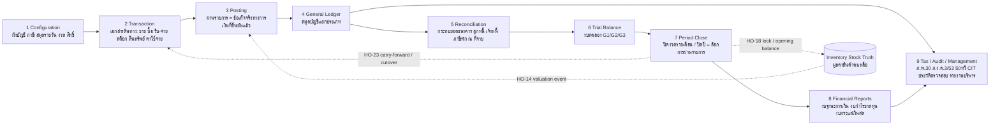

# 04 — ACCOUNT PROCESS HANDOFF MAP

| Field | Value |
|---|---|
| Session | `SMEPLUS-26-09-02-ACC-MENU-PROCESS-DEEP-STUDY-001` |
| Jira | `ERPPLUS-138` |
| Project / STATE | `SMEsPlus ENTERPRISE SUITE` / `STATE03 - Architecture` |
| Repository | `TH-PATTARAKRIT/AI-Collaboration-Hub` |
| Canonical Branch | `SMEsPlus` (base commit `788479552971940a126a542da5343944f7f3e0d4`, 2026-09-02 08:47 +0700) |
| Execution Branch | `audit/account-menu-process-deep-study-2026-09-02-001` (isolated worktree `ACCOUNT_MENU_PROCESS_DEEP_STUDY_2026_09_02_EXECUTION`) |
| Executor | Claude (this session), on behalf of Boss; Boss = Sole Final Approver |
| Mode | `READ ONLY / PROCESS BENCHMARK / CLEAN-ROOM / EVIDENCE-FIRST / MENU-BY-MENU / CHECKPOINT-CONTROLLED / L999.999` |
| Document status | `PROCESS REFERENCE ONLY` — not a Gate PASS, not a Final Solution, not development/production authorization, not an approved SMEsPlus UI/schema/workflow |
| Clean-room rule | Open ERP / Odoo and the iTEST02 dump are used only as `PROCESS BENCHMARK / MENU COVERAGE CHECKLIST / BUSINESS CAPABILITY REFERENCE / RISK DISCOVERY SOURCE`. No source code, ORM, schema, workflow-as-architecture, or menu name is adopted as final SMEsPlus design. Thai names below are **candidates only**. |
| Purpose of this file | Third mandatory analytical file (Section 5.1). Maps the mandatory study sequence `Configuration -> Transaction -> Posting -> General Ledger -> Reconciliation -> Trial Balance -> Period Close -> Financial Reports -> Tax / Audit / Management Reports` as explicit handoffs (`HO-nn`): what artifact crosses each boundary, what triggers it, which control governs it, what the benchmark does, what the SMEsPlus candidate principle is, and the evidence/owner/verifier/gate/status for each. |

`No Evidence = No Progress.` `Never Skip Gate.` `Boss is the sole Final Approver.` `Open ERP / Odoo = Process Benchmark Only.` `SMEsPlus = New Thai Business Process Design Candidate, not final solution.`

## 0. Stage model (benchmark -> business meaning -> SMEsPlus candidate)

Sequence rule applied: no conclusion about financial statements (stage 8) is drawn in this package without the upstream handoffs HO-01..HO-19 being mapped first.

## 1. Handoff register

| ID | From stage | To stage | Artifact crossing the boundary | Trigger | Control at boundary | Benchmark behaviour (process benchmark only) | SMEsPlus candidate principle (not approved) | Evidence location | Owner | Verifier | Gate impact | Status | Notes |
|---|---|---|---|---|---|---|---|---|---|---|---|---|---|
| HO-01 | 1 Configuration | 2 Transaction | Chart of accounts, account types (19), groups, tags, product-category account policy | Configuration change approved | Only valid, non-deprecated accounts of correct type usable; Account Group cannot redefine Account Type (Boss AK) | Chart + category defaults route document lines (M-CFG-01, M-STK-04) | CAP-01 versioned chart; category-membership answer for any point in time | TEAM_B_DESIGN/DOMAIN_01_ACCOUNTING_CORE/B02 CAP-01; BOSS_GATE AJ/AK; file 02 M-CFG-01..03 | Accounting Core (Team B DOMAIN_01) | Boss rulings AJ/AK; Team B verified | COA-G01..G04 | PARTIAL | COA-G01 HOLD carries into every downstream handoff. |
| HO-02 | 1 Configuration | 2 Transaction | Tax definitions (VAT/WHT rates, groups, fiscal positions, tax units) | Tax configured / fiscal position applied | Tax country validation (BR-05); WT-account flag constraint; rate list gated by partner type (company->PND53, individual->PND3) | Taxes and fiscal positions attach to product/partner/document (M-CFG-04..08, M-INV-04) | Tax policy owned outside Accounting Core (B03 §4); Accounting records computed effect | file 02 M-CFG-04/05/06/08, M-INV-04; branch audit/account-wht-grpa-m18-closure-010 GRPA_M18_CLOSURE/EXECUTION/01 §2.1 | Accounting/Tax (ACC-WHT owner) | Template read; statutory unverified | COA-G06 | PARTIAL | - |
| HO-03 | 1 Configuration | 2 Transaction | Journals (numbering, default accounts, hash mode), payment terms, currencies, fiscal years | Journal/term/currency created | Journal-type vs document-type constraint (BR-04); numbering shape (CFG-13); hash guard (BR-11) | Documents inherit journal sequence and defaults (M-CFG-07/09/10, M-INV-01) | CAP-07 regulated-document integrity automatic per document class (not opt-in) | TEAM_A/06_DOMAIN_RESEARCH/DOMAIN_01_ACCOUNTING_CORE/06 BR-04/BR-11; TEAM_B_DESIGN/DOMAIN_01_ACCOUNTING_CORE/B02 CAP-07; B09 CO-12 | Accounting Core (Team B DOMAIN_01) | Team A/Team B verified | CAP-07; COA-G06 (tax invoice numbering) | PARTIAL | Benchmark hash mode is opt-in (negative example). |
| HO-04 | 1 Configuration | 2 Transaction | Lock dates, fiscal year boundaries, roles | Lock set / FY defined / role assigned | CO-08 tiering; per-user lock variants in benchmark (SEC-01) | Locks and roles pre-condition every transaction (M-CTL-01, M-CTL-10) | One authoritative open/closed answer per date/class/company (CAP-04) | TEAM_A/06_DOMAIN_RESEARCH/DOMAIN_01_ACCOUNTING_CORE/11 CFG-03..09; TEAM_B_DESIGN/DOMAIN_01_ACCOUNTING_CORE/B02 CAP-04 | Accounting Core (Team B DOMAIN_01) | Verified | CAP-04; CO-01/CO-02 | PARTIAL | - |
| HO-05 | 2 Transaction | 3 Posting | Originating document (invoice, bill, credit/debit note, payment, receipt, expense, asset, deferral, stock event) translated into a proposed entry | Document confirmed/validated | Document-level validations; system-generated lines (tax, term, rounding) added | One overloaded entry table by document type (ADV-05 negative example); confirm = post | Every originating domain translates its own object into a proposed Entry; Accounting Core never learns Sales/Purchase vocabulary (B03 §3) | TEAM_B_DESIGN/DOMAIN_01_ACCOUNTING_CORE/B03 §3; TEAM_A/06_DOMAIN_RESEARCH/DOMAIN_01_ACCOUNTING_CORE/13 AU-08; TEAM_A/06_DOMAIN_RESEARCH/DOMAIN_01_ACCOUNTING_CORE/14 INT-01..06 | Accounting Core (Team B DOMAIN_01) | Team B verified | CAP-02 | PARTIAL | Stock-originated proposals are Joint (HO-14). |
| HO-06 | 3 Posting | 4 General Ledger | Committed (posted) entry with permanent identity and number | Post action | Balance (Σdebit=Σcredit), account validity, company boundary, period-open check at commitment; audit event | Application-level balance check, suppressible; reset-to-draft allowed (EC-03) | Non-optional at durable write (ADV-01); no reset after consumption (BINV-06); correction only additive (CAP-03) | TEAM_A/06_DOMAIN_RESEARCH/DOMAIN_01_ACCOUNTING_CORE/06 BR-01..03; CRITICAL_FINDING_REGISTER CF-01; TEAM_B_DESIGN/DOMAIN_01_ACCOUNTING_CORE/B02 CAP-02/CAP-03; B04 §4 | Accounting Core (Team B DOMAIN_01) | Team A CORR-001; Team B verified | CAP-02/CAP-03; MG-C10 | PARTIAL | - |
| HO-07 | 4 General Ledger | 5 Reconciliation | Open items on reconcilable accounts (AR, AP, bank suspense, WHT) | Line posted on reconcile-flagged account | Reconcile flag per account (BR-09) | Journal Items view feeds reconciliation workbench (black-box) | Ledger read access supplied to Treasury/AR/AP matching (B03 §3 OUT) | TEAM_A/06_DOMAIN_RESEARCH/DOMAIN_01_ACCOUNTING_CORE/03 CAP-09; TEAM_A/06_DOMAIN_RESEARCH/DOMAIN_01_ACCOUNTING_CORE/14 INT-08 | Accounting Core (Team B DOMAIN_01) | Structural | AR/AP gap G-B5 | PARTIAL | - |
| HO-08 | 4 General Ledger | 6 Trial Balance | All committed lines by account, period, company, currency | Query | Mode labelling (CO-14 known vs current) | GL report (black-box engine) | MP-09 all-time aggregation; implicit carry-forward (B07 §1d) | TEAM_B_DESIGN/DOMAIN_01_ACCOUNTING_CORE/B07 §1d; B09 CO-14; TEAM_A/06_DOMAIN_RESEARCH/DOMAIN_01_ACCOUNTING_CORE/15 RPT-02/03 | Financial Reporting (not yet designed) | Team B verified; engine black-box | COA-G05 | HOLD | - |
| HO-09 | 5 Reconciliation | 5 Reconciliation | AR settlement: invoice <-> receipt/credit note match; payment_state | Receipt posted / match action | Partial->full reconciliation; write-off/FX difference lines only if created | Auto-match on reversal; manual/auto workbench | Settlement status orthogonal to posting status (B04); Treasury owns bank-side mechanics | TEAM_A/06_DOMAIN_RESEARCH/DOMAIN_01_ACCOUNTING_CORE/05 PR-05; TEAM_A/06_DOMAIN_RESEARCH/DOMAIN_01_ACCOUNTING_CORE/07 (payment_state) | Accounting Core (Team B DOMAIN_01) | Team A verified | AR/AP gap | PARTIAL | - |
| HO-10 | 5 Reconciliation | 5 Reconciliation | AP settlement: bill <-> payment net of WHT; WHT payable recognised | Vendor payment posted | WHT recognised at payment not invoice; single-rate limitation in base module | Payment register wizard computes net; certificate manual | WHT recognition at payment matches Thai practice (STEP040304 FE2); multi-rate must be designed | branch audit/account-wht-grpa-m18-closure-010 GRPA_M18_CLOSURE/EXECUTION/01 §2; 05 §2; A2 (multi module absent) | Accounting/Tax (ACC-WHT owner) | Team A5 re-verified; Boss Partial | COA-G06; ACC-WHT-06 HIGH | PARTIAL | - |
| HO-11 | 5 Reconciliation | 5 Reconciliation | Bank statement line <-> payment/receipt match; suspense cleared | Statement imported / synced | Reconciliation models (rules) — placement unknown; outstanding accounts | Bank journal dashboard flow | Treasury supplies one side, Accounting the other (B03 §4) | file 02 M-BNK-01..04 | Treasury / Cash & Bank (not yet designed) | UNVERIFIED (this session reading only) | Treasury not designed | HOLD | - |
| HO-12 | 5 Reconciliation | 7 Period Close | Unreconciled items aging (bank suspense, AR, AP, WHT) | Close checklist | Aging thresholds; exceptions listed | Aged Receivable/Payable reports; no bank-suspense aging menu | Close readiness control item (SMEsPlus candidate) | file 02 M-BNK-08, M-ARP-08/09 | Accounting Core (Team B DOMAIN_01) | UNVERIFIED (this session reading only) | AR/AP gap; Treasury | GAP | - |
| HO-13 | 5 Reconciliation | 6 Trial Balance | Reconciled and unreconciled balances feed TB (no GL change from matching itself) | TB generation | Reconciliation posts nothing unless write-off/FX lines exist | TB from posted lines | Raw Cumulative TB (G1) / Current-FY (G2) / Balanced Presentation (G3) with mandatory labels (CO-14) | TEAM_B_DESIGN/DOMAIN_01_ACCOUNTING_CORE/B08 MP-12 via B09 CO-14; B10 MG-C11 | Financial Reporting (not yet designed) | Team B verified Round 5 | COA-G05; MG-C11 | PARTIAL | - |
| HO-14 | 2 Transaction | 3 Posting | Inventory valuation event (receipt, delivery/COGS, adjustment, return, manufacturing consumption, landed cost) -> proposed entry | Stock move done (perpetual) or inventory close (periodic) | Valuation gate (storable + real-time) in benchmark; category policy; cut-off vs lock dates | Direct account-move construction from stock module | Inventory decides the number; Accounting commits it; posting-architecture fork (direct write vs neutral event) is an Accounting-owned open decision | TEAM_B_DESIGN/DOMAIN_01_ACCOUNTING_CORE/B03 §3/§4; branch audit/inventory-reopen-2026-09-02-inv-reopen-001 INVENTORY_REOPEN/EXECUTION/14 §2; branch audit/inventory-reopen-2026-09-02-inv-reopen-001 INVENTORY_REOPEN/EXECUTION/20 §3; branch audit/inventory-core-corr007b-3high-closure-010 CORR_007B_3HIGH_CLOSURE/EXECUTION/08 §7 | Joint Account x Inventory (Session 3) | Boundary principle RESOLVED; scenarios PARTIAL; return basis CONFLICTING | Joint Session 3; N-A12-01 | HOLD | Never closed by Account alone. |
| HO-15 | 2 Transaction | 3 Posting | Purchase price difference between receipt cost and bill | Bill posted for received goods | Variance account configured | Price-difference posting (purchase_stock) | Variance controlled and reportable (CORR-007B §7) | branch audit/inventory-core-corr007b-3high-closure-010 CORR_007B_3HIGH_CLOSURE/EXECUTION/09 §7 | Joint Account x Inventory (Session 3) | UNVERIFIED (this session reading only) | Joint | HOLD | - |
| HO-16 | 2 Transaction | 3 Posting | Depreciation run -> depreciation entries | Period run | Asset model method/life; posted per period | Asset module posts into core (black-box) | Assets scope decision required; RD rates legal-tax review | file 02 M-AST-01..05; A2 | Accounting Core (Team B DOMAIN_01) | UNVERIFIED (this session reading only) | No asset gate; COA-G06 | HOLD | - |
| HO-17 | 2 Transaction | 3 Posting | Deferral recognition entries (revenue/expense) | Period run | Schedule per deferral | Report-driven regularization (benchmark version) | Scope decision required | file 02 M-AST-06..10 | Accounting Core (Team B DOMAIN_01) | UNVERIFIED (this session reading only) | No gate | HOLD | - |
| HO-18 | 7 Period Close | 2 Transaction | Account -> Inventory: lock/close boundaries, opening balances, valuation-policy approval | Period close / migration cutover | Inventory cut-off must respect Accounting lock (document vs line granularity open) | Inventory has own unaudited backdate bypass (Inventory G-2) | Explicit close sequencing checklist owned by Accounting; inventory-to-GL reconciliation artifact before statements | branch audit/inventory-core-corr007b-3high-closure-010 CORR_007B_3HIGH_CLOSURE/EXECUTION/08 §3-§5; branch audit/inventory-reopen-2026-09-02-inv-reopen-001 INVENTORY_REOPEN/EXECUTION/20 §3 (G-1, G-2, G-5) | Joint Account x Inventory (Session 3) | UNVERIFIED (this session reading only) | Joint G-1/G-2/G-5 | HOLD | - |
| HO-19 | 6 Trial Balance | 7 Period Close | Close checklist: bank/AR/AP reconciled, recurring/deferral/depreciation/FX posted, tax return closed, inventory reconciled -> lock | Month-end | CO-08 tier; audit event; no closing entry | Closing menu: Reconcile, Tax Returns, Lock Dates, Secure Entries | PeriodClosed = posting lock only (CAP-04); monthly carry-forward implicit | TEAM_B_DESIGN/DOMAIN_01_ACCOUNTING_CORE/B02 CAP-04; prior AI Audit P0-5; A1 Closing menu | Accounting Core (Team B DOMAIN_01) | Verified (B19) | CAP-04; Joint N-A12-01 | PARTIAL | - |
| HO-20 | 7 Period Close | 8 Financial Reports | Locked-period TB (G1/G2/G3) as statement basis | Statements requested | Mode labels; Off-Balance exclusion (Boss AJ) | Report engine (black-box) | Financial statement taxonomy maps canonical accounts to lines independently of company Account Groups (COA-G05) | BOSS_GATE AJ; AK COA-G05; TEAM_B_DESIGN/DOMAIN_01_ACCOUNTING_CORE/B08 MP-12 | Financial Reporting (not yet designed) | Boss AJ; Team B verified | COA-G05 (HOLD) | HOLD | - |
| HO-21 | 8 Financial Reports | 8 Financial Reports | P&L current earnings -> Balance Sheet equity (Reported Retained Earnings derived) | Elapsed fiscal year | Boundary-driven, not declaration-driven (M-AUD-09) | 'Current Year Earnings' unaffected-equity account (999999) in Thai template | Derived formula, no posted transfer (B07 §1e) | TEAM_B_DESIGN/DOMAIN_01_ACCOUNTING_CORE/B07 §1e/§1f; l10n_th 999999/321200 | Accounting Core (Team B DOMAIN_01) | Verified Round 4 | CAP-09; COA-G05 | PARTIAL | - |
| HO-22 | 7 Period Close | 7 Period Close | Fiscal Year Close declaration -> FY posting lock; boundary/membership governance | Authorized FY close | CO-08 tier; FiscalYearBoundaryChanged / MembershipRestated events at CO-15 tier | No year-end RE entry found in reference (Inventory G-6) | CAP-09 posts no entry | TEAM_B_DESIGN/DOMAIN_01_ACCOUNTING_CORE/B02 CAP-09; branch audit/inventory-reopen-2026-09-02-inv-reopen-001 INVENTORY_REOPEN/EXECUTION/14 G-6 | Accounting Core (Team B DOMAIN_01) | Verified Rounds 2-7 | CAP-09; COA-G08 | PARTIAL | Thai statutory year-end filing calendar EVIDENCE REQUIRED. |
| HO-23 | 7 Period Close | 2 Transaction | Opening balance / carry-forward into next period and next FY; migration cutover entries | New period / cutover | MG-C03 balanced opening entries; MG-C11 tie-out; subledger detail decision | Implicit running balances | Implicit carry-forward (B07 §1d); explicit cutover entries with provenance (MG-C02) | TEAM_B_DESIGN/DOMAIN_01_ACCOUNTING_CORE/B10 MG-C03/C04/C07/C11/C15; branch audit/inventory-reopen-2026-09-02-inv-reopen-001 INVENTORY_REOPEN/EXECUTION/20 G-5 | Accounting Core (Team B DOMAIN_01) | Verified; Joint G-5 open | MG-C11; Joint G-5 | PARTIAL | AR/AP aging + asset roll-forward at cutover: no research (G-B5). |
| HO-24 | 4 General Ledger | 9 Tax / Audit / Management Reports | Tax-grid-tagged lines -> VAT report (PP30 lines 1-12; sales/purchase tax reports) | Period | Tag mapping via tax repartition; tax lock date | Thai report lines in l10n_th; XLSX export ext (SMEsPlus-authored) | VAT semantics zero-researched (G-B1) — must be evidenced before any statutory claim | l10n_th account_tax_report_data.xml; branch audit/account-wht-grpa-m18-closure-010 GRPA_M18_CLOSURE/EXECUTION/04 §1.3; file 02 M-RPT-07 | Accounting/Tax (ACC-WHT owner) | Grid read; statutory unverified | COA-G06 | PARTIAL | - |
| HO-25 | 5 Reconciliation | 9 Tax / Audit / Management Reports | WHT recognised at payment/receipt -> WHT ledger lines (payable 2133xx / receivable 114300) | Payment posted | WT-account flag; rate; PND tag | Base module tags only single-rate payments | Multi-rate and sales-side must be designed; certificate evidence retention | branch audit/account-wht-grpa-m18-closure-010 GRPA_M18_CLOSURE/EXECUTION/01/02/08/09 | Accounting/Tax (ACC-WHT owner) | Team A5 re-verified | COA-G06; ACC-WHT-01/02/06 | PARTIAL | - |
| HO-26 | 5 Reconciliation | 9 Tax / Audit / Management Reports | WHT lines -> 50 ทวิ certificate (issue to vendor) | Manual wizard after payment | Form fields; income type per line | 5 form fields missing; manual issuance | Auto-issue on payment posting is a candidate requirement (not benchmark behaviour) | branch audit/account-wht-grpa-m18-closure-010 GRPA_M18_CLOSURE/EXECUTION/03; 05 §6 item 3 | Accounting/Tax (ACC-WHT owner) | CORR-007A + A3 | COA-G06; ACC-WHT-03 | PARTIAL | - |
| HO-27 | 8 Financial Reports | 9 Tax / Audit / Management Reports | P&L + adjustments + WHT credits -> CIT computation (PND50/51) | Year-end / half-year | Non-deductible expense identification; WHT credit substantiation | No benchmark menu | Zero CIT research — scope confirmation required | prior AI Audit G-B1; BOSS_GATE AK COA-G06 | Accounting/Tax (ACC-WHT owner) | UNVERIFIED (this session reading only) | COA-G06 | GAP | - |
| HO-28 | 9 Tax / Audit / Management Reports | 9 Tax / Audit / Management Reports | WHT lines -> PND3/PND53 filing export | Monthly | Payee routing (individual/company), condition code, branch | CSV/XLSX/PDF/TXT exports; monkey-patch risk; hardcoded condition | Deterministic single export definition; RD spec alignment via legal-tax review | branch audit/account-wht-grpa-m18-closure-010 GRPA_M18_CLOSURE/EXECUTION/04; 05 §5 items 5-10 | Accounting/Tax (ACC-WHT owner) | Verified code path; statutory unverified | COA-G06; ACC-WHT-04 | PARTIAL | - |
| HO-29 | 4 General Ledger | 9 Tax / Audit / Management Reports | Analytic items / budget lines -> management dimension reports | On demand | Distribution models; dimension applicability | Analytic report pivot; Financial Budgets (account_reports) | Dimensions preferred over GL proliferation (Boss AK COA-G07) | file 02 M-ANA-01..08 | Financial Reporting (not yet designed) | UNVERIFIED (this session reading only) | COA-G07 | PARTIAL | - |
| HO-30 | 3 Posting | 9 Tax / Audit / Management Reports | Every state-changing action -> audit event stream -> internal/external audit | Continuous | Append-only; tamper-evident by default (CO-07); retention floor 5-7 years (CO-11) | Optional chatter tracking + opt-in hash + Secure Entries wizard | Non-negotiable CAP-08 | TEAM_B_DESIGN/DOMAIN_01_ACCOUNTING_CORE/B02 CAP-08; B09 CO-07/CO-11; A1 Audit Trail / Secure Entries | Accounting Core (Team B DOMAIN_01) | Verified | CAP-08 | PARTIAL | - |
| HO-31 | 2 Transaction | 3 Posting | Employee expense report -> expense + employee payable (HR -> Accounting) | Expense approved | Approval; VAT/WHT where applicable | Employee Expenses under Vendors menu (hr_expense installed) | Payroll/HR IN seam (B03 §3) — not in Boss Section 6 | A1; A2; TEAM_B_DESIGN/DOMAIN_01_ACCOUNTING_CORE/B03 §3 | UNASSIGNED | UNVERIFIED (this session reading only) | SCOPE QUESTION — BOSS DECISION | HOLD | - |

## 2. Stage-by-stage summary (input -> action -> output -> downstream)

| Stage | Input | User/system action | Output | Downstream receiver | Impacts (GL/TB/Stock/P&L/BS/CF/Tax/Mgmt/Audit) | Required controls | Evidence | Unknown |
|---|---|---|---|---|---|---|---|---|
| 1 Configuration | Thai chart template (144 rows / 15 types), Boss 19 types, tax templates (17), journals, terms, FY, locks, roles | Set up / approve configuration | Governing master data | Stage 2 (HO-01..04) | Indirect on all; Tax Y; Audit Y | CAP-01, CO-01/02, AK rules | file 02 §6.1/6.2 | COA-G01 HOLD; 'Sources' unknown; Thai VAT group filing unknown |
| 2 Transaction | Originating documents (AR/AP/bank/stock/asset/deferral/expense) | Create, validate, confirm | Proposed entries | Stage 3 (HO-05, HO-14..17, HO-31) | GL/TB Y; Stock Conditional; Tax Y | Document validations; CAP-07 regulated docs | file 03 Part A | Debit note absent; receipt tax point; landed cost; returns basis |
| 3 Posting | Proposed entry | Commit (balance, account, company, period checks) | Committed entry + audit event | Stage 4 (HO-06); audit (HO-30) | GL/TB Y; Audit Y | ADV-01 non-optional balance; BINV-06 immutability | Team A BR-01..03/CF-01; Team B CAP-02/03 | DB-level enforcement design not yet made |
| 4 General Ledger | Committed entries | Aggregate / query (mode-labelled) | Ledger by account; open items | Stage 5 (HO-07), Stage 6 (HO-08), Stage 9 (HO-24, HO-29) | Mgmt/Audit Y | CO-14 labelling | B07 §1d; B09 CO-14 | Report engine black-box |
| 5 Reconciliation | Open items, statements, payments | Match; recognise WHT; clear suspense | Settlement status; WHT ledger lines | Stage 6 (HO-13), Stage 7 (HO-12), Stage 9 (HO-25/26) | GL Conditional; Tax Y; CF Y | Reconcile flag; WHT rules | PR-05; WHT branch | Treasury not designed; multi-rate WHT; bank feeds |
| 6 Trial Balance | Committed lines as of date | Aggregate G1/G2/G3 with labels | TB | Stage 7 (HO-19), Stage 8 (HO-20) | TB Y | CO-14; MG-C11 | B08 MP-12; B10 MG-C11 | Thai TB statutory format unknown |
| 7 Period Close | TB + checklist | Reconcile, post recurring, tax return, inventory reconcile, lock | Locked period; FY event; opening balances | Stage 8 (HO-20/21), Stage 2 (HO-18/23) | Stock Conditional; Tax Y; Audit Y | CO-08; CAP-04/09; Joint N-A12-01 | B02 CAP-04/09; CORR-007B 08 | Inventory close sequencing; G-5 opening cross-proof; Thai year-end calendar |
| 8 Financial Reports | Locked TB + taxonomy + fiscal calendar | Map to statement lines; derive RE | BS, P&L, CFS, Executive summary | Stage 9 (HO-27), Boss/auditor | BS/P&L/CF Y | CO-14; Off-Balance rule (AJ) | B07 §1e/§1f; AJ | COA-G05 HOLD; DBD/NPAE format (N-04) |
| 9 Tax / Audit / Management | Tagged lines, WHT lines, P&L, audit stream, analytic items | Generate PP30, PND3/53, 50 ทวิ, CIT inputs, audit trail, dimension reports | Filings/exports; audit evidence; management views | Revenue Department / auditor / management (external) | Tax Y; Audit Y; Mgmt Y | Legal-tax review; CO-07/CO-11 | l10n_th report data; WHT branch; B09 | VAT/CIT zero research; RD specs; monkey-patch risk |

## 3. Joint and external boundaries (never closed by this Account-only study)

- **HO-14 / HO-15 / HO-18 / HO-23 (inventory side)** — routed to Account x Inventory Joint Session 3 (Jira `ERPPLUS-140` per Inventory reopen file 20). Return valuation basis is `CONFLICTING` inside Inventory's own evidence and must be resolved there first.
- **HO-11 / HO-12 (bank side)** — Treasury / Cash & Bank is a neighbour domain named but not designed (B03 §3/§4); no gate exists; routed to file 20 as scope item.
- **HO-24 / HO-27 / HO-28 (statutory filing)** — the export/filing step to the Revenue Department and DBD is outside the benchmark's evidenced scope and outside this study; only the report inputs are mapped.
- **HO-31 (HR expense)** — surfaced from the benchmark instance; not in Boss Section 6; scope question only.

## 4. Consistency statement

- 31 handoffs — status {'PARTIAL': 20, 'HOLD': 9, 'GAP': 2}. Every `Handoff to next process` reference in files 02/03 resolves to one of these IDs or to a file 02 menu ID.
- No handoff is marked `PASS`/`CLOSED`. `GAP` marks a required Thai handoff with no benchmark evidence (HO-12, HO-27); `HOLD` marks black-box or joint items.
