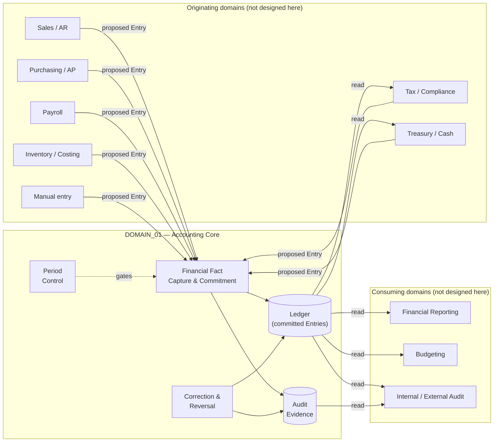

# B03 — Domain Boundary Model

| Field | Value |
|---|---|
| Domain | DOMAIN_01 — Accounting Core |
| Phase | B3 — Domain Boundary Design |
| Method | Boundaries derived from business responsibility (B02); conceptual objects only, no physical schema |

## 1. Boundary Statement

Accounting Core owns the moment a proposed financial fact becomes — or fails to become —
part of the authoritative ledger, and everything required to keep that ledger correct,
closed, and auditable afterward. It does **not** own how a business event gets translated
into a proposed fact in the first place; that translation is each originating domain's
responsibility (§3). This single-sentence boundary is what makes CAP-05's "wrong company"
check and CAP-02's "is this balanced" check meaningful gatekeeping rather than formality:
Accounting Core is the *only* place a fact can become authoritative, and it is authoritative
precisely because everything else must pass through this gate.

## 2. Conceptual Objects

These are business concepts, not table names. Each is defined precisely enough to prevent
the conflation the reference system exhibits (its `state` field mixes concepts that are kept
separate below — see [B04](B04_BUSINESS_LIFECYCLE_EVENT_MODEL.md)).

| Concept | Definition | Is NOT | Owning capability |
|---|---|---|---|
| **Financial Fact** | The general concept: any discrete, dated, monetary business occurrence with accounting significance. Superset of everything below. | A specific format or structure | — (conceptual root) |
| **Entry** | A Financial Fact expressed in double-entry form: a set of Lines, each attributing an amount to one Account with a debit or credit direction, that together must balance to be valid. May exist proposed (not yet authoritative) or committed. | The act of making it authoritative (that is *Posting*) | CAP-02 defines validity; CAP-01 constrains what Lines may reference |
| **Line** | One attribution within an Entry: an amount, a direction (debit/credit), an Account, a Currency Context. The smallest unit that carries financial meaning. | An Entry by itself — a Line has no independent balance requirement | CAP-02 |
| **Posting** | The *act* of transitioning a proposed Entry into committed, authoritative status. A verb, not a state to store on the Entry. | A synonym for "Entry" | CAP-02 (the capability's defining action) |
| **Ledger** | The aggregate, queryable collection of all committed Entries — the authoritative financial record itself. A conceptual view, not a single physical store. | A specific document or report (those are *outputs derived from* the Ledger, owned by domains outside Accounting Core) | CAP-02 (writes), all capabilities (read) |
| **Period** | A bounded span of time with an independently determinable open/closed status, evaluated per company and, where a regulated document class requires it, per class. | A field on an Entry — a Period is a first-class concept an Entry's date is checked *against*, not a property the Entry asserts about itself | CAP-04 |
| **Currency Context** | The pairing of transaction currency, functional currency, and the rate/remeasurement relationship between them for a given Entry or Line. | A single stored amount — a Currency Context is a relationship, and remeasurement is an ongoing obligation of that relationship, not a one-time conversion | CAP-06 |
| **Correction / Reversal** | A distinct kind of Entry whose defining property is that it links to, and never mutates, an earlier committed Entry. | An edit — if it changes the original in place, it is not this concept, by definition | CAP-03 |
| **Audit Evidence** | The append-only record of everything that happened to an Entry or an attempt to act on one — actor, timestamp, before/after. Exists independently of whether the Entry's own content is mutable. | Part of the Entry itself — conflating these two is exactly the reference system's CF-02/LC-04 weakness | CAP-08 |

## 3. Upstream / Downstream Seams

Accounting Core's neighbors are not designed in this domain pass — they are named here only
to define the shape of what crosses the boundary. **The critical design decision is that
every originating domain translates its own business object into a proposed Entry before it
reaches Accounting Core — Accounting Core never learns the vocabulary of Sales, Purchasing,
or Payroll.** This is an independent structural choice (not inherited from the reference
system, which does not enforce this separation as cleanly — see B02 §3 point 1), made because
it is what lets CAP-02 stay a single, simple, non-domain-specific choke point.

| Neighbor (not designed here) | Direction | What crosses | Shape |
|---|---|---|---|
| Sales / Accounts Receivable | IN | Revenue and receivable recognition | Proposed Entry — never a "customer invoice" object |
| Purchasing / Accounts Payable | IN | Expense and payable recognition | Proposed Entry — never a "vendor bill" object |
| Payroll / HR Cost | IN | Wage, benefit, and statutory-withholding expense | Proposed Entry |
| Inventory / Costing | IN | Stock value movements (the *result* of a valuation method decided elsewhere) | Proposed Entry — valuation methodology is out of scope here (§4) |
| Tax / Compliance | IN | Computed tax effects (the *result* of tax policy decided elsewhere) | Proposed Entry, often tagged as a regulated document class (CAP-07) |
| Tax / Compliance | OUT | Committed facts needed for statutory filing | Read access to the Ledger, scoped to what's needed |
| Treasury / Cash & Bank | IN | Bank fees, interest, and similar bank-originated facts | Proposed Entry |
| Treasury / Cash & Bank | OUT | Committed facts needed for bank reconciliation | Read access to the Ledger |
| Financial Reporting / Consolidation | OUT | Everything needed to produce statements | Read access to the Ledger + Period state |
| Budgeting / Forecasting | OUT | Actuals to compare against plan | Read access to the Ledger |
| Internal / External Audit | OUT | Full evidentiary trail | Read access to the Ledger + Audit Evidence (CAP-08) — this is the one consumer that needs Audit Evidence directly, not just the Ledger |
| Manual entry (any authorized user) | IN | Ad hoc financial facts not originating from another domain | Proposed Entry, same shape as any other origin — manual entry is not a privileged or differently-shaped path |

Every IN arrow terminates at CAP-02. No neighbor writes to the Ledger, Period state, or
Audit Evidence directly — this is the enforceable meaning of "Accounting Core owns the
moment a fact becomes authoritative."

## 4. Explicitly Out of Scope for DOMAIN_01

Named to prevent scope creep in later phases, not because these are unimportant:

- **How a business event becomes a proposed Entry** (e.g., revenue-recognition timing rules,
  which cost elements load into inventory value, payroll gross-to-net computation, tax rate
  determination) — owned by the originating domain.
- **Inventory valuation methodology** (FIFO, weighted-average, standard cost) — Accounting
  Core records the resulting value movement as a fact; it does not choose the method.
- **Tax policy** (rates, rules, jurisdiction determination) — Accounting Core records the
  computed effect; it does not compute it.
- **Multi-company consolidation** — a distinct capability that would read multiple companies'
  Ledgers; CAP-05 explicitly keeps company boundaries separate and does not itself consolidate.
- **Financial statement presentation/formatting** — Accounting Core guarantees what it
  publishes is trustworthy (B02 §2 CAP-02); it does not format a balance sheet.
- **Bank-side reconciliation mechanics** (matching bank statement lines to Ledger entries) —
  Treasury's responsibility; Accounting Core supplies one side (committed facts) of that match.
- **User authorization / role model** — referenced as a control objective in
  [B09](B09_CONTROL_AUDIT_DESIGN_OBJECTIVES.md), but the permission system itself is a
  cross-cutting platform concern, not an Accounting Core capability.

## 4a. Inter-Company Transactions *(clarification added at B16 §11, Persona 7 fix)*

§4's out-of-scope list excludes multi-company *consolidation*, and CAP-05/BINV-03 forbid a
single Entry from spanning Companies — but neither statement says a legitimate
**inter-company transaction** (e.g., one Company paying an expense on behalf of a related
one) is impossible to represent. It is not. The red-team pass found this domain's design had
never actually said how: an inter-company transaction is modeled as **two independent
Entries, one in each Company's books, each individually satisfying every rule in this domain
exactly as any other Entry would** (typically using a "due to/due from" pair of Accounts,
one per side) — linked only by a shared origin reference (B11 scenario 15), never by a single
Entry whose Lines resolve to more than one Company. This preserves BINV-03 exactly while
still allowing the business reality multi-company SME tenants routinely need.

## 5. Boundary Diagram



## 6. Acceptance Check

```
No physical schema in this phase           : CONFIRMED
No vendor module boundary copied           : CONFIRMED (see B02 §3 for explicit divergence points)
Every conceptual object has one clear owner: CONFIRMED
Boundary is enforceable, not aspirational  : Ledger/Period/Evidence writes are structurally
                                              limited to CAP-02/03/04 — no neighbor path exists
```

**B3 = COMPLETE.**
