# B04 — Business Lifecycle & Event Model

| Field | Value |
|---|---|
| Domain | DOMAIN_01 — Accounting Core |
| Phase | B4 — Business Lifecycle & Event Model |
| Builds on | B01 LC-01..04, ADV-04, ADV-07, INV-06 — extends Team A's *neutral observation* into an actual Team B *design decision* |

## 1. What This Phase Adds Beyond Team A's Input

Team A's `06_STATE_EVENT_LOGIC_ANALYSIS.md` correctly identified the reference system's flaw
(mutability gated on raw status, not on downstream consumption) and correctly stopped short
of proposing a fix, per its own read-only mandate. This phase is where that stops being an
observation and becomes a design: **Downstream Consumption is promoted here to a first-class,
tracked concept**, not merely a reasoning aid. This is the specific, independent design
decision this phase contributes.

## 2. State — What an Entry Can Be

Four states, deliberately minimal, deliberately not reusing the reference system's field
shape (no `parent_state` denormalization, no orthogonal `payment_state` folded in — those are
separate concerns, out of this domain's lifecycle by [B03](B03_DOMAIN_BOUNDARY_MODEL.md) §4
or belonging to a different capability):

| State | Meaning | Part of the Ledger? | Mutable? |
|---|---|---|---|
| DRAFT | Captured, not yet authoritative | No | Freely, by definition |
| COMMITTED | Authoritative financial fact | Yes | Governed by §4 (consumption-gated) |
| VOIDED | Retained, excluded from counting | Yes (for traceability), excluded from balances | Only reachable as described in §5 |
| SUPERSEDED | A COMMITTED entry that has been corrected; retained, unchanged, permanently linked to its correction | Yes | No — frozen the moment a correction links to it |

`SUPERSEDED` is a Team B addition, not present in Team A's neutral four-term list. It exists
because "COMMITTED" alone does not distinguish an entry nothing has ever corrected from one
that has been corrected and is now purely historical context — collapsing the two loses
information a reader of the Ledger needs (per PR-07, traceability to origin includes knowing
whether a fact is still the operative one). An entry becomes `SUPERSEDED` automatically and
only as a side effect of a Correction (§6) being committed against it — it is never a
directly-requested state.

## 3. Event — What Is Recorded, Independent of State

Per LC-04, the event log is a forced, append-only capability (CAP-08), structurally separate
from the Entry's own state. Every state-changing action produces exactly one event, and event
production is not optional or configurable:

| Event | Produced by | Recorded even if... |
|---|---|---|
| `Captured` | Fact enters DRAFT | ...it is later discarded without ever posting |
| `Posted` | DRAFT → COMMITTED (CAP-02) | ...the entry is corrected the next second |
| `Amended` | An in-place content change to an unconsumed COMMITTED entry (§4) | ...the amendment is itself later superseded |
| `Corrected` | A Correction/Reversal Entry is committed, linking to and superseding an original (§6) | ...the original was itself already a correction |
| `Voided` | COMMITTED or DRAFT → VOIDED (§5) | ...the void is later found to be itself mistaken (which requires a further, new event — voids are not undone by mutation) |
| `Consumed` | Any recorded downstream-consumption trigger fires against a COMMITTED entry (§4) | ...the consuming action itself later fails or is retracted — the fact that consumption was *attempted/recorded* stays on the trail |
| `PeriodClosed` | CAP-04 closes a period | — |
| `Remeasured` | CAP-06 produces a remeasurement adjustment | — |
| `CarriedForward` | CAP-09 produces an opening-balance fact | — |

## 4. The Consumption Gate — The Core Design Decision

**Definition — Downstream Consumption:** a COMMITTED entry is *consumed* the moment any of
the following becomes true. This list is the design answer to Team A's open question
(`06_STATE_EVENT_LOGIC_ANALYSIS.md`, "is reset/reopen ever legitimate — yes, conditionally"):

1. It has been included in a statutory filing or externally issued financial statement.
2. It has been matched/reconciled against an external record (e.g., a bank statement) outside
   this entity's own books.
3. Another COMMITTED entry — in this domain or any consumer named in
   [B03](B03_DOMAIN_BOUNDARY_MODEL.md) §3 — was itself computed from or references this one.
4. **The accounting period containing its date has been closed (CAP-04).** This is a
   deliberate, conservative default: period close is itself an act of publishing everything
   within it, so this domain treats every entry in a closed period as consumed even absent a
   separately recorded external-consumption event. This single rule closes most of the
   practical surface of GAP-D01-22 (unauthorized reopen) without requiring a separate
   permission model to be designed in this domain pass — reopening a period (an explicit,
   authorized CAP-04 action, itself audited) is the only path back to "correctable," and even
   then only for entries not independently consumed by triggers 1–3.

**Gate rule, stated once, enforced everywhere:**

```
IF entry.state == COMMITTED AND entry.consumed == false:
    an in-place Amendment (§3 `Amended` event) MAY be permitted, still logged, still creating
    a permanent before/after record in Audit Evidence
ELSE IF entry.state == COMMITTED AND entry.consumed == true:
    the ONLY correction path is a linked Correction Entry (§6); the original becomes
    SUPERSEDED; direct mutation is refused, not merely discouraged
```

This is the direct design answer to ADV-04 and ADV-07, and the structural fix for INV-06: the
invariant that *should* gate mutability (consumption) is now the invariant that *does* gate
it — closing the gap Team A identified as the domain's central weakness (CF-06,
`06_STATE_EVENT_LOGIC_ANALYSIS.md`).

## 5. Void — A Distinct Operation From Correction

Voiding answers "should this still count," not "was this wrong as originally captured." A
DRAFT entry can be discarded freely (never becomes VOIDED — it simply never existed
authoritatively). A COMMITTED entry can only move to VOIDED through the same consumption gate
as §4: unconsumed → a direct void event is permitted (still logged); consumed → voiding must
itself be expressed as a Correction (§6) that zeroes out the original's effect, because a
silent state flip on a consumed fact is exactly the mutation §4 exists to prevent.

## 6. Correction / Reversal — Relationship, Not Mutation

A Correction is a COMMITTED entry with one additional, mandatory property: a link to the
entry it corrects. Positing this as a **relationship** (an edge between two Entries) rather
than a state or a field-level flag is deliberate — per [B03](B03_DOMAIN_BOUNDARY_MODEL.md)
§2, "Correction/Reversal" is a *kind* of Entry, defined by having this relationship, not a
separate concept requiring separate lifecycle rules. Consequences of this design choice:

- The relationship is bidirectional and permanent: the original is discoverable from the
  correction and vice versa (answers B04's mandated question "how is correction
  represented" directly — as a first-class, queryable relationship, not a derived inference).
- A correction can itself be corrected — the relationship chains. `06_STATE_EVENT_LOGIC_
  ANALYSIS.md`'s open question (GAP-D01-23, reversal-of-a-reversal semantics) is resolved
  here as a design decision: each link is independent and equally valid; there is no special
  case for a second-order correction, because the relationship, not the entry's "distance"
  from an original, is what carries meaning.
- Committing a correction is itself subject to every rule in §4 — a correction is not exempt
  from balance (IV-01), period-validity (CAP-04), or company-boundary (CAP-05) checks merely
  because it is a correction.

## 7. Commitment — When a Fact Becomes Authoritative

A financial fact becomes authoritative at exactly one moment: successful completion of
Posting (CAP-02), which requires — synchronously, not as a follow-up check — that the
proposed Entry balances (IV-01), every line references a valid, active account (CAP-01),
every line's company is consistent (CAP-05), and the entry's date falls within a period
CAP-04 confirms open. Failing any one of these means the fact never becomes authoritative;
there is no partially-committed state. This directly implements ADV-01 (the balance guarantee
must be non-optional at the point data becomes durable) by making balance validation
structurally part of the state transition itself, not a separate, skippable step before it.

## 8. Lifecycle Diagram

> **SMEsPlus Independent Conceptual Design — NOT Vendor Translation.**
> States, event names, and the consumption gate are this domain's own design; no vendor field
> or method name appears below.

```mermaid
stateDiagram-v2
    [*] --> DRAFT: Captured
    DRAFT --> [*]: Discarded (never authoritative)
    DRAFT --> COMMITTED: Posted (balance + account +\ncompany + period checks pass)

    state COMMITTED {
        [*] --> Unconsumed
        Unconsumed --> Unconsumed: Amended (logged,\nin-place, pre-consumption only)
        Unconsumed --> Consumed: Consumption trigger\n(filed / reconciled / referenced /\nperiod closed)
    }

    COMMITTED --> VOIDED: Void (unconsumed: direct;\nconsumed: via Correction)
    COMMITTED --> SUPERSEDED: Correction links\nto this entry
    SUPERSEDED --> [*]
    VOIDED --> [*]

    note right of COMMITTED
        Every transition out of Consumed
        must be a new, linked Entry
        (Correction / Reversal / Void-as-Correction).
        Never a mutation of this entry.
    end note
```



## 9. Answers to the Phase's Mandated Questions

| Question | Answer |
|---|---|
| When does a fact become authoritative? | At successful Posting (§7) — one synchronous transition, no partial commitment |
| When can it change? | Before consumption, via a logged Amendment (§4) |
| When must it become immutable? | The instant it is consumed — including, by default, when its period closes (§4) |
| How is correction represented? | As a permanent, bidirectional, chainable relationship between Entries (§6), not a field or flag |
| What constitutes a new accounting fact? | Every Posting, Correction, consumed-Void, Remeasurement (CAP-06), and Carry-Forward (CAP-09) — nothing is a free edit once consumed |

**B4 = COMPLETE.**
