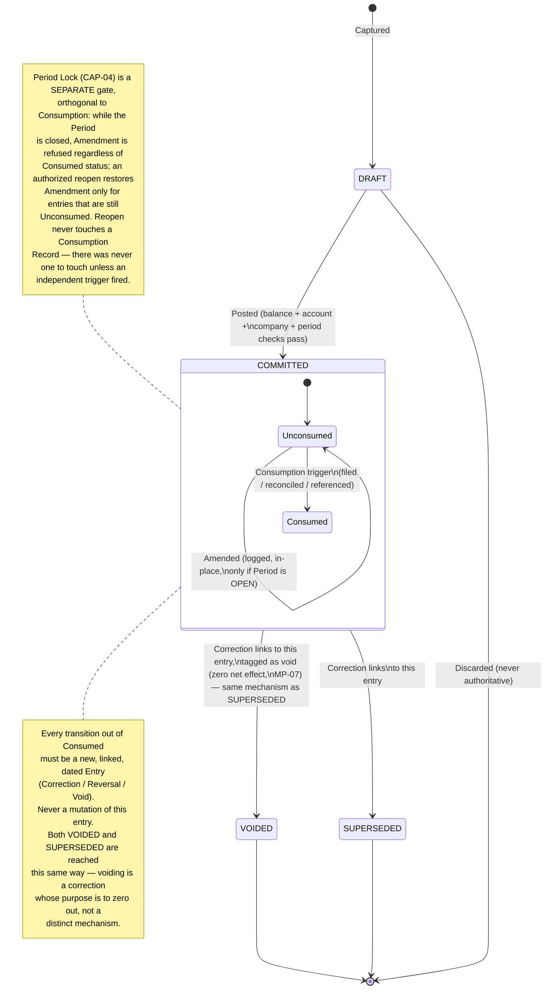

# B04 — Business Lifecycle & Event Model

| Field | Value |
|---|---|
| Domain | DOMAIN_01 — Accounting Core |
| Phase | B4 — Business Lifecycle & Event Model |
| Builds on | B01 LC-01..04, ADV-04, ADV-07, INV-06 — extends Team A's *neutral observation* into an actual Team B *design decision* |
| **Corrected** | **CORR-B01 / CORR-B03 (2026-08-29)** — ChatGPT Independent Design Audit (commit `aa60c2d0497cefe804d37953bbfaa597c3476d79`) found two material defects in this document's original version: (1) period close was modeled as an automatic, *permanent* Consumption trigger, which directly contradicted BINV-07's "never retracted" guarantee once this document also described period reopen as restoring correctability — those two claims cannot both be true; (2) direct VOID excluded an entry's Lines from historical as-of aggregation based on *current* status, which lets a later event silently rewrite an earlier as-of result. §4 and §5 below are corrected in place; the reasoning that led to each correction is kept visible, not deleted — see [CORR_B01_B02_B03_CORRECTIVE_ROUND.md](CORR_B01_B02_B03_CORRECTIVE_ROUND.md) for the full comparison of alternatives considered. |

## 1. What This Phase Adds Beyond Team A's Input

Team A's `06_STATE_EVENT_LOGIC_ANALYSIS.md` correctly identified the reference system's flaw
(mutability gated on raw status, not on downstream consumption) and correctly stopped short
of proposing a fix, per its own read-only mandate. This phase is where that stops being an
observation and becomes a design: **Downstream Consumption is promoted here to a first-class,
tracked concept**, not merely a reasoning aid. This is the specific, independent design
decision this phase contributes.

## 2. State — What an Entry Can Be

Four states, deliberately minimal, deliberately not reusing the reference system's field
shape (no `parent_state` denormalization, no orthogonal `payment_state` folded in — those are
separate concerns, out of this domain's lifecycle by [B03](B03_DOMAIN_BOUNDARY_MODEL.md) §4
or belonging to a different capability):

| State | Meaning | Part of the Ledger? | Mutable? |
|---|---|---|---|
| DRAFT | Captured, not yet authoritative | No | Freely, by definition |
| COMMITTED | Authoritative financial fact | Yes | Governed by §4 (consumption- and lock-gated) |
| VOIDED | A COMMITTED entry whose effect has been zeroed by a linked, dated correction (§5) — **not** a flag flip | Yes — its own Lines still count at their own date; the *voiding* entry's Lines (dated at the void's own, later date) are what remove the effect, from that date forward | Reached only via the same Correction Link mechanism as SUPERSEDED (§5/§6) |
| SUPERSEDED | A COMMITTED entry that has been corrected; retained, unchanged, permanently linked to its correction | Yes | No — frozen the moment a correction links to it |

`SUPERSEDED` is a Team B addition, not present in Team A's neutral four-term list. It exists
because "COMMITTED" alone does not distinguish an entry nothing has ever corrected from one
that has been corrected and is now purely historical context — collapsing the two loses
information a reader of the Ledger needs (per PR-07, traceability to origin includes knowing
whether a fact is still the operative one). An entry becomes `SUPERSEDED` automatically and
only as a side effect of a Correction (§6) being committed against it — it is never a
directly-requested state.

**Corrected at CORR-B03:** `VOIDED` and `SUPERSEDED` are now the *same underlying mechanism*
(a Correction Link, §6), distinguished only by the correction's **purpose**: a `VOIDED`-tagged
correction is a full, exact reversal with no accompanying replacement value (net effect:
zero) — the "this should never have counted" case. A `SUPERSEDED`-tagged correction may carry
a replacement value — the "this was wrong, here is the right figure" case. Both are ordinary,
dated Entries, subject to every rule any Entry is subject to (BR-01 balance, etc.), and both
are included in historical aggregation (§8/B08 MP-09) exactly like any other Entry — because
they are one. The original version of this document treated `VOIDED` as a status that could
be flipped directly and that historical aggregation then filtered on *current* status; that
was the defect the independent audit found (`D01-B-AUD-03`) — see §5.

## 3. Event — What Is Recorded, Independent of State

Per LC-04, the event log is a forced, append-only capability (CAP-08), structurally separate
from the Entry's own state. Every state-changing action produces exactly one event, and event
production is not optional or configurable:

| Event | Produced by | Recorded even if... |
|---|---|---|
| `Captured` | Fact enters DRAFT | ...it is later discarded without ever posting |
| `Posted` | DRAFT → COMMITTED (CAP-02) | ...the entry is corrected the next second |
| `Amended` | An in-place content change to a COMMITTED entry that is both unconsumed and in an open Period (§4, corrected at CORR-B01) | ...the amendment is itself later superseded |
| `Corrected` | A Correction/Reversal Entry is committed, linking to and superseding an original (§6) | ...the original was itself already a correction |
| `Voided` | COMMITTED → VOIDED, via a linked Correction Entry tagged as void (§5, corrected at CORR-B03 — never a bare status flip, never from DRAFT) | ...the void is later found to be itself mistaken (which requires a further, new, linked correction — voids are not undone by mutation) |
| `Consumed` | Any recorded downstream-consumption trigger fires against a COMMITTED entry (§4) | ...the consuming action itself later fails or is retracted — the fact that consumption was *attempted/recorded* stays on the trail |
| `PeriodClosed` | CAP-04 closes a period | — |
| `PeriodReopened` *(added at CORR-B01)* | An authorized CO-08 action reopens a closed period | ...no entry in it ends up amendable, because every one of them was independently consumed — the event is still recorded, since the reopen itself is the auditable fact, regardless of its practical effect |
| `Remeasured` | CAP-06 produces a remeasurement adjustment | — |
| `CarriedForward` | CAP-09 produces an opening-balance fact | — |

## 4. The Consumption Gate — The Core Design Decision

**Corrected at CORR-B01.** The original version of this section listed period close as a
fourth, automatic Consumption trigger, and separately described period reopen as a path back
to "correctable." ChatGPT's independent audit (`D01-B-AUD-01`) correctly identified that
these two claims cannot both be true once BINV-07 requires a recorded Consumption event to be
*permanent* — if period close created a real Consumption Record, no reopen could legitimately
undo it, full stop. Three alternatives were compared before choosing the correction below
(full comparison: [CORR_B01_B02_B03_CORRECTIVE_ROUND.md](CORR_B01_B02_B03_CORRECTIVE_ROUND.md) §1):
keeping period-close-as-consumption and simply deleting the reopen-restores-correctability
claim (rejected — needlessly rigid, and CO-06 already keeps Correction no harder than
Amendment, so the rigidity buys little); introducing a new three-state Period concept
(rejected — adds surface area the existing Period/Consumption split can already express
correctly once properly separated); and **separating Period lock-status from Entry
consumption-status as two independent, orthogonal gates on the same action (Amendment)** —
the option adopted. This is, precisely, the same category of bug Team A found in the
reference system's own `state` field (CF-06/`06_STATE_EVENT_LOGIC_ANALYSIS.md`: conflating
"is this committed yet" with "should this still count") recurring inside this domain's own
design, between "is the period locked" and "has this fact been externally relied upon" —
caught by independent audit rather than by this domain's own ten-persona red-team pass,
recorded honestly in [B16](B16_TEAM_B_INTERNAL_RED_TEAM_REVIEW.md)'s addendum.

**Definition — Downstream Consumption:** a COMMITTED entry is *consumed* the moment any of
the following becomes true. This list is the design answer to Team A's open question
(`06_STATE_EVENT_LOGIC_ANALYSIS.md`, "is reset/reopen ever legitimate — yes, conditionally").
**Three triggers, not four** — period close is no longer one of them:

1. It has been included in a statutory filing or externally issued financial statement.
2. It has been matched/reconciled against an external record (e.g., a bank statement) outside
   this entity's own books.
3. Another COMMITTED entry — in this domain or any consumer named in
   [B03](B03_DOMAIN_BOUNDARY_MODEL.md) §3 — was itself computed from or references this one.

Once triggered, a Consumption Record is permanent (BINV-07, unchanged) and BINV-06's
immutability applies forever after, regardless of any later Period action — consumption is no
longer entangled with Period status in any direction.

**Period Lock — a separate, orthogonal gate.** An open/closed Period (CAP-04, BINV-02)
independently gates two things: new Posting (BR-05, unchanged) and, corrected here, in-place
Amendment (BR-14). While a Period is closed, Amendment is refused **because the Period is
locked**, not because closing it created a Consumption Record. An authorized, audited reopen
(CO-08) restores the "Period is open" half of this condition — and, because Consumption was
never entangled with Period status in the first place, reopen never has to (and structurally
cannot) touch a Consumption Record that does not exist for that reason. This is a *stricter*
reading of Team A's original insight than the version this document previously shipped with:
"a mistake caught before external consumption is arguably safe to correct" is restored to its
precise, narrow meaning — Period Lock alone was never a legitimate stand-in for that test.

**Gate rule, stated once, enforced everywhere — corrected:**

```
Amendment (§3 `Amended` event) is permitted on a COMMITTED entry if and only if BOTH:
  (a) entry.consumed == false   — no independent Consumption trigger (1-3 above) has fired
  (b) entry.period.status == OPEN   — the entry's Period is not locked

IF NOT (a):
    the ONLY correction path is a linked Correction Entry (§6); permanent, regardless of
    Period status — reopening the Period changes nothing about this
IF (a) AND NOT (b):
    Amendment is refused because the Period is locked; an authorized reopen (CO-08) can
    restore (b) — and, since (a) was never affected by Period status, reopen's effect on
    amendability is now exactly what it should be: it restores what Period locking took
    away, nothing more, nothing that BINV-06/07 ever promised to protect
IF (a) AND (b):
    Amendment is permitted, exactly as originally designed
```

This is the direct design answer to ADV-04 and ADV-07, and the structural fix for INV-06: the
invariant that *should* gate mutability (consumption) is now the invariant that *does* gate
it, cleanly separated from the invariant that gates timing (Period lock) — closing both the
gap Team A identified as the domain's central weakness (CF-06,
`06_STATE_EVENT_LOGIC_ANALYSIS.md`) and the gap this domain's own first design pass
introduced by conflating the two.

## 5. Void — A Distinct *Purpose*, the Same Mechanism as Correction

**Corrected at CORR-B03.** Voiding still answers "should this still count," not "was this
wrong as originally captured" — that semantic distinction from Correction is preserved. What
changes is *how* it is achieved. The original version of this section allowed an unconsumed
COMMITTED entry to move to VOIDED via "a direct void event" — implying a status flip on the
entry itself. ChatGPT's independent audit (`D01-B-AUD-03`) correctly identified that this
broke historical reproducibility: [B08](B08_ACCOUNTING_MATHEMATICAL_DESIGN_PRINCIPLES.md)
MP-09 filtered aggregation by an Entry's *current* VOIDED status, so voiding something today
would silently change what "balance as of last month" reports — even though, last month, the
entry was genuinely valid and should stay reported that way. A later event must not rewrite
an earlier as-of result.

Two alternatives were compared (full detail:
[CORR_B01_B02_B03_CORRECTIVE_ROUND.md](CORR_B01_B02_B03_CORRECTIVE_ROUND.md) §3): keep Void
as a distinct status but make aggregation date-aware (filter on *when* the void became
effective, not current status); or make voiding **always** a dated, linked Correction Entry —
a full reversal (MP-07) with no accompanying replacement value — so that no special
aggregation logic is needed at all, since a dated Entry already only affects "as of" queries
on or after its own date. **The second option was adopted.** It requires no new
temporal-tracking concept, it naturally produces the correct *prospective* semantics (a void
takes effect when it is recorded, not retroactively at the original entry's own date — the
only reading consistent with "a report issued as of D1 reflected the truth as of D1"), and it
collapses what was previously a consumption-gated, two-branch rule into one uniform mechanism:

**Voiding a COMMITTED entry — regardless of its consumption status — is always a Correction
Entry (§6) whose Lines are the exact negation of the original's (MP-07), carrying no
replacement value, tagged with void as its purpose.** The original becomes VOIDED (a labeled
flavor of SUPERSEDED, §2); its own Lines, at its own date, are never altered or excluded —
the voiding Entry's Lines, at *their own* (later) date, are what remove the effect, and only
from that date forward. This applies uniformly whether the original was consumed or not:
consumption no longer changes *how* voiding happens (it was never a meaningfully lighter
operation than an ordinary correction to begin with, given BR-14 already requires an Amendment
to be logged with a full before/after record), only the routine consumption gate (§4) still
governs whether an *Amendment* — a different operation — is available.

## 6. Correction / Reversal — Relationship, Not Mutation

A Correction is a COMMITTED entry with one additional, mandatory property: a link to the
entry it corrects. Positing this as a **relationship** (an edge between two Entries) rather
than a state or a field-level flag is deliberate — per [B03](B03_DOMAIN_BOUNDARY_MODEL.md)
§2, "Correction/Reversal" is a *kind* of Entry, defined by having this relationship, not a
separate concept requiring separate lifecycle rules. Consequences of this design choice:

- The relationship is bidirectional and permanent: the original is discoverable from the
  correction and vice versa (answers B04's mandated question "how is correction
  represented" directly — as a first-class, queryable relationship, not a derived inference).
- A correction can itself be corrected — the relationship chains. `06_STATE_EVENT_LOGIC_
  ANALYSIS.md`'s open question (GAP-D01-23, reversal-of-a-reversal semantics) is resolved
  here as a design decision: each link is independent and equally valid; there is no special
  case for a second-order correction, because the relationship, not the entry's "distance"
  from an original, is what carries meaning.
- Committing a correction is itself subject to every rule in §4 — a correction is not exempt
  from balance (IV-01), period-validity (CAP-04), or company-boundary (CAP-05) checks merely
  because it is a correction.

## 7. Commitment — When a Fact Becomes Authoritative

A financial fact becomes authoritative at exactly one moment: successful completion of
Posting (CAP-02), which requires — synchronously, not as a follow-up check — that the
proposed Entry balances (IV-01), every line references a valid, active account (CAP-01),
every line's company is consistent (CAP-05), and the entry's date falls within a period
CAP-04 confirms open. Failing any one of these means the fact never becomes authoritative;
there is no partially-committed state. This directly implements ADV-01 (the balance guarantee
must be non-optional at the point data becomes durable) by making balance validation
structurally part of the state transition itself, not a separate, skippable step before it.

## 8. Lifecycle Diagram

> **SMEsPlus Independent Conceptual Design — NOT Vendor Translation.**
> States, event names, and the consumption gate are this domain's own design; no vendor field
> or method name appears below.

> **Corrected at CORR-B01/CORR-B03.** Period-close removed as a Consumption trigger (now an
> independent Period Lock gate on Amendment); VOIDED now reached only via a linked, dated
> Correction Entry, never a direct status flip.



## 9. Answers to the Phase's Mandated Questions

| Question | Answer |
|---|---|
| When does a fact become authoritative? | At successful Posting (§7) — one synchronous transition, no partial commitment |
| When can it change? | Via a logged Amendment, if and only if BOTH unconsumed and its Period is open (§4, corrected at CORR-B01) — the two conditions are independent and both must hold |
| When must it become immutable? | Permanently, the instant it is consumed (§4) — Period status (open, closed, or reopened) never affects this. Separately, Amendment is also unavailable, non-permanently, whenever the Period is locked |
| How is correction represented? | As a permanent, bidirectional, chainable relationship between Entries (§6), not a field or flag — Void (§5) is this same relationship, tagged by purpose, corrected at CORR-B03 |
| What constitutes a new accounting fact? | Every Posting, Correction, Void, Remeasurement (CAP-06), and Carry-Forward (CAP-09) — nothing is a free edit once consumed, and nothing is ever a bare status flip |

**B4 = COMPLETE.**
