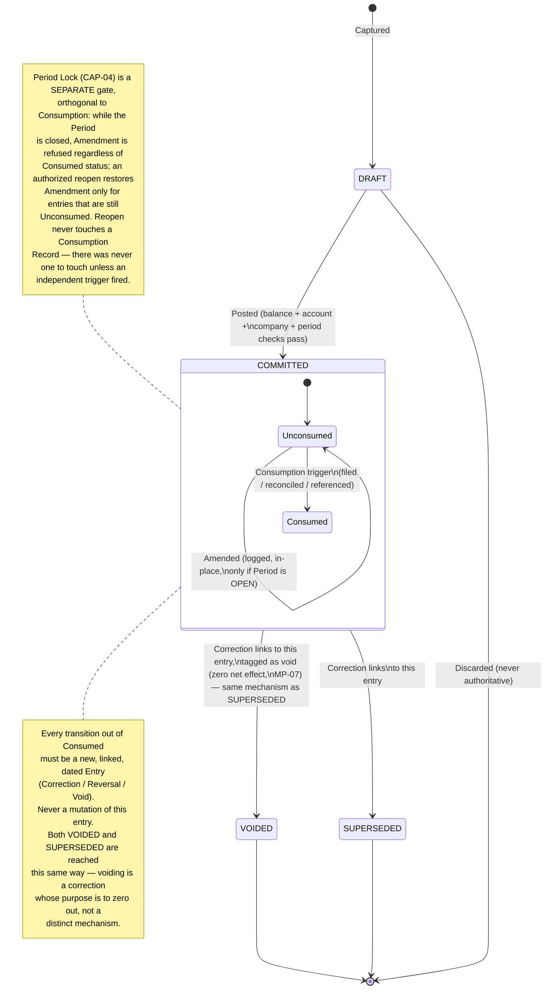

# B04 — Business Lifecycle & Event Model

| Field | Value |
|---|---|
| Domain | DOMAIN_01 — Accounting Core |
| Phase | B4 — Business Lifecycle & Event Model |
| Builds on | B01 LC-01..04, ADV-04, ADV-07, INV-06 — extends Team A's *neutral observation* into an actual Team B *design decision* |
| **Corrected** | **CORR-B01 / CORR-B03 (2026-08-29)** — ChatGPT Independent Design Audit (commit `aa60c2d0497cefe804d37953bbfaa597c3476d79`) found two material defects in this document's original version: (1) period close was modeled as an automatic, *permanent* Consumption trigger, which directly contradicted BINV-07's "never retracted" guarantee once this document also described period reopen as restoring correctability — those two claims cannot both be true; (2) direct VOID excluded an entry's Lines from historical as-of aggregation based on *current* status, which lets a later event silently rewrite an earlier as-of result. §4 and §5 below are corrected in place; the reasoning that led to each correction is kept visible, not deleted — see [CORR_B01_B02_B03_CORRECTIVE_ROUND.md](CORR_B01_B02_B03_CORRECTIVE_ROUND.md) for the full comparison of alternatives considered. |
| **Corrected (Round 2)** | **CORR-B2-01/02/03 (2026-08-29)** — ChatGPT's Round 2 re-audit (`04e44b06489d8bea6c8d39410050d68cf08bce21`) found (1) a backdated Correction could still rewrite relied-upon history, since Entry had only one temporal property (`M-AUD-04`) — fixed by adopting B07 §1c's Effective-Date/Recorded-At split, reflected below; (2) "period close" as used throughout this document conflated an ordinary posting lock with Fiscal Year Close specifically (`M-AUD-05`) — every reference below is now precise about which one applies. A new correction-purpose, **Restatement**, is introduced for backdated corrections into already-consumed periods. See [CORR_B2_CORRECTIVE_ROUND.md](CORR_B2_CORRECTIVE_ROUND.md). |
| **Corrected (Round 3)** | **CORR-B3-01/02/05 (2026-08-29)** — *(header row added retroactively at CORR-B4-07 — this round's body edits were made but this summary row was omitted at the time, a gap noticed and fixed while propagating Round 4, not a Round-4 finding itself)*. ChatGPT's Round 3 re-audit (`f6fb633fd141f45caf047bc94d75f84420e1cc6d`) required (1) an IAS 8-grounded Error/Estimate/Materiality classification, added as new §3b/§3c (`M-AUD-06`); (2) removal of the `FiscalYearClosed` event table row's claim that it triggers a posted Entry (`M-AUD-07`). See [CORR_B3_ACCOUNTING_STANDARD_CORRECTIVE_ROUND.md](CORR_B3_ACCOUNTING_STANDARD_CORRECTIVE_ROUND.md). |
| **Corrected (Round 4)** | **CORR-B4-03 (2026-08-30)** — ChatGPT's Round 4 re-audit (`9c0a3f2d179994a20f01db16d5713989a78c0b2a`, finding `M-AUD-09`) found the `FiscalYearClosed` event table row still implied Reported Retained Earnings *waits* for this declaration. Corrected: this event now governs Period Lock scope only; reporting inclusion is boundary-driven ("Elapsed," B07 §1e), never declaration-driven. See [CORR_B4_REPORTING_EQUITY_CORRECTIVE_ROUND.md](CORR_B4_REPORTING_EQUITY_CORRECTIVE_ROUND.md). |
| **Corrected (Round 5)** | **CORR-B5-05 (2026-08-30)** — ChatGPT's Round 5 re-audit (`de7492afd0af0f58185f3f36940a77f2389aa8b8`, finding `M-AUD-12`) found no Audit Event existed for a Fiscal Year boundary change, leaving the calendar dates the Elapsed test relies on unprotected against silent retroactive editing. New `FiscalYearBoundaryChanged` event added (B07 §1h). See [CORR_B5_TRIAL_BALANCE_FISCAL_CALENDAR_CORRECTIVE_ROUND.md](CORR_B5_TRIAL_BALANCE_FISCAL_CALENDAR_CORRECTIVE_ROUND.md). |

## 1. What This Phase Adds Beyond Team A's Input

Team A's `06_STATE_EVENT_LOGIC_ANALYSIS.md` correctly identified the reference system's flaw
(mutability gated on raw status, not on downstream consumption) and correctly stopped short
of proposing a fix, per its own read-only mandate. This phase is where that stops being an
observation and becomes a design: **Downstream Consumption is promoted here to a first-class,
tracked concept**, not merely a reasoning aid. This is the specific, independent design
decision this phase contributes.

## 2. State — What an Entry Can Be

Four states, deliberately minimal, deliberately not reusing the reference system's field
shape (no `parent_state` denormalization, no orthogonal `payment_state` folded in — those are
separate concerns, out of this domain's lifecycle by [B03](B03_DOMAIN_BOUNDARY_MODEL.md) §4
or belonging to a different capability):

| State | Meaning | Part of the Ledger? | Mutable? |
|---|---|---|---|
| DRAFT | Captured, not yet authoritative | No | Freely, by definition |
| COMMITTED | Authoritative financial fact | Yes | Governed by §4 (consumption- and lock-gated) |
| VOIDED | A COMMITTED entry whose effect has been zeroed by a linked, dated correction (§5) — **not** a flag flip | Yes — its own Lines still count at their own date; the *voiding* entry's Lines (dated at the void's own, later date) are what remove the effect, from that date forward | Reached only via the same Correction Link mechanism as SUPERSEDED (§5/§6) |
| SUPERSEDED | A COMMITTED entry that has been corrected; retained, unchanged, permanently linked to its correction | Yes | No — frozen the moment a correction links to it |

`SUPERSEDED` is a Team B addition, not present in Team A's neutral four-term list. It exists
because "COMMITTED" alone does not distinguish an entry nothing has ever corrected from one
that has been corrected and is now purely historical context — collapsing the two loses
information a reader of the Ledger needs (per PR-07, traceability to origin includes knowing
whether a fact is still the operative one). An entry becomes `SUPERSEDED` automatically and
only as a side effect of a Correction (§6) being committed against it — it is never a
directly-requested state.

**Corrected at CORR-B03:** `VOIDED` and `SUPERSEDED` are now the *same underlying mechanism*
(a Correction Link, §6), distinguished only by the correction's **purpose**: a `VOIDED`-tagged
correction is a full, exact reversal with no accompanying replacement value (net effect:
zero) — the "this should never have counted" case. A `SUPERSEDED`-tagged correction may carry
a replacement value — the "this was wrong, here is the right figure" case. Both are ordinary,
dated Entries, subject to every rule any Entry is subject to (BR-01 balance, etc.), and both
are included in historical aggregation (§8/B08 MP-09) exactly like any other Entry — because
they are one. The original version of this document treated `VOIDED` as a status that could
be flipped directly and that historical aggregation then filtered on *current* status; that
was the defect the independent audit found (`D01-B-AUD-03`) — see §5.

## 3. Event — What Is Recorded, Independent of State

Per LC-04, the event log is a forced, append-only capability (CAP-08), structurally separate
from the Entry's own state. Every state-changing action produces exactly one event, and event
production is not optional or configurable:

| Event | Produced by | Recorded even if... |
|---|---|---|
| `Captured` | Fact enters DRAFT | ...it is later discarded without ever posting |
| `Posted` | DRAFT → COMMITTED (CAP-02) | ...the entry is corrected the next second |
| `Amended` | An in-place content change to a COMMITTED entry that is both unconsumed and in an open Period (§4, corrected at CORR-B01) | ...the amendment is itself later superseded |
| `Corrected` | A Correction/Reversal Entry is committed, linking to and superseding an original (§6), Effective Date >= its own Recorded At's period *or* the target has no independent Consumption — an ordinary correction (§4a, added Round 2) | ...the original was itself already a correction |
| `Restated` *(added at CORR-B2-01/02)* | A Correction/Reversal Entry is committed whose Effective Date falls within a period where the target Entry has an independent Consumption Record — a distinguished, higher-scrutiny correction (§4a) | ...the restatement itself is later found mistaken (a further Restatement, chained, per B04 §6's existing chain rules) |
| `Voided` | COMMITTED → VOIDED, via a linked Correction Entry tagged as void (§5, corrected at CORR-B03 — never a bare status flip, never from DRAFT); may itself be an ordinary void or a Restated void per the same test as `Corrected` above | ...the void is later found to be itself mistaken (which requires a further, new, linked correction — voids are not undone by mutation) |
| `Consumed` | Any recorded downstream-consumption trigger fires against a COMMITTED entry (§4) | ...the consuming action itself later fails or is retracted — the fact that consumption was *attempted/recorded* stays on the trail |
| `PeriodClosed` | CAP-04 locks an **ordinary Period** to new Posting/Amendment — corrected at CORR-B2-03: this is a posting lock only, never a Revenue/Expense reset or Current Earnings transfer (that is `FiscalYearClosed`, below) | — |
| `PeriodReopened` *(added at CORR-B01)* | An authorized CO-08 action reopens a closed **ordinary Period** | ...no entry in it ends up amendable, because every one of them was independently consumed — the event is still recorded, since the reopen itself is the auditable fact, regardless of its practical effect |
| `FiscalYearClosed` *(added at CORR-B2-03/04; corrected at CORR-B3-05 — no longer posts any Entry; scope corrected at CORR-B4-03 — governs posting lock only, never reporting inclusion)* | An authorized action locks the whole Fiscal Year (extending Period Lock's scope) to new Posting/Amendment. ~~declares it closed for reporting purposes~~ — **corrected at CORR-B4-03 (`M-AUD-09`): this event has no reporting effect at all.** **Posts no financial Entry** — Current Earnings becomes part of Reported Retained Earnings via B07 §1e's derived formula, which triggers on the Fiscal Year having **elapsed** (its own calendar End Date passing), never on this declaration. A Fiscal Year is routinely elapsed-but-not-yet-closed for a real operational window; reporting is correct throughout it | — |
| `Remeasured` | CAP-06 produces a remeasurement adjustment | — |
| `FiscalYearBoundaryChanged` *(new, added at CORR-B5-05)* | An authorized, CO-15-tier action changes a Fiscal Year's Start/End boundary AFTER that boundary has already governed a COMMITTED Entry, elapsed, or been referenced by an issued/consumed report (B07 §1h) — pre-reliance corrections require no such event, since nothing has yet depended on the old value | ...the boundary change itself is later found mistaken (a further, chained `FiscalYearBoundaryChanged`, same authorization tier — never a silent revert) |

**`CarriedForward` removed at CORR-B2-03/04, deliberately, not silently.** Round 1 listed
this as the event produced when CAP-09 posts an opening-balance fact at ordinary Period
close. Per B07 §1d's corrected model, ordinary carry-forward is now **implicit** — nothing is
posted, so there is no event to record.

**`FiscalYearClosed` corrected again at CORR-B3-05 — it never produced a posted Entry either,
despite what the Round-2 text here claimed.** The Round-2 version of this note said Fiscal
Year Close's "one genuine posted fact... triggers MP-11's Entry, itself producing an ordinary
`Posted` event" — this was the same error `M-AUD-07` found in B08 MP-11 directly, repeated
here. Corrected: `FiscalYearClosed` is a pure declaration/lock event, structurally identical
in kind to `PeriodClosed` (just wider in scope), and produces no `Posted` event because it
posts nothing.

**`FiscalYearClosed`'s reporting role corrected again at CORR-B4-03.** Even after the fix
above removed the posted Entry, the Round-3 table row still said this event "marks that year's
Current Earnings as closed, so it becomes eligible for inclusion in Reported Retained
Earnings" — implying Reported Retained Earnings *waits* for this declaration. ChatGPT's Round
4 audit (`M-AUD-09`) correctly found this a real reporting hole: a delayed declaration would
delay a real, already-elapsed Fiscal Year's earnings from appearing in any report. Corrected:
this event is now understood as governing **Period Lock scope only** (identical in kind to
`PeriodClosed`, exactly as stated above) — it has never had, and now explicitly does not have,
any bearing on what Reported Retained Earnings includes. That is governed entirely by whether
a Fiscal Year has **elapsed** (B07 §1e), a pure calendar fact independent of this event.

### 3a. Correction vs. Restatement — Which Applies *(new, added at CORR-B2-01/02)*

A Correction/Void (§5, §6) is classified as an ordinary **Correction** or as a **Restatement**
by one test, applied at the moment it is committed:

```
IF the target Entry (the one being corrected/voided) has an independent Consumption Record
   (B04 §4: filed, reconciled, or referenced downstream) AND the correcting Entry's Effective
   Date falls within a period that Record already covers:
       -> RESTATEMENT. Produces a `Restated` event, not `Corrected`/`Voided`. Requires
          authorization at least as strict as Fiscal Year Close (CO-08 tiering extended,
          B09 CO-15, new). The correcting Entry's Recorded At is, as always, the true
          commitment time — a Restatement does not and cannot claim a false Recorded At.
ELSE:
       -> ORDINARY CORRECTION. Produces `Corrected`/`Voided` as before B04 §5/§6 already
          describe. No additional authorization tier beyond CO-06's existing requirement.
```

This is the direct design answer to `M-AUD-04`'s acceptance requirement: a Restatement is
never silently indistinguishable from an ordinary same-day correction, and — because MP-09
Mode 1 (B08, corrected) filters by Recorded At, not Effective Date — a Restatement's backdated
Effective Date can change Mode-2 ("current/restated") results but structurally cannot change
any Mode-1 ("as originally known") result for a time before the Restatement was Recorded.

**Correcting an error discovered in an already-closed Fiscal Year — corrected TWICE now
within this same document, both versions kept visible, not deleted.** An earlier draft
required a mandatory "Prior Period Adjustment" line backdated against Retained Earnings
whenever a Restatement's target Fiscal Year had already closed; [B19](B19_CORR_B2_FOCUSED_RED_TEAM_REGRESSION.md)
Test 11 found that over-engineered and replaced it with a second claim: that an **ordinary,
current-dated Entry** against current-period Revenue/Expense is *sufficient* treatment,
universally, for any error discovered after its Fiscal Year closed. **ChatGPT's Round 3 audit
(`M-AUD-06`) correctly found this second claim wrong too** — not over-engineered this time,
but under-engineered: it silently assumed every such error is *immaterial*, when IAS 8
(verified against the primary standard text, not memory) draws a hard line at materiality
that this design had simply never represented. **Corrected now, per §3b below:** whether an
ordinary current-dated Entry is acceptable, or whether mandatory retrospective Restatement
(backdated into the actual erroneous period, excluded from current-period P&L) is required
instead, depends entirely on a materiality judgment this domain's design does not — and per
the standard itself, must not — make on anyone's behalf. The Restatement classification test
(first part of this section) is unchanged and still correctly identifies *when* a correction
is backdated into a consumed period; §3b adds the further, IAS-8-required question of
*whether backdating is optional or mandatory* for that correction.

### 3b. Error vs. Estimate vs. Formal Restatement — IAS 8 Classification *(new, added at CORR-B3-01/02)*

Grounded in IAS 8 *Accounting Policies, Changes in Accounting Estimates and Errors*
(primary source fetched and read this round, not recalled from memory — paragraph
references below are to that text). Thailand's TAS 8 is described, in secondary sources, as
substantively aligned with IAS 8 following TFAC's 2023-bound-volume revisions; this design
cites IAS 8 as the primary authority and flags TAS 8's alignment as evidenced only at
secondary-source confidence, not independently verified against TAS 8's own primary text —
consistent with this project's own P1/P4 confidence discipline.

**Four cases, not one, and this domain's design must route a discovery through all of them
before deciding how to record it:**

```
DISCOVERY
  |
  v
Is this a NEW piece of information/development about present status or future
benefits (IAS 8 para 5, 34)?
  YES -> CHANGE IN ACCOUNTING ESTIMATE. Not an error (para 34 states this explicitly).
         Applied PROSPECTIVELY (para 36-38): recognized in the period of change (and
         future periods, if the change affects both) via an ordinary, current-dated
         Entry. This is this domain's EXISTING ordinary-Entry machinery, unchanged,
         and is the CORRECT treatment for this case -- not every "ordinary Entry"
         answer from Round 2 was wrong, only its universal application to errors.
  NO, this is a failure to use (or misuse of) reliable information that WAS
  available when the affected period's statements were authorized (para 5's
  definition, quoted precisely, not paraphrased loosely) -> ERROR. Continue below.
  |
  v
Were the affected period's own financial statements already authorized for issue
when this was discovered?
  NO (still the current, not-yet-authorized period) -> CURRENT-PERIOD ERROR
         (para 41). Corrected before authorization, via this domain's existing
         Amendment (if unconsumed) or Correction (if consumed) machinery --
         unchanged, and correct for this case.
  YES -> PRIOR-PERIOD ERROR. Continue below.
  |
  v
Is the error MATERIAL (IAS 1 para 7's definition, as IAS 8 para 5 adopts it --
a qualitative, judgment-based test; this design does NOT compute, infer, or
default a numeric threshold, per this round's explicit instruction)?
  This is a POLICY/JUDGMENT INPUT to this domain's design, supplied by whoever is
  authorized to make it (CO-16, B09, new) -- never guessed, never defaulted to
  either answer by this domain's own logic.
  |
  +-- IMMATERIAL -> may be corrected via an ordinary, current-dated Entry (the
  |    Round-2 Test 11 treatment remains valid, but ONLY for this narrower case).
  |
  +-- MATERIAL -> MANDATORY Retrospective Restatement (para 42), continue to
       B04 §3c/B08 for the mechanics -- an ordinary current-dated Entry against
       current-period Revenue/Expense is NOT an available treatment for this case.
```

### 3c. Material Prior-Period Error — Retrospective Restatement Mechanics *(new, added at CORR-B3-02/03/04)*

For a Material Prior-Period Error (§3b), this domain's design requires, mapped directly onto
IAS 8's own structure (paragraphs cited, not invented):

1. **Ordinary case (para 42(a)):** a Restatement (§3a) is created with Effective Date
   backdated into the actual period(s) the error occurred in, among the comparative periods
   this domain's design presents. This changes MP-09 Mode 2 for those periods — "restating
   the comparative amounts for the prior period(s) presented in which the error occurred" is
   exactly what a backdated Restatement, as already designed in §3a, produces.
2. **Error predates the earliest comparative period presented (para 42(b)):** the Restatement
   instead targets the *opening* Balance Sheet position of the earliest presented comparative
   period. Under B07 §1e's derived Reported-Retained-Earnings formula, this requires no new
   mechanism — restating an earlier-still Fiscal Year's Current Earnings (via the same
   Restatement, backdated further) automatically changes every later period's opening
   position, because §1e's formula sums *every* closed Fiscal Year's (current) Current
   Earnings, not just the one directly targeted.
3. **Always excluded from current-period P&L (para 41/46):** BR-07/CO-15's existing
   Restatement-authorization gate already prevents a Restatement from being silently confused
   with an ordinary Correction; this domain's design additionally requires that a *Material*
   Prior-Period Error's Restatement is **never** satisfied by an ordinary current-dated Entry
   — §3b's decision tree makes this the only path once "material" is the judgment reached.
4. **Impracticable to determine period-specific effects for one or more presented prior
   periods (para 43/44):** the Restatement targets the *earliest period for which retrospective
   restatement is practicable* instead — which "may be the current period" (para 44's own
   words) if nothing earlier is practicable. This domain's design does not fabricate a
   period-specific figure it cannot actually support with evidence — practicability is itself
   a judgment input (CO-16), not something this domain computes.
5. **Impracticable to determine the cumulative effect at the start of the current period
   (para 45):** the Restatement instead corrects prospectively from the earliest date
   practicable — i.e., a Restatement whose Effective Date is the earliest practicable point,
   not a fabricated reconstruction of the full historical chain.
6. **No hindsight (para 53):** a Restatement's content must reflect only what was knowable —
   evidence of circumstances that existed at the time, available when the original period's
   statements were authorized — never information that only became available afterward. This
   domain's design does not verify this substantively (it is a content-quality question for
   whoever prepares the Restatement, not something CAP-02 can check), but states it as an
   explicit design expectation rather than leaving it unmentioned.

None of this requires new machinery beyond what §3a (Restatement) and B07 §1c (Effective
Date/Recorded At) and §1e (Reported Retained Earnings) already provide — IAS 8 compliance is
achieved by using the *existing* temporal and Restatement model correctly and completely,
not by adding a parallel mechanism.

**Why this is a design decision this domain must encode, not a judgment call left silently
implicit:** IAS 8 para 41 states plainly that material prior-period errors are excluded from
current-period profit or loss precisely because discovery happened in the current period —
the Round-2 design's failure was treating "discovered now" as sufficient justification for
"recognized now," which is exactly the reasoning the standard rules out. Para 46 states the
correction of a prior period error is excluded from profit or loss for the period in which
the error is discovered — stated here as the specific, load-bearing sentence that closes
`M-AUD-06`, cited rather than paraphrased into something weaker.

## 4. The Consumption Gate — The Core Design Decision

**Corrected at CORR-B01.** The original version of this section listed period close as a
fourth, automatic Consumption trigger, and separately described period reopen as a path back
to "correctable." ChatGPT's independent audit (`D01-B-AUD-01`) correctly identified that
these two claims cannot both be true once BINV-07 requires a recorded Consumption event to be
*permanent* — if period close created a real Consumption Record, no reopen could legitimately
undo it, full stop. Three alternatives were compared before choosing the correction below
(full comparison: [CORR_B01_B02_B03_CORRECTIVE_ROUND.md](CORR_B01_B02_B03_CORRECTIVE_ROUND.md) §1):
keeping period-close-as-consumption and simply deleting the reopen-restores-correctability
claim (rejected — needlessly rigid, and CO-06 already keeps Correction no harder than
Amendment, so the rigidity buys little); introducing a new three-state Period concept
(rejected — adds surface area the existing Period/Consumption split can already express
correctly once properly separated); and **separating Period lock-status from Entry
consumption-status as two independent, orthogonal gates on the same action (Amendment)** —
the option adopted. This is, precisely, the same category of bug Team A found in the
reference system's own `state` field (CF-06/`06_STATE_EVENT_LOGIC_ANALYSIS.md`: conflating
"is this committed yet" with "should this still count") recurring inside this domain's own
design, between "is the period locked" and "has this fact been externally relied upon" —
caught by independent audit rather than by this domain's own ten-persona red-team pass,
recorded honestly in [B16](B16_TEAM_B_INTERNAL_RED_TEAM_REVIEW.md)'s addendum.

**Definition — Downstream Consumption:** a COMMITTED entry is *consumed* the moment any of
the following becomes true. This list is the design answer to Team A's open question
(`06_STATE_EVENT_LOGIC_ANALYSIS.md`, "is reset/reopen ever legitimate — yes, conditionally").
**Three triggers, not four** — period close is no longer one of them:

1. It has been included in a statutory filing or externally issued financial statement.
2. It has been matched/reconciled against an external record (e.g., a bank statement) outside
   this entity's own books.
3. Another COMMITTED entry — in this domain or any consumer named in
   [B03](B03_DOMAIN_BOUNDARY_MODEL.md) §3 — was itself computed from or references this one.

Once triggered, a Consumption Record is permanent (BINV-07, unchanged) and BINV-06's
immutability applies forever after, regardless of any later Period action — consumption is no
longer entangled with Period status in any direction.

**Period Lock — a separate, orthogonal gate.** An open/closed Period (CAP-04, BINV-02)
independently gates two things: new Posting (BR-05, unchanged) and, corrected here, in-place
Amendment (BR-14). While a Period is closed, Amendment is refused **because the Period is
locked**, not because closing it created a Consumption Record. An authorized, audited reopen
(CO-08) restores the "Period is open" half of this condition — and, because Consumption was
never entangled with Period status in the first place, reopen never has to (and structurally
cannot) touch a Consumption Record that does not exist for that reason. This is a *stricter*
reading of Team A's original insight than the version this document previously shipped with:
"a mistake caught before external consumption is arguably safe to correct" is restored to its
precise, narrow meaning — Period Lock alone was never a legitimate stand-in for that test.

**Gate rule, stated once, enforced everywhere — corrected:**

```
Amendment (§3 `Amended` event) is permitted on a COMMITTED entry if and only if BOTH:
  (a) entry.consumed == false   — no independent Consumption trigger (1-3 above) has fired
  (b) entry.period.status == OPEN   — the entry's Period is not locked

IF NOT (a):
    the ONLY correction path is a linked Correction Entry (§6); permanent, regardless of
    Period status — reopening the Period changes nothing about this
IF (a) AND NOT (b):
    Amendment is refused because the Period is locked; an authorized reopen (CO-08) can
    restore (b) — and, since (a) was never affected by Period status, reopen's effect on
    amendability is now exactly what it should be: it restores what Period locking took
    away, nothing more, nothing that BINV-06/07 ever promised to protect
IF (a) AND (b):
    Amendment is permitted, exactly as originally designed
```

This is the direct design answer to ADV-04 and ADV-07, and the structural fix for INV-06: the
invariant that *should* gate mutability (consumption) is now the invariant that *does* gate
it, cleanly separated from the invariant that gates timing (Period lock) — closing both the
gap Team A identified as the domain's central weakness (CF-06,
`06_STATE_EVENT_LOGIC_ANALYSIS.md`) and the gap this domain's own first design pass
introduced by conflating the two.

## 5. Void — A Distinct *Purpose*, the Same Mechanism as Correction

**Corrected at CORR-B03.** Voiding still answers "should this still count," not "was this
wrong as originally captured" — that semantic distinction from Correction is preserved. What
changes is *how* it is achieved. The original version of this section allowed an unconsumed
COMMITTED entry to move to VOIDED via "a direct void event" — implying a status flip on the
entry itself. ChatGPT's independent audit (`D01-B-AUD-03`) correctly identified that this
broke historical reproducibility: [B08](B08_ACCOUNTING_MATHEMATICAL_DESIGN_PRINCIPLES.md)
MP-09 filtered aggregation by an Entry's *current* VOIDED status, so voiding something today
would silently change what "balance as of last month" reports — even though, last month, the
entry was genuinely valid and should stay reported that way. A later event must not rewrite
an earlier as-of result.

Two alternatives were compared (full detail:
[CORR_B01_B02_B03_CORRECTIVE_ROUND.md](CORR_B01_B02_B03_CORRECTIVE_ROUND.md) §3): keep Void
as a distinct status but make aggregation date-aware (filter on *when* the void became
effective, not current status); or make voiding **always** a dated, linked Correction Entry —
a full reversal (MP-07) with no accompanying replacement value — so that no special
aggregation logic is needed at all, since a dated Entry already only affects "as of" queries
on or after its own date. **The second option was adopted.** It requires no new
temporal-tracking concept, it naturally produces the correct *prospective* semantics (a void
takes effect when it is recorded, not retroactively at the original entry's own date — the
only reading consistent with "a report issued as of D1 reflected the truth as of D1"), and it
collapses what was previously a consumption-gated, two-branch rule into one uniform mechanism:

**Voiding a COMMITTED entry — regardless of its consumption status — is always a Correction
Entry (§6) whose Lines are the exact negation of the original's (MP-07), carrying no
replacement value, tagged with void as its purpose.** The original becomes VOIDED (a labeled
flavor of SUPERSEDED, §2); its own Lines, at its own date, are never altered or excluded —
the voiding Entry's Lines, at *their own* (later) date, are what remove the effect, and only
from that date forward. This applies uniformly whether the original was consumed or not:
consumption no longer changes *how* voiding happens (it was never a meaningfully lighter
operation than an ordinary correction to begin with, given BR-14 already requires an Amendment
to be logged with a full before/after record), only the routine consumption gate (§4) still
governs whether an *Amendment* — a different operation — is available.

## 6. Correction / Reversal — Relationship, Not Mutation

A Correction is a COMMITTED entry with one additional, mandatory property: a link to the
entry it corrects. Positing this as a **relationship** (an edge between two Entries) rather
than a state or a field-level flag is deliberate — per [B03](B03_DOMAIN_BOUNDARY_MODEL.md)
§2, "Correction/Reversal" is a *kind* of Entry, defined by having this relationship, not a
separate concept requiring separate lifecycle rules. Consequences of this design choice:

- The relationship is bidirectional and permanent: the original is discoverable from the
  correction and vice versa (answers B04's mandated question "how is correction
  represented" directly — as a first-class, queryable relationship, not a derived inference).
- A correction can itself be corrected — the relationship chains. `06_STATE_EVENT_LOGIC_
  ANALYSIS.md`'s open question (GAP-D01-23, reversal-of-a-reversal semantics) is resolved
  here as a design decision: each link is independent and equally valid; there is no special
  case for a second-order correction, because the relationship, not the entry's "distance"
  from an original, is what carries meaning.
- Committing a correction is itself subject to every rule in §4 — a correction is not exempt
  from balance (IV-01), period-validity (CAP-04), or company-boundary (CAP-05) checks merely
  because it is a correction.

## 7. Commitment — When a Fact Becomes Authoritative

A financial fact becomes authoritative at exactly one moment: successful completion of
Posting (CAP-02), which requires — synchronously, not as a follow-up check — that the
proposed Entry balances (IV-01), every line references a valid, active account (CAP-01),
every line's company is consistent (CAP-05), and the entry's date falls within a period
CAP-04 confirms open. Failing any one of these means the fact never becomes authoritative;
there is no partially-committed state. This directly implements ADV-01 (the balance guarantee
must be non-optional at the point data becomes durable) by making balance validation
structurally part of the state transition itself, not a separate, skippable step before it.

## 8. Lifecycle Diagram

> **SMEsPlus Independent Conceptual Design — NOT Vendor Translation.**
> States, event names, and the consumption gate are this domain's own design; no vendor field
> or method name appears below.

> **Corrected at CORR-B01/CORR-B03.** Period-close removed as a Consumption trigger (now an
> independent Period Lock gate on Amendment); VOIDED now reached only via a linked, dated
> Correction Entry, never a direct status flip.



## 9. Answers to the Phase's Mandated Questions

| Question | Answer |
|---|---|
| When does a fact become authoritative? | At successful Posting (§7) — one synchronous transition, no partial commitment |
| When can it change? | Via a logged Amendment, if and only if BOTH unconsumed and its Period is open (§4, corrected at CORR-B01) — the two conditions are independent and both must hold |
| When must it become immutable? | Permanently, the instant it is consumed (§4) — Period status (open, closed, or reopened) never affects this. Separately, Amendment is also unavailable, non-permanently, whenever the Period is locked |
| How is correction represented? | As a permanent, bidirectional, chainable relationship between Entries (§6), not a field or flag — Void (§5) is this same relationship, tagged by purpose, corrected at CORR-B03; a backdated correction into an already-consumed period is further distinguished as a **Restatement** (§3a, Round 2) |
| What constitutes a new accounting fact? | Every Posting, Correction, Restatement, Void, and Remeasurement (CAP-06) — **corrected Round 2:** ordinary carry-forward is no longer on this list, because it is not a posted fact at all (§3a note, B07 §1d) — nothing is a free edit once consumed, and nothing is ever a bare status flip. **Corrected again at CORR-B3-05:** Fiscal Year Close's Entry (CAP-09/MP-11) is also removed from this list — this row was left stale through Round 3 itself (a gap fixed while propagating Round 4, not a Round-4 finding) — Fiscal Year Close produces only the `FiscalYearClosed` Audit Event, no Entry, per B08 MP-11's Round-3 rewrite |
| Which temporal axis does aggregation filter on? *(new question, Round 2)* | Two, not one (B07 §1c) — Effective Date determines Period/Fiscal-Year membership; Recorded At, immutable (BINV-12), is what makes "as originally known" (MP-09 Mode 1) provably stable. See B08 MP-09. |

**B4 = COMPLETE.** *(Corrected at CORR-B01/CORR-B03/CORR-B2-01/02/03/CORR-B3-01/02/05/
CORR-B4-03/CORR-B5-05 — see header. §3a is new at Round 2; §3b/§3c new at Round 3; the event
table gained `Restated` and `FiscalYearClosed`, lost `CarriedForward` (removed deliberately,
explained above, not silently deleted); `FiscalYearClosed`'s own description was corrected at
Round 3 (no posted Entry) and again at Round 4 (no reporting-inclusion effect, `M-AUD-09`).
`FiscalYearBoundaryChanged` is new at Round 5, protecting the calendar facts `FiscalYearClosed`
and the Elapsed test (B07 §1e) both depend on from silent retroactive editing (`M-AUD-12`).)*
