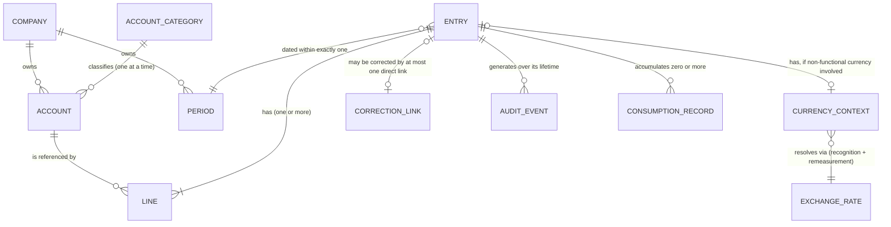

# B07 — Conceptual Information Model

| Field | Value |
|---|---|
| Domain | DOMAIN_01 — Accounting Core |
| Phase | B7 — Conceptual Information Model |
| Scope | Business concepts, meaning, ownership, relationships, cardinality, identity. **No physical schema, SQL, ORM, index, or vendor field/PK/FK below.** |
| **Corrected** | **CORR-B02 (2026-08-29)** — §1a's closing claim ("this is what makes Assets = Liabilities + Equity meaningful") overstated what Normal Balance Side alone proves; corrected below, and a new §1b defines Current Earnings. **CORR-B01** — the Consumption Record row's "four B04 §4 trigger kinds" corrected to three (period close removed as a trigger). See [CORR_B01_B02_B03_CORRECTIVE_ROUND.md](CORR_B01_B02_B03_CORRECTIVE_ROUND.md). |
| **Corrected (Round 2)** | **CORR-B2-01/02/03/04 (2026-08-29)** — ChatGPT's Round 2 re-audit (`04e44b06489d8bea6c8d39410050d68cf08bce21`) found two further defects: an Entry's single "date" property let a backdated Correction rewrite relied-upon history (M-AUD-04), and Current Earnings (§1b) was bounded "since the last close" — ambiguous between ordinary Period close and Fiscal-Year close, matching M-AUD-05's finding that CAP-09 overgeneralized BF-09's year-end-specific rule. Fixed below: Entry now has two distinct temporal properties (§1c), and a new **Fiscal Year** entity is added. See [CORR_B2_CORRECTIVE_ROUND.md](CORR_B2_CORRECTIVE_ROUND.md). |
| **Corrected (Round 3)** | **CORR-B3-01..05 (2026-08-29)** — ChatGPT's Round 3 re-audit (`f6fb633fd141f45caf047bc94d75f84420e1cc6d`) found (1) prior-period error treatment did not comply with IAS 8's mandatory retrospective restatement for material errors (`M-AUD-06`, verified against primary IAS 8 text, paragraphs 5/41-48/50-53 — not memory or secondary sources); (2) §1d's "no posted action ever touches Revenue/Expense" claim directly contradicted MP-11's actual definition, which did (`M-AUD-07`). §1b/§1d rewritten: Fiscal Year Close is now purely declarative (no posted Entry); Reported Retained Earnings is a new derived reporting formula (§1e). See [CORR_B3_ACCOUNTING_STANDARD_CORRECTIVE_ROUND.md](CORR_B3_ACCOUNTING_STANDARD_CORRECTIVE_ROUND.md). |
| **Corrected (Round 4)** | **CORR-B4-01/02/03/04 (2026-08-30)** — ChatGPT's Round 4 re-audit (`9c0a3f2d179994a20f01db16d5713989a78c0b2a`) found §1e's Round-3 formula, combined with B08 MP-02's reporting equation, double-counted the designated Retained-Earnings account's direct-posted balance (`M-AUD-08`); found §1e's "closed before D" boundary made Reported Retained Earnings depend on when an operator *declares* Fiscal Year Close, not on the Fiscal Year's own calendar boundary — a genuine reporting hole if that declaration is ever delayed (`M-AUD-09`); and found §1e defined Reported Retained Earnings using MP-09 Mode 2 only, with no defined Mode-1 ("as originally known") counterpart, despite B20 Test 8 relying on one (`M-AUD-10`). §1e corrected (Fiscal-Year inclusion is now boundary-driven, "elapsed," not declaration-driven); new §1f defines a non-overlapping Reported Equity decomposition; new §1g defines viewpoint-parameterized Known/Current functions. See [CORR_B4_REPORTING_EQUITY_CORRECTIVE_ROUND.md](CORR_B4_REPORTING_EQUITY_CORRECTIVE_ROUND.md). |

## 1. Conceptual Entities

| Entity | Business meaning | Identity principle | Owning capability |
|---|---|---|---|
| **Company** | A legal entity whose books are kept separately (CAP-05) | A stable business identifier, independent of any source-system internal ID | CAP-05 |
| **Account Category** | A fixed classification governing statement placement and carry-forward behavior (BINV-09) — **corrected Round 2:** carry-forward behavior is now defined precisely per §1b/§1d, not a generic "year-end" gloss | A closed, small set defined at the domain level, not per company | CAP-01 |
| **Account** | A node in one Company's chart of accounts | Stable once created; its Category is mutable only before first use (BR-08) | CAP-01 |
| **Fiscal Year** *(new, Round 2)* | A bounded span of time, composed of one or more contiguous Periods, that defines the horizon over which Income Statement (Revenue/Expense) activity accumulates before being closed to Equity (§1b, §1d) | Identified by its Company and the span it covers; exactly one Fiscal Year contains any given date for a Company | CAP-09 (renamed/rescoped, §2) |
| **Period** | A bounded span of time with one authoritative open/closed status (BINV-02) — an ordinary **posting lock**, distinct from and nested within a Fiscal Year; closing a Period never itself resets or transfers anything (corrected Round 2 — see §1d) | Identified by its Company and the span it covers; never two overlapping Periods answer for the same date/company/class; belongs to exactly one Fiscal Year | CAP-04 |
| **Entry** | A Financial Fact expressed in double-entry form (B03 §2) | A permanent, system-assigned identity that exists independently of any human-readable document number (see §4); **carries two distinct temporal properties, not one — see §1c (Round 2 correction)** | CAP-02 |
| **Line** | One attribution within an Entry (B03 §2) | Identified only in relation to its owning Entry — a Line has no independent existence | CAP-02 |
| **Currency Context** | The relationship between a transaction currency and a Company's functional currency for a given Entry (B03 §2) | Identified by the (Entry, currency pair) it applies to, not stored independently of the Entry it values | CAP-06 |
| **Exchange Rate** | A (currency pair, date) → rate fact, external to this domain's own authority but consumed by it | Identified by currency pair and date | CAP-06 (consumer, not source of truth) |
| **Correction Link** | The permanent, directed relationship between a correcting Entry and the Entry it corrects (B04 §6) | Identified by the ordered pair (correcting Entry, corrected Entry); see §3 cardinality rule | CAP-03 |
| **Audit Event** | One immutable record of a state-changing action (B04 §3) | A permanent, append-only identity; never reused, never edited | CAP-08 |
| **Consumption Record** | A specialization of Audit Event marking that a specific COMMITTED Entry has been consumed, and by which of the three B04 §4 trigger kinds *(corrected at CORR-B01 — was four; period close is no longer one of them)* | Identified by (Entry, trigger kind, occurrence) — an Entry may accumulate multiple Consumption Records over time (e.g., filed, *then* separately referenced downstream); only the *first* one matters for BINV-06, but all are retained (BINV-07) | CAP-08, triggered by whichever capability observes the external event (filing/reconciliation are typically reported by domains outside this one, per B03 §3; downstream reference — including CAP-09's own carry-forward, which references the prior period's closing Entries — is observed within this domain) |

### 1a. Account Category — Normal Balance Side *(added at B16 §11, Persona 1 fix; corrected at CORR-B02)*

The red-team pass found that [MP-02](B08_ACCOUNTING_MATHEMATICAL_DESIGN_PRINCIPLES.md)'s
proof of the accounting equation as a corollary of MP-01 depends on "Account Category
correctly determines its normal balance side" — a property this entity list never actually
stated. Stated explicitly now: **every Account Category carries a Normal Balance Side
(debit-normal or credit-normal)**, fixed for the category (**Asset and Expense** categories
are debit-normal; **Liability, Equity, and Revenue** categories are credit-normal — standard
accounting convention, PR-01/PR-02, not an independent invention). An Account's aggregate
balance (MP-09) is interpreted against its Category's Normal Balance Side.

**Corrected at CORR-B02:** the previous version of this paragraph claimed Normal Balance Side
alone is "what makes `Assets = Liabilities + Equity` meaningful." ChatGPT's independent audit
(`D01-B-AUD-02`) correctly found this incomplete — Normal Balance Side alone proves the
*expanded* equation (`Assets + Expenses = Liabilities + Equity + Revenue`), which holds at
every moment, open period or not. The *simple* equation is a special case of the expanded one
(true exactly when Revenue and Expenses are both zero — i.e., after closing) — see §1b and
[B08](B08_ACCOUNTING_MATHEMATICAL_DESIGN_PRINCIPLES.md) MP-02 for the corrected proof.

### 1b. Current Earnings *(new, added at CORR-B02; re-bounded at CORR-B2-03/04)*

**Current Earnings** is a derived concept, not a separately stored entity — like Ledger
(B03 §2), it is a computed view, not something with its own identity or lifecycle. It is
defined as: `Current Earnings = (sum of Revenue-category account balances) − (sum of
Expense-category account balances)`, **for the current Fiscal Year** (from that Fiscal
Year's start date through the query date) — **corrected at CORR-B2-03/04: "since the last
close" (the original round-1 wording) was exactly the ambiguity ChatGPT's Round 2 audit
flagged (`M-AUD-05`).** An ordinary Period closing (a posting lock, §1d) never bounds this
sum — only a Fiscal Year boundary does. It exists specifically to answer the question the
simple accounting equation cannot answer on its own during an open Fiscal Year: where does
the net effect of not-yet-closed Revenue and Expense activity sit, for reporting purposes?
Two equivalent ways to state the answer:

- **Expanded form (always true, open or closed):** `Assets + Expenses = Liabilities + Equity
  + Revenue` — a direct corollary of BINV-01 (every Entry balances) plus Normal Balance Side
  (§1a), with no additional assumption.
- **Reporting form (regroup the same equation):** `Assets = Liabilities + (Equity + Current
  Earnings)` — i.e., for reporting purposes, Equity-plus-not-yet-closed-Current-Earnings
  behaves as the simple equation's "Equity" term. This is a restatement, not a separate fact.

**Corrected at CORR-B2-03/04, corrected again at CORR-B3-05:** at **Fiscal Year Close**
(CAP-09, redefined — not ordinary Period close), Current Earnings becomes part of **Reported**
Retained Earnings (§1e) — **not via a posted Entry** (the Round-2 wording here claimed
exactly one new committed Entry did this; that claim directly contradicted the very next
sentence's "not reset by any posted action" and, worse, was mathematically unsound if taken
literally — see §1d's Round-3 correction for why). Revenue/Expense accounts are **not reset
by any posted action** — see §1d: their zero-point for the new Fiscal Year is a consequence
of how they are aggregated (bounded by Fiscal Year start), not something anyone resets.
After Fiscal Year Close, Current Earnings is zero again for the new Fiscal Year (nothing has
been dated into it yet) and the simple equation holds directly, using the now-updated
Reported Retained Earnings figure (§1e). See
[B08](B08_ACCOUNTING_MATHEMATICAL_DESIGN_PRINCIPLES.md) MP-02 for the full proof.

### 1c. Entry Temporal Properties — Effective Date and Recorded At *(new, added at CORR-B2-01/02)*

ChatGPT's Round 2 audit (`M-AUD-04`) found that this domain's Entry concept had only one
temporal property ("date"), used for two different purposes at once: determining which
Period an Entry belongs to, *and* determining what counts toward a historical "as of"
aggregation (B08 MP-09). Collapsing these let a backdated Correction silently rewrite
already-relied-upon history — because nothing distinguished "when this economically
happened" from "when the system actually accepted this fact." Fixed by splitting Entry's
temporal identity into two independent properties, corrected here and reflected in B08's
aggregation model:

- **Effective Date** — the date the accounting effect belongs to, from the business
  perspective (e.g., "this sale happened on March 15"). Business-meaningful, chosen by
  whoever proposes the Entry (subject to the ordinary Period-lock check, BR-05), and the
  basis for "which Period is this in." This is what the pre-Round-2 design called "date."
- **Recorded At** — the moment CAP-02 actually accepted the Entry as authoritative (Posting,
  B04 §7). **System-generated, assigned exactly once, at the instant of commitment; never
  user-settable, never editable, never backdated** — this is the property that makes it
  structurally impossible to fake "this was known earlier than it actually was." See
  [B05](B05_ACCOUNTING_INVARIANT_BASELINE.md) BINV-12 (new).

Effective Date answers "what period does this belong to and what did it change." Recorded At
answers "when could anyone possibly have known about this." B08 MP-09's two aggregation
modes (§1c continued in B08) are built on exactly this distinction, and neither property is
redundant with the other — an ordinary, same-day Entry has Effective Date ≈ Recorded At, but
a Correction or Restatement typically does not, and the difference between them is precisely
what the historical-reproducibility guarantee depends on.

### 1d. Carry-Forward Is Implicit, Not a Posted Fact *(new, added at CORR-B2-03/04)*

ChatGPT's Round 2 audit (`M-AUD-05`) found that CAP-09/BINV-10 (round 1) described carry-
forward as an *explicit committed fact* — a new "opening balance" Entry posted at every
Period close — while B08 MP-09 sums *all* historical Lines dated ≤ D. Combined, these two
statements double-count: the original historical activity and the new opening-balance Entry
both contribute to the same balance. **Resolved by adopting a Continuous Ledger model**
(compared against a Segmented-Period alternative in
[B13](B13_DESIGN_OPTION_TRADEOFF_REGISTER.md) DT-09):

- **Asset / Liability / Equity accounts (Balance Sheet categories) accumulate all-time** —
  their balance as of any date D is the sum of every Line ever posted against them with
  Effective Date ≤ D, with no periodic re-assertion. Carry-forward across an ordinary Period
  boundary is therefore **implicit** — a mathematical consequence of the aggregation formula,
  not a fact anyone has to post. Nothing is created, so nothing can double-count.
- **Revenue / Expense accounts (Income Statement categories) accumulate within the current
  Fiscal Year only** — bounded below by the current Fiscal Year's start date, not all-time.
  This is what makes YTD reporting correct across ordinary Period boundaries (B08 MP-09) and
  what makes the zero-point for a new Fiscal Year automatic rather than something that must
  be reset by a posted action.
- **Fiscal Year Close posts NO Entry at all — corrected at CORR-B3-05.** The Round-2 text
  here originally said Fiscal Year Close "creates" a Current Earnings transfer Entry into
  Equity, while [B08](B08_ACCOUNTING_MATHEMATICAL_DESIGN_PRINCIPLES.md) MP-11 (also Round 2)
  separately defined that Entry as directly debiting Revenue and crediting Expense accounts.
  ChatGPT's Round 3 audit (`M-AUD-07`) correctly found these two statements contradictory —
  and working through it precisely showed the contradiction was not merely cosmetic: an
  Entry that debits Revenue/credits Expense, dated within the Fiscal Year being closed, would
  itself be included in that same Fiscal Year's own Mode-1/Mode-2 aggregation (B08 MP-09),
  silently zeroing out the very P&L figures BINV-11 promises stay reproducible. **Fixed:**
  Fiscal Year Close is now purely a declarative, authorized action — an Audit Event
  (`FiscalYearClosed`, B04 §3) that locks the Fiscal Year, exactly like an ordinary Period
  Lock but scoped to the whole year. It posts nothing. See §1e for how Current Earnings then
  becomes part of Reported Retained Earnings without any Entry moving it.

This is also why a **migration opening balance** (B10 MG-C03) is not an instance of this
pattern: under a Continuous Ledger, there is no recurring "carry-forward" business event to
be an instance of. A migration opening balance is a one-time, distinct act — establishing the
starting point of a ledger that has no prior history *in this system* to sum over — not a
periodic transfer between two periods that both already exist in the same ledger.

### 1e. Reported Retained Earnings — A Derived Reporting Formula, Not a Posted Balance *(new, added at CORR-B3-05; boundary condition corrected at CORR-B4-03)*

Because Fiscal Year Close posts no Entry (§1d), **formal Retained Earnings is not a ledger
account that "receives" each year's Current Earnings through a journal posting** — it is a
**derived reporting figure**, computed the same way Current Earnings itself already was
(B07 §1b) rather than through a physical transfer:

```
ROUND 3 FORMULA (kept visible, not deleted — this is exactly what ChatGPT's Round 4 audit,
`M-AUD-09`, found wrong):

Reported Retained Earnings(Company C, as of date D) =
    all-time balance of the formally-designated Retained Earnings account
      (direct postings only — e.g. dividend declarations; a real, distinct
      business event, not part of closing)
  + SUM over every Fiscal Year that CLOSED before D of:
      that Fiscal Year's Current Earnings, computed via MP-09's Mode-2
      (current/restated) Fiscal-Year-bounded aggregation for that year
```

**WHY THIS WAS WRONG (`M-AUD-09`):** "closed" here meant "has had a `FiscalYearClosed` Audit
Event declared for it" — an authorized, operator-triggered action (§1d, B02 CAP-09). Nothing
in this domain's design requires that declaration to happen *at* the Fiscal Year's own calendar
boundary — the whole point of separating governance/lock actions from posted facts (§1d) is
that a declaration is a discrete, authorized, potentially-delayed human/process action, not an
instantaneous one. If FY2024 ends Dec 31 but `FiscalYearClosed` for FY2024 is not declared
until Jan 15, then on Jan 5 — with the Round-3 formula above — FY2024's Current Earnings would
be excluded from Reported Retained Earnings (it is not yet "closed"), while FY2025's Revenue/
Expense would correctly still read zero (nothing dated in FY2025 yet). The result: Assets would
reflect FY2024's activity (it was never un-posted), but Reported Equity would not — the
reporting equation would fail by exactly FY2024's Current Earnings amount, *solely* because an
operator had not yet clicked a button. Reporting truth must never depend on operational close
timing this way.

**CORRECTED FORMULA (CORR-B4-03, supersedes the Round-3 formula above):**

```
Reported Retained Earnings(Company C, as of date D) =
    all-time balance of the formally-designated Retained Earnings account
      (direct postings only — e.g. dividend declarations; a real, distinct
      business event, not part of closing)
  + SUM over every Fiscal Year that has ELAPSED as of D of:
      that Fiscal Year's Current Earnings, computed via MP-09's Mode-2
      (current/restated) Fiscal-Year-bounded aggregation for that year

  where a Fiscal Year has ELAPSED as of D  <=>  its own defined End Date <= D
  (a pure calendar fact about the Fiscal Year and the query date — never about
  whether any `FiscalYearClosed` Audit Event has been recorded)
```

**Elapsed and Closed are now two deliberately independent concepts, on the same "orthogonal
gates" pattern this domain has used since CORR-B01's Period-Lock/Consumption split (B04 §4)
and CORR-B2-03/04's Period-Lock/Fiscal-Year-Lock split:**

- **Elapsed** (new term, this correction) — a pure calendar fact: has the Fiscal Year's own
  End Date passed as of the query date D? Governs **reporting inclusion only** — whether that
  year's Current Earnings counts toward Reported Retained Earnings. Requires no authorization,
  no action, no Audit Event — it is true or false by construction, the instant the calendar
  date passes.
- **Closed** (unchanged concept, scope clarified this correction) — has an authorized
  `FiscalYearClosed` declaration (§1d, B02 CAP-09) been recorded for the year? Governs
  **posting-lock scope only** — whether ordinary new activity or Amendment can still enter that
  Fiscal Year without an authorized reopen (CO-08). Has **zero effect** on Reported Retained
  Earnings — corrected here to state this explicitly, closing exactly the gap `M-AUD-09` found.

A Fiscal Year is routinely Elapsed-but-not-yet-Closed for a real, often multi-week window
(the ordinary close/reconciliation/review process) — this is normal, expected operation, not
an edge case or a failure state, and the corrected formula treats it as such: FY2024's Current
Earnings enter Reported Retained Earnings automatically the instant Dec 31 2024 passes,
continuing to update (via Mode 2) as ordinary pre-close entries, corrections, or later
Restatements are dated into FY2024 — exactly the same living, current computation Reported
Retained Earnings has always been, with no discontinuity at the close declaration. See
[B13](B13_DESIGN_OPTION_TRADEOFF_REGISTER.md) DT-11 for the full comparison against two
rejected alternative models, and
[B20](B20_CORR_B3_ACCOUNTING_STANDARD_REGRESSION.md#reported-equity-terminology-note-added-at-corr-b4)/
[B21](B21_CORR_B4_REPORTING_EQUITY_REGRESSION.md) Tests 5-7 for the numeric proof.

This is not a new mathematical claim beyond the boundary-condition fix above — it remains
[B08](B08_ACCOUNTING_MATHEMATICAL_DESIGN_PRINCIPLES.md) MP-02's "reporting form" (`Assets =
Liabilities + (Equity + Current Earnings)`), applied across every elapsed Fiscal Year instead
of only the current one. Three properties follow, the third added this round:

1. **No double counting from postings, ever** — nothing is posted at Fiscal Year Close, so
   there is nothing to duplicate against the historical Revenue/Expense activity that produced
   each year's Current Earnings in the first place. (This property does NOT by itself prevent
   double-counting the direct Retained-Earnings balance against other Equity accounts when
   forming a total Reported Equity figure — that is a separate defect, `M-AUD-08`, fixed in
   §1f below, not by this formula.)
2. **A later Restatement of an elapsed Fiscal Year (B04 §3a/§3b) automatically flows through**
   — because Reported Retained Earnings sums each elapsed year's Current Earnings *as MP-09
   Mode 2 computes it today*, a Restatement that changes a prior year's Mode-2 figures changes
   Reported Retained Earnings for every later date with no separate "prior period adjustment"
   entry required. This is precisely the property [B19](B19_CORR_B2_FOCUSED_RED_TEAM_REGRESSION.md)
   Test 11 needed but, on its first attempt, tried to achieve with a superfluous posted line —
   it is now a structural consequence of this formula instead.
3. **Reporting correctness never depends on operational close timing (new, CORR-B4-03)** —
   because inclusion is calendar-boundary-driven, not declaration-driven, a delayed
   `FiscalYearClosed` declaration changes nothing about what any report computes; it changes
   only whether that Fiscal Year can still accept ordinary new postings without an authorized
   reopen.

**Annotation added at CORR-B3-06, while constructing [B20](B20_CORR_B3_ACCOUNTING_STANDARD_REGRESSION.md)
Tests 4/5 (kept as an addition, not a restructure — the formula's shape is unchanged by this
note; only "closed" vs "elapsed" terminology, corrected above at CORR-B4-03, applies to it
now):** IAS 8 para 43 requires that when a material prior-period error's *period-specific*
effects cannot be determined (after genuine effort), the correction is applied by restating
the opening balances of assets/liabilities/equity for the earliest period for which
restatement IS practicable — **not attributed to any single elapsed Fiscal Year's own Current
Earnings term**, because that attribution is exactly what para 43 says cannot be reliably made.
This is already representable by the formula above with no change: such a correction is a
**direct posting to the formally-designated Retained Earnings account** (the formula's first
term — the same term that already covers dividend declarations), dated at the earliest
practicable point, rather than a restatement of any specific year's Mode-2 Current Earnings
(the formula's second, summed term). The formula did not previously say this explicitly, which
[B20](B20_CORR_B3_ACCOUNTING_STANDARD_REGRESSION.md) Test 4's construction flagged as worth
stating outright rather than leaving for a future reader to re-derive.

### 1f. Reported Equity — A Non-Overlapping Decomposition *(new, added at CORR-B4-01/02)*

ChatGPT's Round 4 audit (`M-AUD-08`) found that this design never precisely defined "Reported
Equity" as a total — [B08](B08_ACCOUNTING_MATHEMATICAL_DESIGN_PRINCIPLES.md) MP-02's Round-3
post-closing paragraph informally described it as "`Equity(ledger, all-time) +` Reported
Retained Earnings," but the formally-designated Retained Earnings account (§1e's first term) is
itself one of the accounts inside the Equity Account Category (§1a/CAP-01) — so
`Equity(ledger, all-time)` **already contains** that account's direct-posted balance, and
adding the full Reported Retained Earnings figure on top counts it a second time. Worked
example (the exact one the audit cited, from [B20](B20_CORR_B3_ACCOUNTING_STANDARD_REGRESSION.md)):
direct Retained Earnings balance entering FY2024 = 1000; FY2024 Current Earnings = 250;
correct Reported Equity = 1250 — the old, informal `Equity(ledger,all-time) + Reported RE`
phrasing, read literally with a single Equity account, computes `1000 + 1250 = 2250`, which is
wrong by exactly the duplicated 1000.

**Corrected: Equity is partitioned into two mutually exclusive sets of accounts, and Reported
Equity is the sum of both, with no account counted in more than one term.**

```
Other Ledger Equity(Company C, as of date D) =
    all-time balance, summed over every Equity-category account for C
      EXCEPT the one formally-designated Retained Earnings account
      (e.g. Share Capital, Additional Paid-in Capital, Other Reserves —
      whatever Equity accounts a Company's chart (CAP-01) defines beyond
      the single designated Retained Earnings account)

Reported Equity(Company C, as of date D) =
    Other Ledger Equity(C, D)
  + Reported Retained Earnings(C, D)                              [§1e, corrected]
```

Because "the designated Retained Earnings account" is excluded, by definition, from "Other
Ledger Equity," and because §1e's Reported Retained Earnings term is the *only* place that
account's balance is summed, **every Equity-category account contributes to Reported Equity
through exactly one term, never two.** This holds regardless of how many other Equity accounts
a Company's chart defines (verified for the multi-account case at
[B21](B21_CORR_B4_REPORTING_EQUITY_REGRESSION.md) Test 2) — "Other Ledger Equity" is simply
whatever remains once the one designated account is set aside; it is not itself a new kind of
account or a new posted concept, only a reporting-time re-grouping of accounts that already
exist under CAP-01.

**Which account is "the designated Retained Earnings account" is a one-time, per-Company
configuration fact** (part of CAP-01's chart setup, confirmed at migration cutover — B10
MG-C03, re-verified at CORR-B4-07 — and unique per Company: exactly one account holds this
designation, never zero, never more than one), not something a report infers from an account's
name or a query re-derives differently each time.

### 1g. Reporting Viewpoint — Known vs. Current, Applied to Reported Retained Earnings and Reported Equity *(new, added at CORR-B4-04)*

ChatGPT's Round 4 audit (`M-AUD-10`) found that §1e's formula (both the Round-3 version and
the CORR-B4-03 correction above) is defined only in terms of MP-09 **Mode 2** ("current/
restated") — yet [B20](B20_CORR_B3_ACCOUNTING_STANDARD_REGRESSION.md) Test 8 already relied on
an "as originally known" (Mode 1) version of Reported Retained Earnings to prove a later
Restatement cannot silently alter an already-issued historical report. The regression's
*behavior* was correct; the authoritative *formula* never actually defined that behavior. If an
implementation followed §1e literally, a later Restatement of an elapsed Fiscal Year would
change Reported Retained Earnings even when reconstructing an *earlier, already-issued*
Balance Sheet — directly violating the historical-reproducibility guarantee ([B05](B05_ACCOUNTING_INVARIANT_BASELINE.md)
BINV-11) this domain has held since CORR-B03.

**Corrected: every Reported Retained Earnings / Reported Equity figure takes an explicit
reporting-viewpoint parameter, exactly mirroring MP-09's existing Mode 1 / Mode 2 split — no
new temporal mechanism is invented, this is that same mechanism applied one level up.**

```
ReportedRetainedEarnings_Current(C, D)     — "Mode 2" / current-restated view (§1e, as
                                              corrected above): every constituent term
                                              (the direct RE balance, each elapsed FY's
                                              Current Earnings) evaluated via MP-09 Mode 2
                                              (balance_current) — reflects every legitimate
                                              fact known as of NOW, including later
                                              Restatements.

ReportedRetainedEarnings_Known(C, D, T)    — "Mode 1" / as-originally-known view: every
                                              constituent term evaluated via MP-09 Mode 1
                                              (balance_known(..., T)) instead — i.e. filtered
                                              additionally by Recorded At <= T. A Restatement
                                              Recorded after T cannot affect this value, for
                                              any T, ever (the same unconditional guarantee
                                              BINV-11/BINV-12 already provide for MP-09 itself
                                              — inherited here directly, not reproven from
                                              scratch).

OtherLedgerEquity_Current(C, D)            — §1f's first term, MP-09 Mode 2
OtherLedgerEquity_Known(C, D, T)           — §1f's first term, MP-09 Mode 1

ReportedEquity_Current(C, D)     = OtherLedgerEquity_Current(C, D)
                                  + ReportedRetainedEarnings_Current(C, D)
ReportedEquity_Known(C, D, T)    = OtherLedgerEquity_Known(C, D, T)
                                  + ReportedRetainedEarnings_Known(C, D, T)
```

**The Elapsed test itself (§1e) never takes a viewpoint parameter.** Whether a Fiscal Year's
End Date is `<= D` is a fact about the Fiscal Year's own configuration and the query date D
alone — Fiscal Year boundaries are not themselves posted facts subject to Recorded-At framing,
so there is nothing for a Mode-1/Mode-2 split to apply to at that step. Viewpoint only affects
*which Lines* count toward each elapsed year's Current Earnings and the direct RE balance —
exactly the same place MP-09's existing split already applies it. This is a direct, structural
benefit of CORR-B4-03's boundary-driven ("Elapsed") redefinition: had Fiscal-Year inclusion
remained declaration-driven (the superseded Round-3 model), a *second*, independent
viewpoint question would have existed ("was the `FiscalYearClosed` declaration itself known as
of T?") — CORR-B4-03 removes that question entirely, not merely defers it.

**The two views must never be silently blended** — the same requirement [CO-14](B09_CONTROL_AUDIT_DESIGN_OBJECTIVES.md)
already imposes on raw MP-09 output, extended by this correction to explicitly cover Reported
Retained Earnings and Reported Equity as well (B09, corrected). A report reconstructing an
originally-issued Balance Sheet uses `_Known(C, D, T)` with T fixed at (or before) the report's
original issuance moment; a report showing "today's best current understanding, including any
Restatements since" uses `_Current(C, D)`. Numeric proof, including a later Restatement that
changes the Current view while the Known view stays fixed: [B21](B21_CORR_B4_REPORTING_EQUITY_REGRESSION.md)
Tests 8-9.

## 2. Deliberately Excluded From This List

Per directive §7, physical concerns are excluded even though they will eventually need
addressing: how an Account's chart relates to a shared template across companies
(`GAP-D01-05`, chart-template mechanics, remains genuinely unresolved — carried to
[B13](B13_DESIGN_OPTION_TRADEOFF_REGISTER.md) as an open design option, not decided here by
default); the specific data type used to store an amount; any notion of a "row" or "table."

## 3. Relationships and Cardinality

Cardinality is stated only where it carries business meaning — i.e., where getting it wrong
would silently violate an invariant from [B05](B05_ACCOUNTING_INVARIANT_BASELINE.md).

| Relationship | Cardinality | Business-significance |
|---|---|---|
| Company — Account | one Company has many Accounts; one Account belongs to exactly one Company | Enforces BINV-03 at the modeling level — there is no shape in which an Account could be shared across Companies |
| Account Category — Account | one Category classifies many Accounts; one Account has exactly one Category at any point in time | Supports BINV-09 — "exactly one at any point in time" is deliberate: it allows a *history* of category (before first use) without ever allowing an Account to have two simultaneous categories |
| Company — Period | one Company has many Periods; one Period belongs to exactly one Company | Supports BINV-02's "per company" scoping — no shared period state across Companies |
| Entry — Line | one Entry has one or more Lines; each Line belongs to exactly one Entry | An Entry with zero Lines cannot be balanced (BINV-01) and is not a meaningful concept — "one or more" is a business minimum, not an implementation default |
| Line — Account | many Lines may reference one Account; a Line references at most one Account (financial lines: exactly one, per BR-04) | Supports traceability (PR-07) — a Line's financial meaning is entirely mediated through its one Account |
| Entry — Company | every Line's Account determines the Entry's Company; an Entry's Lines must all resolve to the same Company | This is the precise, checkable form of BINV-03 — company consistency is a property of the *set* of an Entry's Lines, not a separate field asserted independently of them |
| Entry — Period | an Entry's date places it within exactly one Period of its Company | Supports BINV-02 — there is exactly one period-validity answer to consult, never an ambiguous match |
| Entry — Currency Context | an Entry has exactly one Currency Context if any Line carries a non-functional-currency amount; none if all Lines are already in the functional currency | Avoids forcing every domestic-currency Entry to carry a vacuous currency relationship |
| Currency Context — Exchange Rate | a Currency Context resolves to exactly one Exchange Rate at recognition, and consults a (possibly different) Exchange Rate at each subsequent remeasurement (BR-09) | Makes explicit that recognition and remeasurement are two distinct rate-lookups, not one rate frozen for the Entry's lifetime |
| Entry — Correction Link | **an Entry may be the *target* (corrected side) of at most one direct Correction Link.** An Entry may be the *source* (correcting side) of any number of Correction Links (in practice, business logic will usually keep this to one, but the model does not need to forbid a single correcting Entry from documenting linkage to more than one original if a future business need justifies it — the hard constraint is on the target side) | This is the precise cardinality rule that makes "chains, not trees" (B04 §6) checkable: at most one direct corrector per corrected Entry prevents two independent, potentially-conflicting corrections from both claiming to supersede the same original. Fixing an already-corrected Entry further means correcting the correction, not adding a second direct link to the original. |
| Entry — Audit Event | one Entry has many Audit Events over its lifetime; every Audit Event references at most one Entry (plus, for Period/Account-level events, the Period or Account instead) | Direct model of B04 §3's event table — nothing changes state without producing exactly one Audit Event |
| Entry — Consumption Record | one Entry has zero or more Consumption Records; the first one is what triggers BINV-06's immutability | Distinguishes "never consumed" from "consumed once" from "consumed multiple ways" without losing any of the history (BINV-07) |

## 4. Identity Principles (consolidated)

1. **No entity in this domain uses a source-system internal identifier as its own identity.**
   This is a direct design commitment carried forward from the migration-requirements input
   (B01 §8, "never use Odoo internal ID as SMEsPlus identity") and applied here as a
   conceptual-modeling principle, not deferred to migration time only.
2. **An Entry's identity is independent of its human-readable document number.** A tax invoice
   number, a check number, or any other printed/displayed reference is an *attribute* of an
   Entry (or, for regulated classes, a property CAP-07 manages under BR-12), never the means by
   which the Entry itself is identified or looked up internally. This deliberately avoids a
   failure mode common across ERPs generally: display numbers get voided, reset per fiscal
   year, or reused across document series, and none of that may ever be allowed to collide with
   or reassign an Entry's actual identity.
3. **Audit Events are the one entity class explicitly designed to never be identified by
   anything other than an append-only sequence.** No business meaning is allowed to attach to
   an Audit Event's identity (unlike an Entry's, which does carry business-meaningful
   attributes) — this keeps CAP-08 simple and resistant to the kind of misuse that could
   otherwise motivate someone to "renumber" history. **Amended at B16 §11 (Persona 5 fix):**
   this append-only sequence must be scoped at least per-Company — never a single sequence
   shared across an entire tenant, and never platform-global across tenants. A shared
   sequence would leak relative activity volume across the boundary it crosses (a
   competitor-adjacent tenant could infer another tenant's transaction volume purely from
   watching identifier gaps), which directly violates CO-10 even though no Entry content
   would be exposed. This is the same reasoning [B13](B13_DESIGN_OPTION_TRADEOFF_REGISTER.md)
   DT-06 already applied to CAP-07's document-numbering sequence, applied here to Audit Event
   identity as well — an inconsistency the red-team pass specifically caught.

## 5. Conceptual Diagram



*(Conceptual relationships only — no attributes, types, keys, or physical structure implied.)*

## 6. Acceptance Check

```
No physical table/column/index/type            : CONFIRMED
No vendor field/method/PK/FK name               : CONFIRMED
Every entity has an explicit owning capability   : CONFIRMED (traces to B02)
Every cardinality rule ties to a B05 invariant   : CONFIRMED (see §3 right-hand column)
```

**B7 = COMPLETE.**
