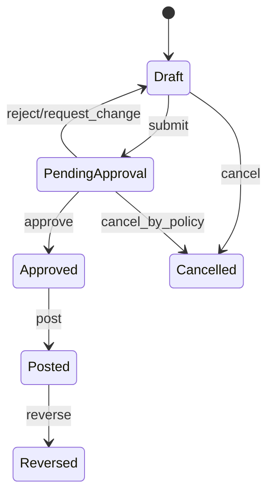
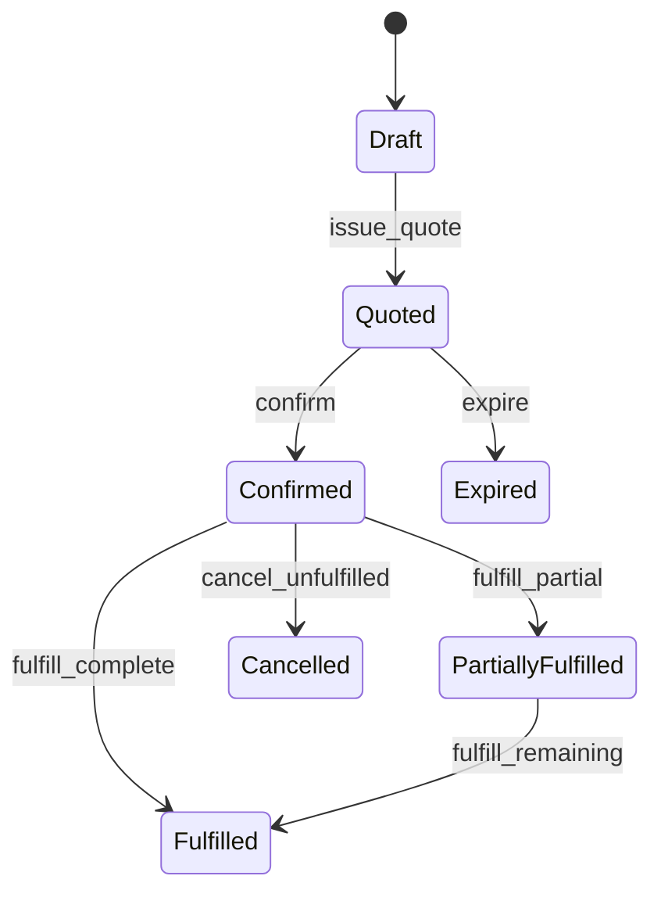
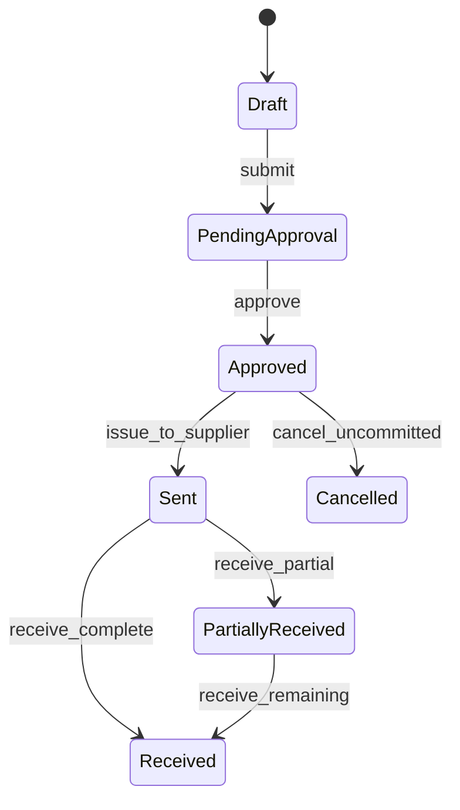
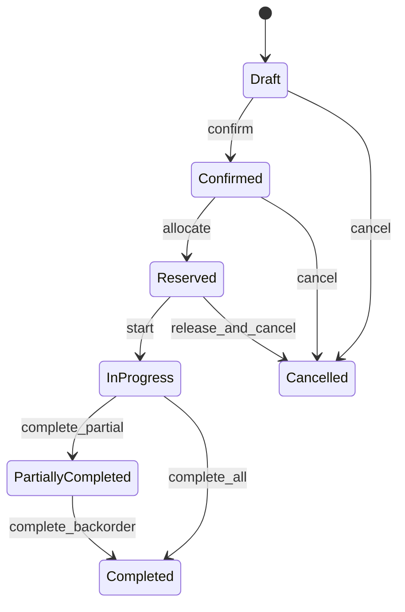
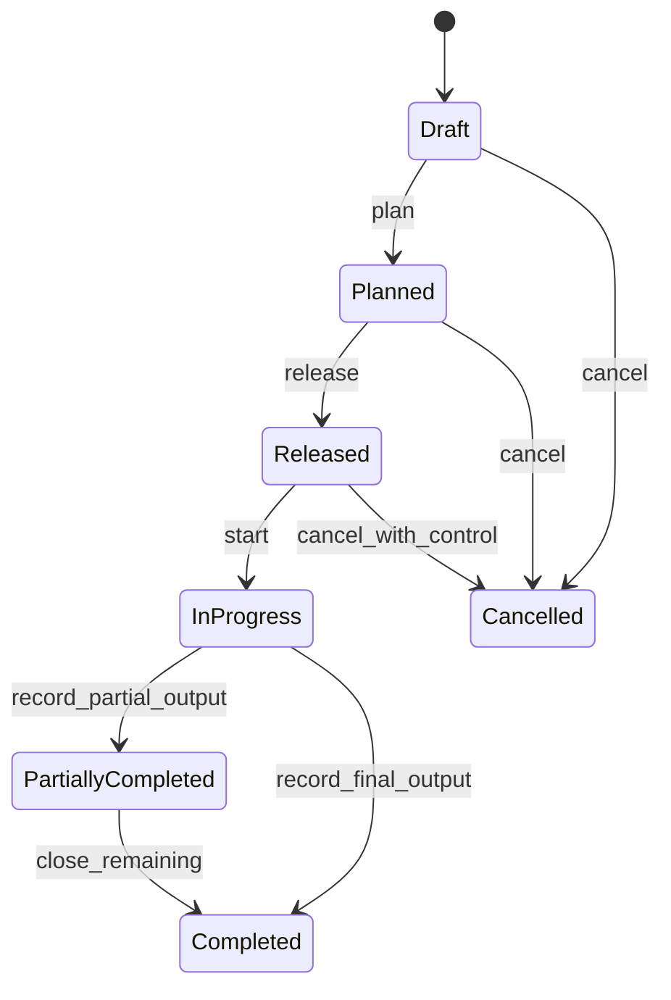
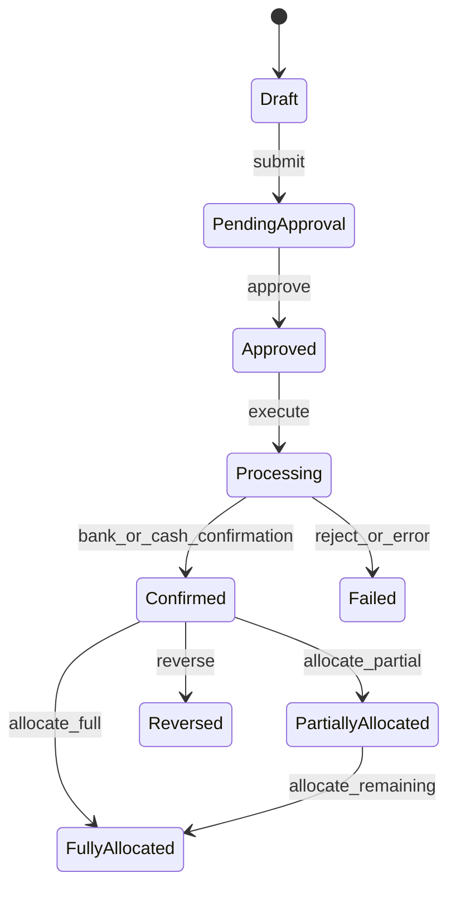

# Clean-Room Functional & Domain Blueprint

Session: `[SMEPLUS-26-08-28-DEEP-CD-001]`  
Status: `INDEPENDENT SPECIFICATION / PASS WITH CONTROL`  
Target Platform: New 100% clean-room Node.js/TypeScript SaaS ERP  
Reference Systems: Learning and benchmark only

## 1. Classification of This Document

This document is an independent target specification. It combines:

- **Observed Facts** — evidence-backed capability or persistence observations.
- **Inferred Business Semantics** — interpretation of what the observed behavior means to a business.
- **Independent Target Design** — vendor-neutral design created without translating source implementation.
- **Unverified Assumptions** — explicitly marked and blocked from implementation until reviewed.

No Odoo ORM, module hierarchy, workflow engine, table schema, controller pattern, report engine, or source algorithm is adopted.

## 2. Vendor-Neutral Domain Map

| Bounded Context | Core Responsibility | Key Aggregates |
|---|---|---|
| Tenant & Organization | tenant isolation, company, branch, division, fiscal scope | Tenant, Company, Branch, OrganizationUnit |
| Identity & Access | users, roles, permission, data scope, segregation of duties | User, Role, PermissionSet, Assignment |
| Party | customer, vendor, contact, address, tax identity, bank account | Party, PartyRole, Address, TaxProfile |
| Product | product, SKU, UOM, category, costing and traceability policy | Product, SKU, UOM, CostProfile |
| Sales | quotation, sales order, pricing, commitment, fulfillment demand | SalesOrder, SalesOrderLine |
| Procurement | requisition, RFQ, purchase order, receipt and supplier commitment | PurchaseRequest, PurchaseOrder |
| Inventory | warehouse, location, reservation, movement, lot/serial, quantity ledger | StockTransfer, StockMovement, Reservation, InventoryBalance |
| Inventory Valuation | cost layer, valuation event, landed cost, variance | CostLayer, ValuationEvent, LandedCostAllocation |
| Manufacturing | BOM, routing, production order, material issue, output, WIP | BillOfMaterial, ProductionOrder, WorkOperation |
| Quality | inspection plan, quality check, nonconformance, disposition | QualityPlan, QualityCheck, Nonconformance |
| Maintenance | equipment, meter, preventive plan, maintenance order | Equipment, MaintenanceOrder |
| Finance Core | chart, journal, journal entry, posting, period, dimensions | JournalEntry, JournalLine, FiscalPeriod |
| Receivables | invoice, credit/debit note, payment allocation, aging | ReceivableDocument, Settlement |
| Payables | supplier bill, credit/debit note, payment proposal, allocation | PayableDocument, Settlement |
| Treasury | cash, bank, payment, statement, reconciliation, FX | Payment, BankStatement, Reconciliation |
| Tax & Localization | VAT, WHT, tax invoice, tax period, statutory report | TaxTransaction, WHTCertificate, TaxReturn |
| Fixed Assets | asset capitalization, depreciation, modification, disposal | FixedAsset, DepreciationSchedule |
| Approval | policy, request, task, action, escalation | ApprovalRequest, ApprovalTask |
| Document & Evidence | numbering, attachment, version, immutable snapshot | BusinessDocument, Attachment, Snapshot |
| Event & Audit | domain event, outbox, delivery, audit trail | DomainEvent, AuditRecord |
| Integration | API client, connector, import/export, idempotency | IntegrationEndpoint, ImportJob, ExportJob |
| Reporting | ledger/report snapshots, operational KPIs, drill-down | ReportDefinition, ReportRun, ReportSnapshot |

## 3. Core Mathematical and Accounting Models

### 3.1 Double-entry general ledger

For every posted journal entry `J`:

```text
Σ debit(J.lines) = Σ credit(J.lines)
```

Account balance for period `P`:

```text
ClosingBalance(account, P)
= OpeningBalance(account, P)
+ Σ debit(account, P)
- Σ credit(account, P)
```

Control rules:

1. Draft entries may be edited; posted entries are immutable.
2. Correction of a posted entry requires reversal or adjustment.
3. Posting date must fall in an open period.
4. Every line carries tenant, company, account, currency, source document, and audit references.
5. Monetary precision follows currency rounding; balancing tolerance must be explicit and normally zero in functional currency.

### 3.2 Multi-currency accounting

For a transaction currency amount `A_tx` and exchange rate `r` expressed as functional currency per transaction currency:

```text
A_fc = round(A_tx × r, functional_currency_precision)
```

Open-item revaluation at rate `r_close`:

```text
UnrealizedFX = round(A_tx_open × r_close) - CarryingAmount_fc
```

Settlement at payment rate `r_pay`:

```text
RealizedFX = SettlementAmount_fc - CarryingAmount_fc_allocated
```

Rules:

- preserve transaction amount, functional amount, rate, rate type, rate date, and source;
- unrealized differences are reversible period-end entries;
- realized differences arise only from settlement or derecognition;
- no revaluation after full settlement;
- partial settlements allocate carrying amount consistently.

### 3.3 Accounts receivable/payable open-item model

```text
OpenAmount(document)
= SignedDocumentAmount
- Σ SignedAllocations
- Σ SignedAdjustments
```

A document is settled only when `abs(OpenAmount) <= currency_tolerance`.

Aging bucket uses contractual due date, not document creation date:

```text
DaysPastDue = AsOfDate - DueDate
```

### 3.4 Tax model

For tax-exclusive pricing:

```text
TaxBase = Σ taxable_line_net
TaxAmount = round(TaxBase × tax_rate)
GrossAmount = TaxBase + TaxAmount
```

For tax-inclusive pricing:

```text
TaxBase = GrossAmount / (1 + tax_rate)
TaxAmount = GrossAmount - TaxBase
```

Rounding policy must identify line-level or document-level rounding. Thailand localization must separately control VAT tax point, tax invoice sequence, branch code, WHT basis, WHT timing, and statutory reporting period.

### 3.5 Inventory quantity conservation

For product `p`, location `l`, and interval `[t0,t1]`:

```text
ClosingQty(p,l)
= OpeningQty(p,l)
+ Σ CompletedInboundQty
- Σ CompletedOutboundQty
+ Σ AdjustmentQty
```

An internal transfer creates two linked quantity effects:

```text
SourceLocation: -Q
DestinationLocation: +Q
NetCompanyQuantity: 0
```

This is the vendor-neutral meaning of double-entry inventory. It is not an adoption of a source implementation.

### 3.6 Availability and reservation

```text
OnHand = Σ completed quantity events
Reserved = Σ active reservations
Available = OnHand - Reserved
Forecast = OnHand + ConfirmedInbound - ConfirmedOutbound
```

Rules:

- reservation does not change on-hand quantity;
- completion changes quantity;
- cancellation releases reservation;
- over-reservation is prohibited unless negative-stock policy is explicitly enabled;
- lot/serial, owner, package, quality status, and location restrictions participate in eligibility.

### 3.7 FIFO valuation

Maintain immutable receipt cost layers `(quantity_remaining, unit_cost, receipt_time)`.

For outbound quantity `Q`:

```text
COGS = Σ consume(q_i × unit_cost_i)
where Σ q_i = Q and layers are consumed oldest first
```

Returns must reference the originating issue or apply an explicit return-cost policy. Negative inventory requires a provisional valuation and later adjustment policy.

### 3.8 Moving average / AVCO

After receipt:

```text
NewAverageCost
= (OldQty × OldAverageCost + ReceiptQty × ReceiptUnitCost + AllocatedLandedCost)
  / (OldQty + ReceiptQty)
```

Outbound valuation:

```text
IssueValue = IssueQty × CurrentAverageCost
```

Rules must define behavior for zero or negative quantity, backdated receipts, returns, and cost corrections.

### 3.9 Standard cost

```text
InventoryValue = Quantity × StandardCost
PurchasePriceVariance = ActualReceiptCost - StandardCostApplied
ProductionVariance = ActualProductionCost - StandardCostOfOutput
```

### 3.10 Landed cost allocation

For landed cost `L` allocated by weight:

```text
Allocation_i = L × Weight_i / Σ Weight
```

Other authorized bases may include quantity, volume, value, or equal split. Residual rounding must be assigned deterministically.

### 3.11 Manufacturing material requirements

For parent demand `D`, BOM component quantity `q`, BOM output basis `b`, expected scrap rate `s`, and yield `y`:

```text
GrossRequirement = D × (q / b)
ScrapAdjustedRequirement = GrossRequirement / (1 - s)
YieldAdjustedRequirement = ScrapAdjustedRequirement / y
NetRequirement = max(0, YieldAdjustedRequirement - AvailableInventory - ScheduledReceipts)
```

### 3.12 Manufacturing cost

```text
ActualProductionCost
= DirectMaterialIssued
+ DirectLabor
+ MachineCost
+ AppliedOverhead
+ SubcontractCost
+ AllocatedLandedCost
- RecoverableByproductValue
```

```text
UnitProductionCost = ActualProductionCost / GoodOutputQty
```

WIP at a cutoff is the cost of issued/consumed resources not yet transferred to completed output or recognized loss.

## 4. State Machines and Domain Events

### 4.1 Journal entry



| Transition | Preconditions | Postconditions / Events |
|---|---|---|
| submit | balanced; required evidence; open drafting period | `JournalSubmitted` |
| approve | approver authorized; segregation-of-duties satisfied | approval audit appended; `JournalApproved` |
| post | approved; period open; account/tax/dimension valid; sequence assigned | immutable ledger lines; `JournalPosted` |
| reverse | posted; reversal period open; reason supplied | linked reversal entry; `JournalReversed` |

### 4.2 Sales order



`confirm` creates fulfillment demand and, where policy permits, reservation requests. It does not itself change on-hand quantity.

### 4.3 Purchase order



Receipt completion creates inventory quantity events and may create valuation and accrual facts. Supplier invoice matching remains a separate control.

### 4.4 Stock transfer



Completion atomically writes source and destination quantity events, lot/serial history, valuation events where applicable, and audit records.

### 4.5 Production order



Release reserves or requests materials and capacity. Completion records material consumption, good output, byproducts, scrap, WIP clearance, and production cost.

### 4.6 Payment and settlement



## 5. Vendor-Neutral Logical Data Model

```mermaid
erDiagram
    TENANT ||--o{ COMPANY : owns
    COMPANY ||--o{ BRANCH : contains
    TENANT ||--o{ USER : has
    PARTY ||--o{ PARTY_ROLE : has
    PARTY ||--o{ PARTY_ADDRESS : has
    PRODUCT ||--o{ SKU : has
    UOM ||--o{ SKU : measures

    SALES_ORDER ||--|{ SALES_ORDER_LINE : contains
    PARTY ||--o{ SALES_ORDER : customer
    SALES_ORDER_LINE }o--|| SKU : orders

    PURCHASE_ORDER ||--|{ PURCHASE_ORDER_LINE : contains
    PARTY ||--o{ PURCHASE_ORDER : supplier
    PURCHASE_ORDER_LINE }o--|| SKU : procures

    WAREHOUSE ||--o{ STOCK_LOCATION : contains
    STOCK_TRANSFER ||--|{ STOCK_MOVEMENT : contains
    STOCK_MOVEMENT }o--|| SKU : moves
    STOCK_MOVEMENT }o--|| STOCK_LOCATION : source
    STOCK_MOVEMENT }o--|| STOCK_LOCATION : destination
    STOCK_MOVEMENT ||--o{ QUANTITY_EVENT : produces
    STOCK_MOVEMENT ||--o{ VALUATION_EVENT : values
    SKU ||--o{ COST_LAYER : valued_by
    STOCK_MOVEMENT ||--o{ LOT_SERIAL_EVENT : traces

    BILL_OF_MATERIAL ||--|{ BOM_COMPONENT : contains
    BILL_OF_MATERIAL }o--|| SKU : output
    BOM_COMPONENT }o--|| SKU : component
    PRODUCTION_ORDER }o--|| BILL_OF_MATERIAL : uses
    PRODUCTION_ORDER ||--o{ MATERIAL_ISSUE : consumes
    PRODUCTION_ORDER ||--o{ PRODUCTION_OUTPUT : produces
    PRODUCTION_ORDER ||--o{ WORK_OPERATION : executes

    JOURNAL_ENTRY ||--|{ JOURNAL_LINE : contains
    JOURNAL_LINE }o--|| GL_ACCOUNT : posts_to
    FISCAL_PERIOD ||--o{ JOURNAL_ENTRY : controls
    BUSINESS_DOCUMENT ||--o{ JOURNAL_ENTRY : sources

    RECEIVABLE_DOCUMENT ||--|{ RECEIVABLE_LINE : contains
    PAYABLE_DOCUMENT ||--|{ PAYABLE_LINE : contains
    PAYMENT ||--o{ SETTLEMENT_ALLOCATION : allocates
    SETTLEMENT_ALLOCATION }o--|| RECEIVABLE_DOCUMENT : settles_ar
    SETTLEMENT_ALLOCATION }o--|| PAYABLE_DOCUMENT : settles_ap

    BANK_STATEMENT ||--|{ BANK_STATEMENT_LINE : contains
    BANK_STATEMENT_LINE ||--o{ RECONCILIATION_MATCH : matched_by
    PAYMENT ||--o{ RECONCILIATION_MATCH : matches

    FIXED_ASSET ||--o{ DEPRECIATION_SCHEDULE_LINE : plans
    FIXED_ASSET ||--o{ ASSET_TRANSACTION : changes
    ASSET_TRANSACTION ||--o{ JOURNAL_ENTRY : posts

    APPROVAL_REQUEST ||--o{ APPROVAL_TASK : contains
    APPROVAL_TASK ||--o{ APPROVAL_ACTION : records
    BUSINESS_DOCUMENT ||--o{ APPROVAL_REQUEST : requests

    BUSINESS_DOCUMENT ||--o{ ATTACHMENT_LINK : evidences
    ATTACHMENT ||--o{ ATTACHMENT_LINK : linked
    BUSINESS_DOCUMENT ||--o{ AUDIT_RECORD : audited
    BUSINESS_DOCUMENT ||--o{ DOMAIN_EVENT : emits
```



## 6. Core Entity Requirements

Every core transactional entity must include:

- UUID identifier
- tenant and company scope
- business number and sequence context
- status and status version
- source-document and correlation references
- effective date, accounting date, and event timestamp where relevant
- created/updated actor and timestamp
- optimistic concurrency version
- immutable audit/event linkage
- currency and UOM precision metadata where relevant

Posted, completed, or legally issued records must not be deleted or edited in place.

## 7. Clean Architecture / DDD Project Blueprint

Recommended implementation posture: modular monolith first, service-ready boundaries, transactional outbox, strict package ownership.

```text
apps/
  api/
    src/
      bootstrap/
      controllers/
      auth/
      exception-mapping/
  workers/
    src/
      event-dispatch/
      scheduled-jobs/

packages/
  foundation/
    tenant-domain/
    identity-domain/
    document-domain/
    approval-domain/
    event-domain/
    audit-domain/
    shared-kernel/

  finance/
    domain/
      aggregates/
      entities/
      value-objects/
      policies/
      services/
      events/
      errors/
    application/
      commands/
      queries/
      use-cases/
      ports/
      dto/
    infrastructure/
      persistence/
      messaging/
      integrations/
    interfaces/
      http/
      event-handlers/

  inventory/
  manufacturing/
  sales/
  procurement/
  party/
  product/
  tax/
  assets/
  treasury/
  reporting/

platform/
  database/
  migrations/
  observability/
  security/
  configuration/
  test-support/
```

Dependency rule:

```text
interfaces -> application -> domain
infrastructure implements application/domain ports
 domain never imports framework, database, HTTP, or Odoo concepts
```

## 8. API Contract Principles

Required controls:

- tenant identity from trusted authentication context, never arbitrary request body
- `Idempotency-Key` for commands that create financial, inventory, or payment effects
- optimistic concurrency through `If-Match` or entity version
- command endpoints return accepted aggregate state and emitted event identifiers
- posting/completion commands are explicit actions
- no generic endpoint may mutate posted or completed facts
- correlation ID and audit actor required

### 8.1 Journal posting example

```yaml
paths:
  /v1/finance/journal-entries/{journalEntryId}/post:
    post:
      operationId: postJournalEntry
      parameters:
        - in: header
          name: Idempotency-Key
          required: true
          schema: { type: string }
        - in: header
          name: If-Match
          required: true
          schema: { type: string }
      responses:
        '200':
          description: Journal entry posted
        '409':
          description: Version conflict, closed period, imbalance, or invalid state
        '422':
          description: Business validation failed
```

### 8.2 Stock transfer completion example

```yaml
paths:
  /v1/inventory/transfers/{transferId}/complete:
    post:
      operationId: completeStockTransfer
      requestBody:
        required: true
        content:
          application/json:
            schema:
              type: object
              required: [completedAt, movements]
              properties:
                completedAt: { type: string, format: date-time }
                movements:
                  type: array
                  items:
                    type: object
                    required: [movementId, quantity, uomId]
                    properties:
                      movementId: { type: string, format: uuid }
                      quantity: { type: string, pattern: '^-?[0-9]+(\\.[0-9]+)?$' }
                      uomId: { type: string, format: uuid }
                      lotSerialIds:
                        type: array
                        items: { type: string, format: uuid }
```

### 8.3 Production completion example

```yaml
paths:
  /v1/manufacturing/production-orders/{productionOrderId}/complete:
    post:
      operationId: completeProductionOrder
      requestBody:
        required: true
        content:
          application/json:
            schema:
              $ref: '#/components/schemas/CompleteProductionOrderRequest'
```

## 9. TypeScript Domain Interfaces and DTOs

```ts
export interface Money {
  readonly amount: string;
  readonly currencyCode: string;
}

export interface JournalLineInput {
  readonly accountId: string;
  readonly debit: Money;
  readonly credit: Money;
  readonly partyId?: string;
  readonly dimensions?: Readonly<Record<string, string>>;
  readonly sourceDocumentId?: string;
}

export interface PostJournalEntryCommand {
  readonly tenantId: string;
  readonly companyId: string;
  readonly journalEntryId: string;
  readonly expectedVersion: number;
  readonly idempotencyKey: string;
  readonly actorId: string;
}

export interface JournalPostingService {
  post(command: PostJournalEntryCommand): Promise<{
    journalEntryId: string;
    postedNumber: string;
    postedAt: string;
    eventIds: readonly string[];
  }>;
}

export interface CompleteStockMovementInput {
  readonly movementId: string;
  readonly quantity: string;
  readonly uomId: string;
  readonly lotSerialIds?: readonly string[];
}

export interface CompleteStockTransferCommand {
  readonly tenantId: string;
  readonly companyId: string;
  readonly transferId: string;
  readonly expectedVersion: number;
  readonly completedAt: string;
  readonly movements: readonly CompleteStockMovementInput[];
  readonly idempotencyKey: string;
  readonly actorId: string;
}

export interface InventoryLedgerPort {
  appendQuantityEvents(events: readonly QuantityEventDraft[]): Promise<void>;
  getAvailableBalance(query: InventoryAvailabilityQuery): Promise<InventoryAvailability>;
}

export interface CostingPolicy {
  valueOutbound(input: OutboundValuationInput): Promise<OutboundValuationResult>;
  applyReceipt(input: ReceiptValuationInput): Promise<ReceiptValuationResult>;
}
```

## 10. Cross-Domain Event Contracts

Minimum immutable events:

- `SalesOrderConfirmed`
- `FulfillmentDemandCreated`
- `PurchaseOrderApproved`
- `GoodsReceived`
- `StockReserved`
- `StockTransferCompleted`
- `InventoryValuationRecorded`
- `ProductionOrderReleased`
- `MaterialConsumed`
- `ProductionOutputRecorded`
- `JournalSubmitted`
- `JournalApproved`
- `JournalPosted`
- `InvoiceIssued`
- `PaymentConfirmed`
- `SettlementAllocated`
- `TaxPointRecognized`
- `AssetCapitalized`
- `DepreciationPosted`
- `ApprovalDecisionRecorded`

Event payloads must be versioned, tenant scoped, immutable, idempotently consumable, and tied to the originating aggregate version.

## 11. Critical Edge Cases

### Finance

- zero-line or unbalanced journal
- posting into closed period
- duplicate document number
- foreign-currency amount with missing rate
- partial settlement and over-allocation
- reversal after subsequent settlement
- tax-inclusive rounding residual
- credit note exceeding original taxable base
- cross-company journal line

### Inventory

- concurrent reservation for the same stock
- unit conversion with incompatible dimensions
- negative stock and later receipt
- backdated transfer affecting closed valuation period
- serial quantity not equal to one
- lot expiry and quality hold
- partial completion and backorder
- return without origin reference
- landed-cost rounding residual

### Manufacturing

- recursive BOM
- alternative BOM effective-date conflict
- component shortage after release
- over-consumption and under-production
- partial output with remaining WIP
- byproduct exceeding policy
- scrap after completion
- subcontract receipt without component issue
- cost correction after period close

### SaaS and control

- cross-tenant identifier injection
- stale aggregate version
- duplicate idempotency key with different payload
- approver equals requester where segregation is required
- attachment hash mismatch
- event delivery retry and dead-letter handling

## 12. Blueprint Verdict

| Area | Result |
|---|---|
| Vendor-neutral domain decomposition | PASS WITH CONTROL |
| Mathematical invariants | PASS WITH CONTROL |
| Core state machines | PASS WITH CONTROL |
| Conceptual/logical ERD | PASS WITH CONTROL |
| Node.js/TypeScript Clean Architecture | PASS WITH CONTROL |
| Core API and interface examples | PASS WITH CONTROL |
| Exhaustive all-1,502-module traceability | HOLD |
| Production schema/API authorization | NOT AUTHORIZED BY THIS REPORT |

This blueprint is suitable as an independent design baseline for review. It is not proof that every legacy module or edge case has been researched, and it must not be treated as a production build authorization.
