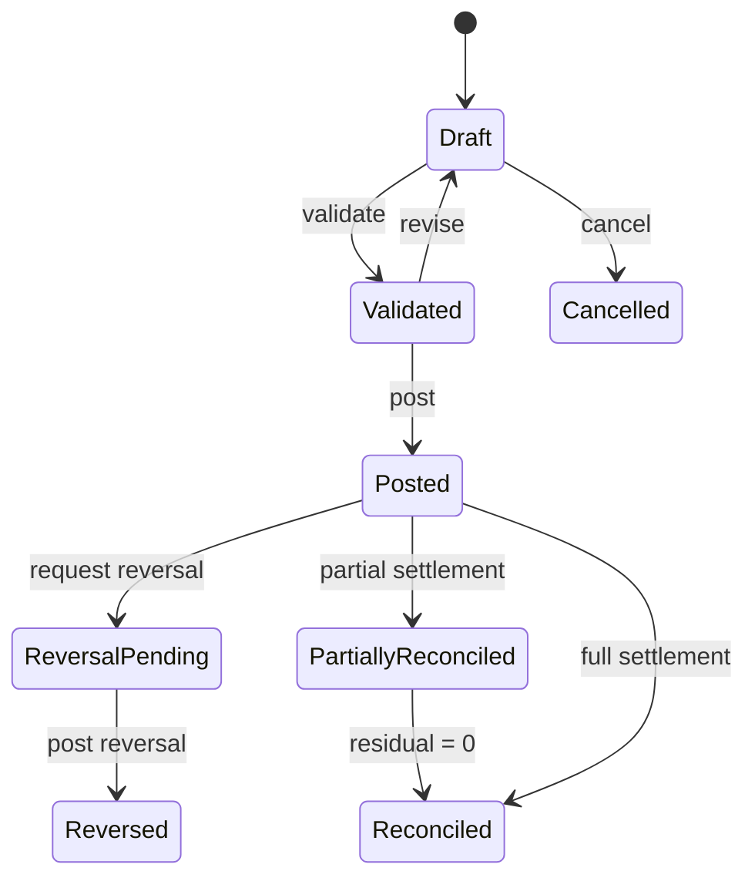
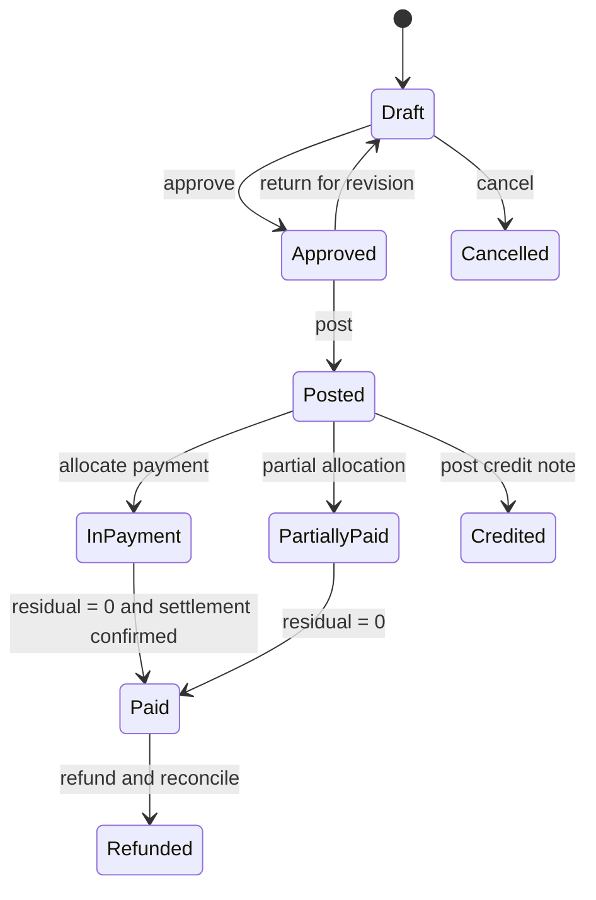
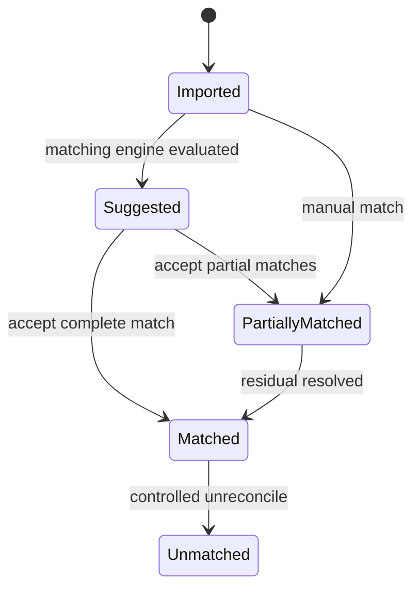
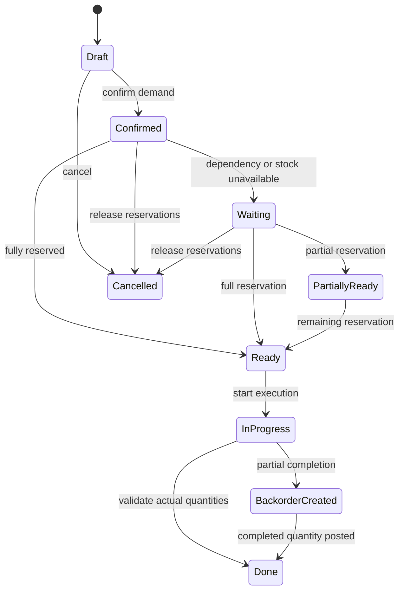
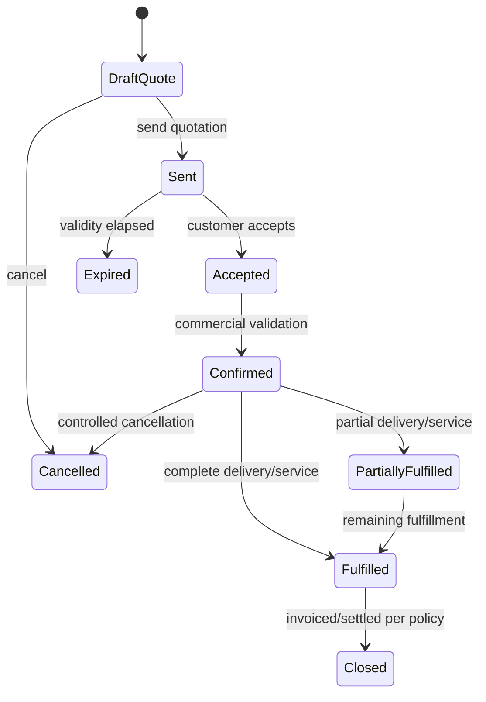
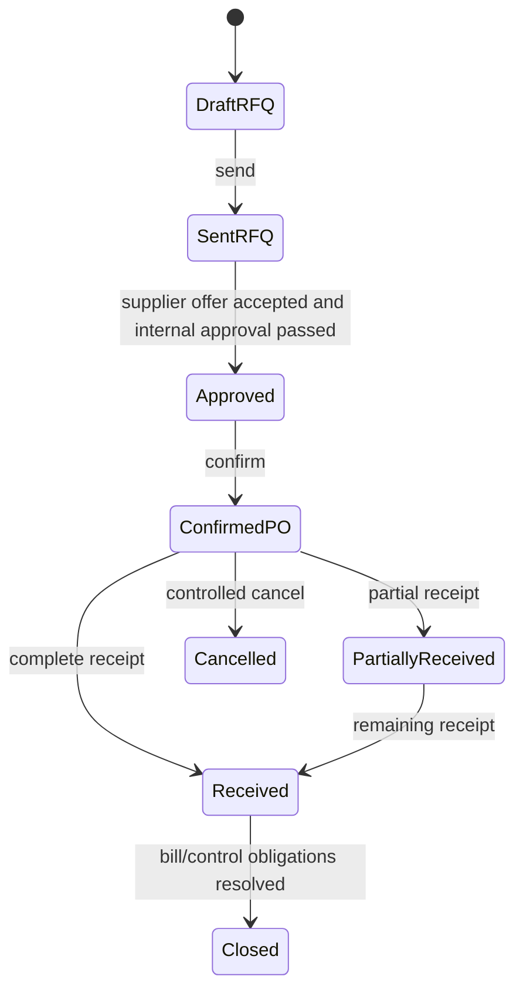
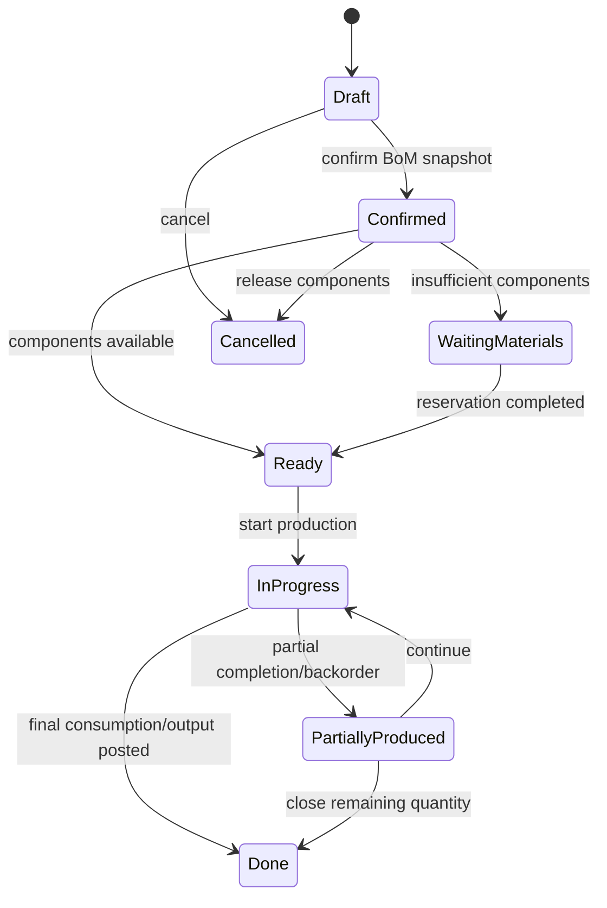
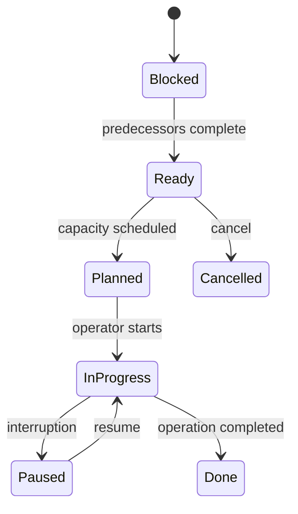
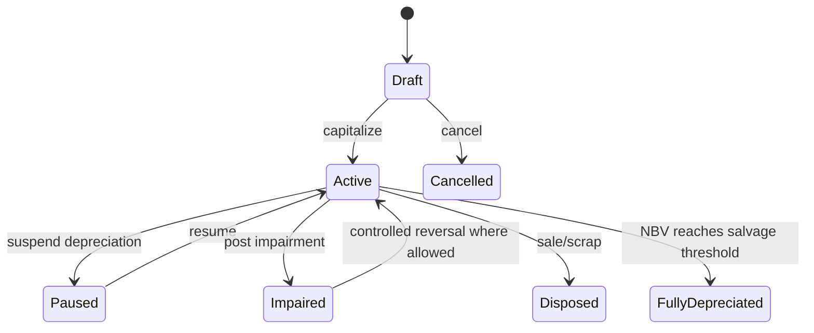

# CORE DOMAIN CLEAN-ROOM BLUEPRINT v0.1

Document ID: `SMEPLUS-26-08-28-DEEP-CD-001-BP-001`  
Project: SMEsPlus Enterprise Suite  
Status: `DRAFT / FINAL-GATE INPUT / NOT APPROVED`  
Target: Ground-up Node.js/TypeScript SaaS ERP  
Reference systems: Odoo and legacy evidence are learning inputs only  
Authority: Boss is the sole Final Approver

---

## 1. Clean-room evidence labels

Every statement in this document uses one of these labels:

| Label | Meaning |
|---|---|
| `OBSERVED` | Directly supported by an inspectable source or evidence register |
| `INFERRED-SEMANTIC` | Vendor-neutral business meaning inferred from multiple observations |
| `INDEPENDENT-TARGET` | New SMEsPlus design proposal based on business principles, not implementation copying |
| `ASSUMPTION` | Unverified hypothesis requiring business or evidence review |
| `QUARANTINED` | Proprietary, license-restricted, ambiguous, or CLASS-D content that must not transfer |

This document deliberately excludes Odoo class structures, source code, ORM conventions, method bodies, workflow engine internals, and database naming as target-design authority.

---

## 2. Evidence basis and limitation

### 2.1 Inspectable historical evidence

The prior evidence pack contains:

- `Module_Inventory.csv` — historical source inventory of 1,436 modules.
- `Business_Rule_Method_Inventory.csv` — 4,377 class/file observations containing business-method indicators.
- `Field_Level_Source_to_Dump_Mapping.csv` — 27,682 field-level observations.
- `Dump_Table_Inventory.csv` — 1,395 observed tables.
- `Dump_Column_Inventory.csv` — 13,940 historical observed columns.
- `Dump_Constraint_Inventory.csv` — 6,682 constraints.
- `Foreign_Key_Relationship_Edges.csv` — 5,141 relationship edges.
- `Dump_Index_Inventory.csv` — 1,714 historical indexes.
- `XML_View_Action_Menu_Inventory.csv` — 6,260 UI/configuration artifacts.
- `Security_Access_Inventory.csv` — 473 security/access observations.

### 2.2 Current-session limitation

The current session received these archives:

- `01_ACCOUNT(1).zip`
- `02_OTHER(1).zip`
- `addons_extra(1).zip`

Their file bodies and SHA-256 identities were not inspectable in the active execution runtime. Therefore this blueprint is a controlled semantic design input, not proof that all 1,502 current manifest records have been individually researched.

### 2.3 Supplementary primary references

Official Odoo 19 documentation was used only to corroborate observable business behavior, not to copy architecture:

- Inventory valuation: https://www.odoo.com/documentation/19.0/applications/finance/accounting/get_started/inventory_valuation.html
- Valuation methods: https://www.odoo.com/documentation/19.0/applications/inventory_and_mrp/inventory/inventory_valuation/cheat_sheet.html
- Reservations: https://www.odoo.com/documentation/19.0/applications/inventory_and_mrp/inventory/shipping_receiving/reservation_methods.html
- Bank reconciliation: https://www.odoo.com/documentation/19.0/applications/finance/accounting/bank/reconciliation.html
- Multi-currency: https://www.odoo.com/documentation/19.0/applications/finance/accounting/get_started/multi_currency.html
- Sales quotations: https://www.odoo.com/documentation/19.0/applications/sales/sales/sales_quotations.html
- Purchase control policies: https://www.odoo.com/documentation/19.0/applications/inventory_and_mrp/purchase/manage_deals/control_bills.html
- Manufacturing: https://www.odoo.com/documentation/19.0/applications/inventory_and_mrp/manufacturing.html

---

## 3. Vendor-neutral bounded-context map

`INDEPENDENT-TARGET`

SMEsPlus must not reproduce source-module packaging. The target is organized into bounded contexts:

| Context | Primary responsibility | Key aggregates |
|---|---|---|
| Platform Foundation | Tenant isolation, organization, identity, role, permission, audit, configuration | Tenant, Organization, Identity, Role, Policy |
| Party & Relationship | Customer, supplier, employee, contact and address facts | Party, ContactPoint, Address, PartyRole |
| Product & Catalog | Product identity, variants, UOM, category and traceability policy | Product, ProductVariant, UnitOfMeasure, LotPolicy |
| Pricing & Commercial Terms | Pricelists, discounts, taxes, payment and delivery terms | PriceRuleSet, PaymentTerm, TradeTerm |
| Sales | Quotation-to-order commercial commitment | SalesQuote, SalesOrder |
| Procurement | Request-to-order supplier commitment | PurchaseRequest, RFQ, PurchaseOrder |
| Inventory | Physical quantity ownership and location movement | StockTransfer, StockMovement, Reservation, Lot |
| Inventory Valuation | Cost layers, quantity/value ledger and landed cost | CostLayer, ValuationEvent, LandedCostAllocation |
| General Ledger | Balanced accounting facts and immutable posting | Journal, JournalEntry, JournalLine |
| Receivables & Payables | Invoice/bill, open item and settlement | ReceivableDocument, PayableDocument, OpenItem |
| Treasury | Payment instruction, bank transaction and reconciliation | Payment, BankStatement, Reconciliation |
| Tax & Localization | Tax determination, statutory documents and filings | TaxRule, TaxTransaction, TaxReturn |
| Fixed Assets | Capitalization, depreciation, impairment and disposal | Asset, DepreciationPlan, AssetTransaction |
| Manufacturing | BoM, production order, consumption and output | BillOfMaterials, ManufacturingOrder, WorkOrder |
| Quality | Inspection plan, quality check and nonconformance | QualityPlan, QualityCheck, Nonconformance |
| Maintenance | Equipment, preventive/corrective maintenance | Equipment, MaintenanceOrder |
| CRM | Lead/opportunity lifecycle and activity planning | Lead, Opportunity, Activity |
| Project & Service | Project, task, timesheet, service delivery and helpdesk | Project, Task, Timesheet, ServiceTicket |
| Human Capital | Employment, attendance, leave, expense and payroll facts | Employee, Employment, Leave, Expense, PayrollRun |
| Point of Sale | Session-controlled retail transactions and settlement | POSSession, POSOrder, POSPayment |
| Commerce | Cart, checkout, online order and fulfillment handoff | Cart, Checkout, CommerceOrder |
| Documents & Knowledge | Attachment metadata, evidence and retention | Document, Attachment, RetentionPolicy |
| Integration | External endpoint, message, idempotency and failure recovery | IntegrationEndpoint, Message, DeliveryAttempt |
| Reporting | Read models, financial statements and operational analytics | ReportDefinition, ReportRun, Snapshot |

---

## 4. Cross-domain invariants

### 4.1 Monetary precision

`INDEPENDENT-TARGET`

1. Monetary amounts use decimal arithmetic; binary floating point is prohibited for posting and valuation.
2. Every monetary amount has a currency and an effective precision rule.
3. Rounding occurs at an explicitly declared boundary: line, tax component, document, settlement, or report.
4. Stored base-currency amounts and transaction-currency amounts must retain the applied exchange rate and rate date.
5. Recalculation cannot silently alter posted facts.

### 4.2 Tenant and organization isolation

`INDEPENDENT-TARGET`

Every mutable business aggregate carries:

- `tenant_id`
- `organization_id`
- `company_id`
- optional `branch_id` and `division_id`

Cross-tenant references are forbidden. Cross-company transactions require an explicit intercompany contract and independent posting in each legal entity.

### 4.3 Auditability

`INDEPENDENT-TARGET`

- Posted financial and completed inventory events are append-only.
- Correction uses reversal, adjustment, return, or compensating event.
- Every state transition records actor, timestamp, prior state, new state, reason and correlation ID.
- Source document identity and external idempotency keys are retained.

---

## 5. General Ledger and journal logic

### 5.1 Mathematical model

`INFERRED-SEMANTIC / INDEPENDENT-TARGET`

For every posted journal entry `J`:

```text
Σ Debit(J.lines) = Σ Credit(J.lines)
Σ SignedBaseAmount(J.lines) = 0
```

For account `A` over interval `[t0,t1]`:

```text
ClosingBalance(A,t1)
= OpeningBalance(A,t0)
+ Σ Debit(A,t0..t1)
- Σ Credit(A,t0..t1)
```

Foreign-currency lines preserve:

```text
transaction_amount
transaction_currency
base_amount
base_currency
exchange_rate
rate_date
```

### 5.2 Posting rules

1. Draft entries may be edited.
2. Posting validates balance, period access, account eligibility, currency completeness, required dimensions and document sequence.
3. A posted entry is immutable except through controlled reversal or jurisdiction-approved exception.
4. A reversal references the original entry and must preserve traceability.
5. Closing-period rules are checked at command execution and again inside the database transaction.
6. Sequence generation must be concurrency-safe and scoped by tenant/company/journal/fiscal rule.
7. Open-item accounts require partner or counterparty identity when configured.
8. Reconciliation never deletes journal lines; it creates settlement links and residual calculations.

### 5.3 Journal entry state machine



### 5.4 Transition controls

| Transition | Preconditions | Postconditions |
|---|---|---|
| Draft → Validated | Lines exist; accounts active; dimensions permitted | Validation snapshot recorded |
| Validated → Posted | Balanced; period open; sequence available; authorization passed | Posting number assigned; immutable ledger event emitted |
| Posted → Reversed | Reversal date allowed; reason supplied | New opposite entry linked to original |
| Posted → Reconciled | Eligible accounts; debit/credit compatibility; residual within tolerance | Settlement links created; residual recalculated |

---

## 6. Receivables, payables and invoices

### 6.1 Core facts

`INDEPENDENT-TARGET`

An invoice or bill is a commercial document whose posting produces accounting facts. The document itself is not the ledger. Required separation:

- commercial document header and lines
- tax determination result
- posting instruction
- posted journal entry
- open item
- payment allocation

### 6.2 Invoice state machine



### 6.3 Validation and edge cases

- Invoice date, accounting date and tax point may differ and must be modeled independently.
- Quantity and price sign rules must prevent accidental inversion.
- Credit/debit notes reference the original document and reason.
- Duplicate supplier invoice detection should use supplier, invoice reference, company and amount/date controls.
- Payment terms generate one or more due-date installments; installment total must equal document residual after rounding.
- Overpayment becomes an unapplied credit or refund obligation; it must not disappear into rounding.
- Partial payment leaves a measurable residual.
- A posted invoice cannot be edited in place.

---

## 7. Treasury and bank reconciliation

### 7.1 Reconciliation model

`INFERRED-SEMANTIC`

A bank transaction represents an observed bank-side fact. It can be matched against one or more ledger open items, payments, write-offs or transfer-clearing items.

```text
BankTransactionAmount
= Σ MatchedOpenItemAmounts
+ Σ WriteOffAmounts
+ UnreconciledResidual
```

Full reconciliation requires `UnreconciledResidual = 0` within currency tolerance.

### 7.2 Reconciliation state machine



### 7.3 Matching controls

- Idempotent statement import using bank account + external transaction ID.
- Exact amount/date/reference matches have higher confidence than fuzzy label matches.
- Automated matching must expose rule, score and selected counterpart.
- Write-offs require account, reason and authorization.
- Unreconcile creates an audit event and restores residuals.
- Internal transfers require paired entries through a clearing account.

---

## 8. Multi-currency and revaluation

### 8.1 Conversion

For transaction currency `C` and base currency `B`:

```text
BaseAmount = Round(TransactionAmount × Rate(C→B, rate_date), base_precision)
```

Rate direction and quotation convention must be explicit.

### 8.2 Realized exchange difference

For an open item initially recognized at `R0` and settled at `R1`:

```text
RealizedFX
= SettlementBaseAmount(R1)
- CarryingBaseAmountAllocated(R0)
```

The sign determines gain or loss according to account orientation.

### 8.3 Unrealized revaluation

At reporting date `T`:

```text
RevaluedBase = OpenForeignAmount × ClosingRate(T)
UnrealizedFX = RevaluedBase - CurrentBaseCarryingAmount
```

Adjustment entries must be reversible and identify rate source, report date and affected open items.

---

## 9. Inventory quantity model

### 9.1 Double-entry physical movement

`INDEPENDENT-TARGET`

Every completed physical movement has one source location and one destination location. Quantity is neither created nor destroyed except through explicitly typed events such as production output, consumption, adjustment, scrap or external boundary movement.

For product `P` at location `L` over interval `[t0,t1]`:

```text
ClosingQty(P,L)
= OpeningQty(P,L)
+ Σ CompletedInbound(P,L)
- Σ CompletedOutbound(P,L)
+ Σ ApprovedAdjustments(P,L)
```

Across internal locations, an internal transfer has net quantity change zero for the organization.

### 9.2 Availability

```text
OnHand = Σ completed quantity ledger events
Reserved = Σ active reservation allocations
Available = OnHand - Reserved - SafetyHold
Forecast = OnHand + ConfirmedInbound - ConfirmedOutbound
```

Negative availability is governed by product/location policy; it must never occur accidentally through a race condition.

### 9.3 Stock transfer state machine



### 9.4 Reservation concurrency

Reservation allocation must execute atomically:

1. lock or version-check candidate availability rows;
2. recompute available quantity inside the transaction;
3. allocate no more than permitted quantity;
4. write reservation event;
5. emit `ReservationAllocated` only after commit.

### 9.5 Traceability

- Serial-tracked products: quantity per serial is normally one base unit.
- Lot-tracked products: all moves retain lot identity.
- Expiry/FEFO affects picking sequence, not necessarily accounting valuation.
- Packages and handling units are logistics identities, not product ownership identities.
- Returns reference the original outbound/inbound movement when available.

---

## 10. Inventory valuation and costing

### 10.1 Value conservation

For a valuation scope `S`:

```text
ClosingInventoryValue(S)
= OpeningInventoryValue(S)
+ Σ InboundValue
- Σ OutboundValue
+ Σ ApprovedValueAdjustments
```

Quantity ledger and value ledger are related but distinct. They reconcile through valuation events, not by storing one mutable product cost as the entire history.

### 10.2 Standard cost

```text
InboundValue  = InboundQty × StandardCostEffectiveAtEvent
OutboundValue = OutboundQty × StandardCostEffectiveAtEvent
```

Changing standard cost creates a controlled revaluation for existing quantity when policy requires.

### 10.3 Weighted average cost (AVCO)

Before inbound event:

```text
OldQty   = Q0
OldValue = V0
InboundQty = Qi
InboundValue = Vi
NewQty   = Q0 + Qi
NewValue = V0 + Vi
NewAverageCost = NewValue / NewQty     when NewQty ≠ 0
```

Outbound value normally uses the average cost effective immediately before the outbound event. Returns require a declared policy: original issue cost, current average cost, or traceable source-layer restoration.

### 10.4 FIFO

Maintain ordered cost layers:

```text
Layer = {remaining_qty, unit_cost, currency_basis, received_at, source_event_id}
```

Outbound requirement `Q` consumes the oldest eligible layers:

```text
OutboundValue = Σ min(Q_remaining, Layer.remaining_qty) × Layer.unit_cost
```

Each consumption references its source layer. Negative-stock policy must define provisional costing and later correction.

### 10.5 Landed cost allocation

For landed cost `LC` allocated across eligible receipt/production layers:

```text
Allocated_i = LC × Weight_i / Σ Weight
```

Supported weight bases may include quantity, weight, volume, current value or equal split. Rounding remainder is assigned deterministically so total allocation equals `LC`.

### 10.6 Inventory accounting boundary

Physical movement, inventory valuation and general-ledger posting are separate services connected by immutable domain events. This avoids making the inventory engine dependent on a specific accounting ORM or journal implementation.

---

## 11. Sales domain

### 11.1 Sales order state machine



### 11.2 Confirmation event chain

```text
Confirm Sales Order
→ validate customer/product/price/tax/credit policy
→ freeze commercial snapshot
→ create fulfillment demand
→ evaluate reservation policy
→ create invoice eligibility according to ordered/delivered policy
→ emit SalesOrderConfirmed
```

### 11.3 Controls

- Confirmation must be idempotent.
- Prices and taxes are snapshotted; later catalog changes do not rewrite the order.
- Delivery and invoice addresses are separate facts.
- Ordered, delivered, invoiced and returned quantities are tracked independently.
- Partial delivery can create a backorder.
- Cancellation after downstream execution requires compensating actions.
- Credit limit override requires authorization and reason.

---

## 12. Procurement domain

### 12.1 Purchase order state machine



### 12.2 Three-way control

`INDEPENDENT-TARGET`

At line level compare:

```text
OrderedQty
ReceivedAcceptedQty
BilledQty
OrderedPrice
BilledPrice
```

Payment release can be blocked when tolerances are exceeded. Exceptions require reason, approver and evidence.

### 12.3 Edge cases

- Over-receipt and under-receipt tolerance.
- Damaged/rejected quantity separate from accepted quantity.
- Vendor bill before receipt.
- Multiple receipts and multiple bills.
- Purchase return and vendor credit.
- Currency/rate differences between order, receipt valuation and bill.
- Service procurement where receipt evidence is service acceptance.

---

## 13. Manufacturing domain

### 13.1 Mass-balance model

For manufacturing order `MO`:

```text
Σ InputComponentQtyEquivalent
+ ProcessGain
= FinishedGoodQty
+ ByProductQty
+ ScrapQty
+ ProcessLoss
```

Conversion across UOMs must use versioned conversion factors.

### 13.2 Manufacturing order state machine



### 13.3 Work order state machine



### 13.4 Production cost

```text
MaterialCost = Σ ActualComponentConsumption × ConsumedLayerCost
LaborCost    = Σ ActualLaborTime × LaborRate
MachineCost  = Σ ActualMachineTime × WorkCenterRate
OverheadCost = AllocationPolicy(actual drivers)
TotalProductionCost = MaterialCost + LaborCost + MachineCost + OverheadCost
UnitFinishedCost = AllocatedFinishedValue / GoodFinishedQty
```

By-product value allocation requires a declared policy and must not double-count value.

### 13.5 BoM controls

- BoM is versioned and effective-dated.
- MO confirmation snapshots the selected BoM version.
- Variant applicability is explicit.
- Recursive/cyclic BoM must be rejected unless a controlled process explicitly supports it.
- Manual consumption can require operator confirmation.
- Work-order dependency graph must be acyclic.
- Substitution requires authorized alternate-component rules.

---

## 14. Fixed asset domain

### 14.1 Depreciation models

Straight line:

```text
DepreciableBase = AcquisitionCost + CapitalizedCosts - SalvageValue
PeriodicDepreciation = DepreciableBase / NumberOfPeriods
```

Declining balance:

```text
PeriodDepreciation = OpeningNetBookValue × PeriodRate
```

Proration is determined by explicit day-count convention and service-start date.

### 14.2 Asset state machine



### 14.3 Controls

- Posted depreciation lines are immutable.
- Disposal calculates proceeds, carrying amount, gain/loss and tax consequences separately.
- Modification of useful life or residual value is prospective unless policy states otherwise.
- Asset split/merge preserves original cost and accumulated depreciation lineage.

---

## 15. Tax and localization boundary

`INDEPENDENT-TARGET`

Tax is a policy engine, not hardcoded document logic. A tax result records:

- jurisdiction
- rule version
- tax point
- taxable base
- rate or formula
- inclusivity
- rounding rule
- recoverability/deductibility
- account/posting instruction
- statutory document requirement

Localization-specific behavior must be isolated in policy packages. Non-Thai localizations observed in source inventory are learning examples only and are not SMEsPlus Thailand scope.

Thai VAT, WHT, tax invoice, credit/debit note and statutory filing rules require independent legal/accounting owner review; this document does not certify statutory compliance.

---

## 16. Conceptual cross-domain ERD

```mermaid
erDiagram
    TENANT ||--o{ ORGANIZATION : contains
    ORGANIZATION ||--o{ COMPANY : contains
    COMPANY ||--o{ BRANCH : contains

    PARTY ||--o{ PARTY_ROLE : has
    PARTY ||--o{ ADDRESS : has

    PRODUCT ||--o{ PRODUCT_VARIANT : has
    PRODUCT ||--o{ BOM : manufactured_by
    BOM ||--o{ BOM_COMPONENT : contains

    SALES_ORDER ||--|{ SALES_ORDER_LINE : contains
    SALES_ORDER }o--|| PARTY : customer
    SALES_ORDER_LINE }o--|| PRODUCT_VARIANT : orders

    PURCHASE_ORDER ||--|{ PURCHASE_ORDER_LINE : contains
    PURCHASE_ORDER }o--|| PARTY : supplier
    PURCHASE_ORDER_LINE }o--|| PRODUCT_VARIANT : procures

    STOCK_TRANSFER ||--|{ STOCK_MOVEMENT : contains
    STOCK_MOVEMENT }o--|| LOCATION : source
    STOCK_MOVEMENT }o--|| LOCATION : destination
    STOCK_MOVEMENT }o--|| PRODUCT_VARIANT : moves
    STOCK_MOVEMENT ||--o{ RESERVATION : allocates
    STOCK_MOVEMENT ||--o{ VALUATION_EVENT : values
    VALUATION_EVENT }o--o{ COST_LAYER : consumes_or_creates

    JOURNAL_ENTRY ||--|{ JOURNAL_LINE : contains
    JOURNAL_LINE }o--|| ACCOUNT : posts_to
    JOURNAL_ENTRY }o--o| BUSINESS_DOCUMENT : originates_from

    INVOICE ||--|{ INVOICE_LINE : contains
    INVOICE ||--|| OPEN_ITEM : creates
    PAYMENT ||--o{ PAYMENT_ALLOCATION : allocates
    PAYMENT_ALLOCATION }o--|| OPEN_ITEM : settles

    MANUFACTURING_ORDER }o--|| BOM : snapshots
    MANUFACTURING_ORDER ||--o{ WORK_ORDER : schedules
    MANUFACTURING_ORDER ||--o{ STOCK_MOVEMENT : consumes_and_produces

    ASSET ||--o{ ASSET_TRANSACTION : records
    ASSET ||--o{ DEPRECIATION_LINE : schedules
```



---

## 17. Domain events

Minimum immutable events:

| Event | Producing context | Typical consumers |
|---|---|---|
| `SalesOrderConfirmed` | Sales | Inventory, Credit, Billing |
| `FulfillmentDemandCreated` | Sales | Inventory |
| `ReservationAllocated` | Inventory | Sales, MRP |
| `GoodsReceived` | Inventory | Procurement, Valuation, Quality |
| `GoodsDelivered` | Inventory | Sales, Valuation, Billing |
| `InventoryAdjusted` | Inventory | Valuation, Audit |
| `ValuationEventRecorded` | Valuation | General Ledger, Reporting |
| `InvoicePosted` | AR/AP | General Ledger, Tax, Collections |
| `PaymentPosted` | Treasury | General Ledger, AR/AP |
| `OpenItemReconciled` | Treasury/AR/AP | Document status, Reporting |
| `ManufacturingOrderConfirmed` | MRP | Inventory, Capacity Planning |
| `ProductionCompleted` | MRP | Inventory, Valuation, Quality |
| `JournalEntryPosted` | General Ledger | Reporting, Audit |
| `AssetCapitalized` | Assets | General Ledger |
| `DepreciationPosted` | Assets | General Ledger, Reporting |

All consumers must be idempotent using `event_id` and aggregate version.

---

## 18. Clean Architecture / DDD project structure

`INDEPENDENT-TARGET`

```text
apps/
  api/
    src/
      controllers/
      auth/
      middleware/
  worker/
    src/
      consumers/
      schedulers/

packages/
  foundation/
    domain/
    application/
    ports/
  finance/
    domain/
      aggregates/
      entities/
      value-objects/
      policies/
      events/
    application/
      commands/
      queries/
      handlers/
      dto/
    ports/
      repositories/
      services/
    adapters/
      persistence/
      messaging/
      external/
  inventory/
  valuation/
  sales/
  procurement/
  manufacturing/
  tax/
  assets/
  treasury/
  reporting/

platform/
  database/
  message-bus/
  observability/
  security/
  tenancy/

tests/
  unit/
  contract/
  integration/
  property/
  end-to-end/
```

Rules:

1. Domain packages do not import NestJS, ORM or transport libraries.
2. Application handlers depend on ports, not adapters.
3. Persistence models are separate from domain entities.
4. Cross-context interaction uses application APIs or domain events.
5. Every command carries tenant scope, actor and idempotency key.

---

## 19. Core TypeScript interfaces

```ts
export type TenantScope = Readonly<{
  tenantId: string;
  organizationId: string;
  companyId: string;
  branchId?: string;
}>;

export type Money = Readonly<{
  amount: string;      // decimal string
  currency: string;    // ISO 4217
}>;

export interface UnitOfWork {
  execute<T>(work: () => Promise<T>): Promise<T>;
}

export interface JournalEntryRepository {
  nextPostingNumber(scope: TenantScope, journalId: string, postingDate: string): Promise<string>;
  getForUpdate(scope: TenantScope, entryId: string): Promise<JournalEntry | null>;
  save(entry: JournalEntry): Promise<void>;
}

export interface InventoryAvailabilityPort {
  reserve(command: ReserveInventoryCommand): Promise<ReservationResult>;
  release(scope: TenantScope, reservationId: string, reason: string): Promise<void>;
}

export interface ExchangeRatePort {
  getRate(baseCurrency: string, transactionCurrency: string, rateDate: string): Promise<string>;
}

export interface DomainEventPublisher {
  publish(events: readonly DomainEvent[]): Promise<void>;
}
```

### Example command DTO

```ts
export interface PostJournalEntryCommand {
  scope: TenantScope;
  entryId: string;
  expectedVersion: number;
  actorId: string;
  idempotencyKey: string;
}
```

### Example stock movement DTO

```ts
export interface CompleteStockMovementCommand {
  scope: TenantScope;
  movementId: string;
  sourceLocationId: string;
  destinationLocationId: string;
  productVariantId: string;
  quantity: string;
  uomId: string;
  lotOrSerialId?: string;
  completedAt: string;
  expectedVersion: number;
  idempotencyKey: string;
}
```

---

## 20. REST/OpenAPI contract examples

```yaml
openapi: 3.1.0
info:
  title: SMEsPlus Core Domain API
  version: 0.1.0
paths:
  /v1/journal-entries/{entryId}/post:
    post:
      operationId: postJournalEntry
      parameters:
        - in: path
          name: entryId
          required: true
          schema: { type: string, format: uuid }
        - in: header
          name: Idempotency-Key
          required: true
          schema: { type: string }
      requestBody:
        required: true
        content:
          application/json:
            schema:
              type: object
              required: [expectedVersion]
              properties:
                expectedVersion: { type: integer, minimum: 0 }
      responses:
        '200': { description: Posted }
        '409': { description: Version conflict, duplicate posting, or closed period }
        '422': { description: Unbalanced or invalid journal entry }

  /v1/inventory/reservations:
    post:
      operationId: reserveInventory
      parameters:
        - in: header
          name: Idempotency-Key
          required: true
          schema: { type: string }
      requestBody:
        required: true
        content:
          application/json:
            schema:
              type: object
              required: [demandId, productVariantId, quantity, uomId]
              properties:
                demandId: { type: string, format: uuid }
                productVariantId: { type: string, format: uuid }
                quantity: { type: string, pattern: '^-?[0-9]+(\\.[0-9]+)?$' }
                uomId: { type: string, format: uuid }
                requiredBy: { type: string, format: date-time }
      responses:
        '201': { description: Reservation created }
        '409': { description: Insufficient availability or concurrency conflict }

  /v1/manufacturing-orders/{orderId}/complete:
    post:
      operationId: completeManufacturingOrder
      parameters:
        - in: path
          name: orderId
          required: true
          schema: { type: string, format: uuid }
        - in: header
          name: Idempotency-Key
          required: true
          schema: { type: string }
      responses:
        '200': { description: Production completion recorded }
        '409': { description: Components, quality checks, dependencies, or version conflict }
```

---

## 21. Required property-based tests

`INDEPENDENT-TARGET`

1. Posted journal entries always balance.
2. Internal transfers conserve organization-wide quantity.
3. Reservation allocation never exceeds policy-permitted availability under concurrent commands.
4. FIFO layer consumption value equals sum of consumed layer portions.
5. AVCO value after inbound equals prior value plus inbound value.
6. Payment allocations plus residual equal original open-item amount.
7. Reversal plus original entry nets to zero in the same currency basis.
8. Manufacturing output/value allocation does not create unexplained value.
9. Idempotent commands produce one business effect.
10. Cross-tenant identifiers cannot resolve or mutate data.

---

## 22. Critical unresolved design inputs

| ID | Input required | Impact |
|---|---|---|
| BP-GAP-001 | Current 1,502-record manifest and archive SHA-256 | Cannot prove per-module coverage |
| BP-GAP-002 | Current 66-record delta attributed to `addons_extra(1).zip` or other source | Cannot establish source lineage |
| BP-GAP-003 | Current database dump identity and 13,942-column inventory | Cannot certify DB findings |
| BP-GAP-004 | CLASS-A/B/C/D item-level register | Cannot enforce item-level research method |
| BP-GAP-005 | Independent clean-room reviewer | Cannot certify non-transfer of proprietary implementation |
| BP-GAP-006 | Thai accounting/legal owner review | Cannot certify statutory behavior |
| BP-GAP-007 | Approved canonical target architecture boundary | This blueprint remains design input, not frozen architecture |

---

## 23. Blueprint verdict

This document provides a vendor-neutral core-domain blueprint and a defensible separation between observed behavior, inferred semantics and independent target design. It does **not** establish complete research coverage for all current source modules because current archive identity and body inspection are not evidenced.

Status: `PREPARED FOR FINAL GATE / NOT APPROVED / NO BUILD AUTHORIZATION`.
